# C++ Notlarım

<a id="icindekiler"></a>
## İçindekiler

- [Ders 1: Giriş](#ders-1)
  - [C++ Nasıl Bir Programlama Dilidir](#d1-s1)
  - [C++ Nerelerde Kullanılır](#d1-s2)
  - [C++ ile Tasarlanmış Örnek Programlar](#d1-s3)
  - [C++ İçin Faydalı Kaynaklar](#d1-s4)
  - [C++ Araçlarına Temel Bir Bakış](#d1-s5)
  - [Range Based For Loop](#d1-s6)
  - [Hello World Programının İncelenmesi](#d1-s7)
- [Ders 2](#ders-2)
  - [AUTO Anahtar Kelimesi](#d2-s1)
  - [Referanslar](#d2-s2)
  - [L Value Referanslar (&)](#d2-s3)
  - [R Value Referanslar (&&)](#d2-s4)
- [Ders 3](#ders-3)
  - [Range Based For Loop](#d3-s1)
  - [Default Arguman (Varsayılan Argüman)](#d3-s2)
  - [C++ Initialization](#d3-s3)
  - [Type Casting](#d3-s4)
- [Ders 4](#ders-4)
  - [Function Overloading](#d4-s1)
- [Ders 5](#ders-5)
  - [C++da Nesneye Yönelimli Programlamaya Giriş](#d5-s1)
- [Ders 6](#ders-6)
  - [Class Scope](#d6-s1)
  - [CONST Üye İşlevler](#d6-s2)
  - [This Pointer](#d6-s3)
  - [Special Member Functions](#d6-s4)
- [Ders 7](#ders-7)
  - [Constructors](#d7-s1)
  - [Destructor](#d7-s2)
- [Ders 8](#ders-8)
  - [Member Initializer List (Üye Başlatıcı Listesi) (MIL) (Constructor Initializer List)](#d8-s1)
  - [Copy Constructor](#d8-s2)
- [Ders 9](#ders-9)
  - [Delete Anahtar Kelimesi](#d9-s1)
  - [Copy Assignment Operatörü](#d9-s2)
  - [Operator Overloading – Giriş](#d9-s3)
  - [Move Constructor](#d9-s4)
  - [Move Assignment Operatörü](#d9-s5)
- [Ders 10](#ders-10)
  - [C++ Initializer – Tekrar](#d10-s1)
  - [Conversion Constructor](#d10-s2)
  - [Dinamik Ömürlü Nesneler ile Tanışma – New & Delete](#d10-s3)
  - [Sınıfların Static Data Memberları](#d10-s4)
- [Ders 13](#ders-13)
  - [Operator Overloading](#d13-s1)
  - [Global Operator Fonksiyonları (Friendlik Bildirimleri)](#d13-s2)
- [Ders 14](#ders-14)
  - [Operator Overloading – Devam](#d14-s1)
  - [String Sınıfı](#d14-s2)
- [Ders 15](#ders-15)
  - [String Sınıfı – Devam](#d15-s1)
- [Ders 16](#ders-16)
  - [String Sınıfı – Devam](#d16-s1)
  - [Algorithm Başlık Dosyası](#d16-s2)
  - [initializer_list](#d16-s3)
  - [Type Members](#d16-s4)
  - [Namespace (İsim Alanı)](#d16-s5)
- [Ders 17](#ders-17)
  - [Namespace – Devam & ADL Akronimi](#d17-s1)
  - [INHERITANCE (Kalıtım)](#d17-s2)
- [Ders 18](#ders-18)
  - [Inheritance – Devam](#d18-s1)
  - [Runtime Polymorphism](#d18-s2)
- [Ders 19](#ders-19)
  - [Virtual Destructor](#d19-s1)
  - [Klon İdiomu](#d19-s2)
- [Ders 20](#ders-20)
  - [Multiple Inheritance (Çoklu Kalıtım)](#d20-s1)
  - [Diamond Problem (Elmas Problemi)](#d20-s2)
  - [Runtime Type Identification (RTTI) (Çalışma Zamanında Tür Belirlenmesi)](#d20-s3)
- [Ders 21](#ders-21)
  - [Composition(Bileşim)](#d21-s1)
  - [Association (İlişkilendirme)](#d21-s2)
  - [Aggregation (Toplama)](#d21-s3)
  - [ENUM Classlar](#d21-s4)
  - [Template (Şablonlar)](#d21-s5)
- [Ders 22](#ders-22)
  - [Template Argument Deduction (Şablon Argüman Çıkarımı)](#d22-s1)
  - [Template Default Argument](#d22-s2)
  - [Pair Başlık Dosyası](#d22-s3)
  - [Template – Devam](#d22-s4)
- [Ders 23](#ders-23)
  - [Lamba Expressions (Anonim Fonksiyonlar)](#d23-s1)
- [Ders 24](#ders-24)
  - [STL (Standart Template Library)](#d24-s1)
- [Ders 25: STL Containers](#ders-25)
  - [Konteyner Türleri](#d25-s1)
  - [std::vector](#d25-s2)
  - [std::array (C++11)](#d25-s3)
  - [std::deque](#d25-s4)
  - [std::list ve std::forward_list](#d25-s5)
  - [Örnek: remove_if kullanımı](#d25-s6)
  - [Örnek: Merge sort](#d25-s7)
  - [Örnek: Splice (transfer elements from list to list)](#d25-s8)
  - [std::map ve std::unordered_map](#d25-s9)
  - [std::set ve std::unordered_set](#d25-s10)
  - [Konteyner Adaptörleri : stack, queue, priority_queue](#d25-s11)
- [Ders 26: STL Algorithms](#ders-26)
  - [Genel Bakış](#d26-s1)
  - [Sıralama ve Arama](#d26-s2)
  - [Örnek: sort, stable_sort, partial_sort](#d26-s3)
  - [Dönüştürme ve Kopyalama](#d26-s4)
  - [Örnek: transform, copy_if, remove_if](#d26-s5)
  - [Sayısal Algoritmalar (<numeric>)](#d26-s6)
  - [Diğer Faydalı Algoritmalar](#d26-s7)
  - [Örnek: any_of / all_of / none_of](#d26-s8)
- [Ders 27: I/O Streams ve File I/O](#ders-27)
  - [Stream Sınıf Hiyerarşisi](#d27-s1)
  - [Dosya üzerindeki işlemler](#d27-s2)
  - [String üzerindeki stream işlemleri](#d27-s3)
  - [Örnek: Dosyaya Yazma ve Okuma](#d27-s4)
  - [Örnek: stringstream](#d27-s5)
- [Ders 28: Exception Handling](#ders-28)
  - [Exception Nedir ?](#d28-s1)
  - [try-catch-throw Mekanizması](#d28-s2)
  - [Exception Sınıf Hiyerarşisi](#d28-s3)
  - [Örnek: Kendi Exception Sınıfımızı Yazalım](#d28-s4)
  - [Birden Fazla catch Bloğu](#d28-s5)
  - [Stack Unwinding (Yığın Geri Sarma)](#d28-s6)
  - [noexcept Belirteci (C++11)](#d28-s7)
- [Ders 29: Smart Pointers (Akıllı İşaretçiler)](#ders-29)
  - [Neden Smart Pointer?](#d29-s1)
  - [std::unique_ptr](#d29-s2)
  - [std::shared_ptr](#d29-s3)
  - [std::weak_ptr](#d29-s4)
- [Ders 30: C++17 Yenilikleri](#ders-30)
  - [Structured Bindings (Yapısal Bağlama)](#d30-s1)
  - [if constexpr (Derleme Zamanı Koşullu Derleme)](#d30-s2)
  - [std::optional](#d30-s3)
  - [std::variant](#d30-s4)
  - [std::any](#d30-s5)
  - [std::filesystem](#d30-s6)
  - [if/switch Initializer](#d30-s7)
  - [std::string_view](#d30-s8)
  - [Diğer C++17 Yenilikleri](#d30-s9)
- [Ders 31: C++20 Concepts](#ders-31)
  - [Concepts Nedir ?](#d31-s1)
  - [requires Expression](#d31-s2)
  - [Standart Kütüphanedeki Hazır Conceptler](#d31-s3)
- [Ders 32: C++20 Ranges (Aralıklar)](#ders-32)
  - [Ranges Nedir ?](#d32-s1)
  - [Views (Görünümler)](#d32-s2)
- [Ders 33: C++20 Coroutines (Eşyordamlar)](#ders-33)
  - [Coroutine Nedir ?](#d33-s1)
  - [Generator Örneği (C++23 std::generator)](#d33-s2)
- [Ders 34: C++20 Modules, Format ve Diğer Yenilikler](#ders-34)
  - [Modules (Modüller)](#d34-s1)
  - [std::format (Biçimlendirilmiş Çıktı)](#d34-s2)
  - [Designated Initializers (Belirlenen Başlatıcılar)](#d34-s3)
  - [Three-Way Comparison (Spaceship Operator <=> )](#d34-s4)
  - [constexpr Gelişmeleri](#d34-s5)

---

<a id="ders-1"></a>
# Ders 1: Giriş

<a id="d1-s1"></a>
## C++ Nasıl Bir Programlama Dilidir

- C++, çok yönlü nesne yönelimli ve genel amaçlı bir programlama dilidir.
- C dilinin bir genişlemesi olarak 1979’da Bjarne Stroustrup tarafından geliştirildi.
- Dilin amacı; hem düşük seviyeli işlemleri verimli bir şekilde gerçekleştirmek hem de yüksek seviyeli programlama özelliklerini desteklemek.
- C++’ın esnek yapısı, hem system programlama hem de uygulama yazılımı geliştirmede kullanılmasını sağlar.
- C++ user friendly bir dil değildir. Yani, C++ da amaç kodun verimliliğidir, kodu yazanın verimliliği değildir.
- C++’da daha katı bir syntax kontrolü vardır.
- Modern C++ deyince C++11 anlaşılır.

<a id="d1-s2"></a>
## C++ Nerelerde Kullanılır

- Sistem yazılımları (işletim sistemleri)
- Oyun Geliştirme (Unreal Engine)
- Grafik ve simulasyon yazılımları (CAD)
- Bankacılık ve finansda veri analizi (Fintech)
- Web Tarayıcıları
- Veri tabanları
- Yapay Zeka; Görüntü işleme, ses işleme, otonom araçlar, makine öğrenimi
- Verim kritik hız gerektiren ugulamalar.

<a id="d1-s3"></a>
## C++ ile Tasarlanmış Örnek Programlar

- Google Chrome
- Paypal
- Adobe Photoshop
- Microsoft Office
- Autodesk Maya
- Blizzard Oyunları

<a id="d1-s4"></a>
## C++ İçin Faydalı Kaynaklar

- The C++ Programming Language - Bjarne Stroustrup
- Effective Modern C++ - Scott Meyers
- C++ Primer - Stanley Lippman, Josee Lajoie, Barbara Moo

<a id="d1-s5"></a>
## C++ Araçlarına Temel Bir Bakış

- Nesne Yönelimli Programlama (OOP) : C++ sınıf, nesne, kalıtım, polimorfizm gibi nesne yönelimli kavramları destekler.

- Standart Şablon Kütüphanesi (STL) : C++'ın temel bileşenidir ve veri yapıları, algoritmalar ve iteratorları içerir.

- Pointerlar ve Bellek Yönetimi : C++ manuel bellek yönetimi ve pointer kullanımı sağlar, bu da sistem seviyesinde kontrol imkanı sunar.

- Lambda Fonksiyonları : C++11 ile gelen lambdalar, fonksiyonel programlama paradigmalarını destekler.

- Akışlar(Streams) : Girdi ve çıktı işlemleri için iostream gibi kütüphaneler kullanılır.

<a id="d1-s6"></a>
## Range Based For Loop

- C++11 ile tanıtılan "range based for loop" kullanımı, diziler ve koleksiyonlar üzerinde kolay ve hızlı iterasyon sağlar.

- Klasik for döngülerine göre daha temiz bir kullanım sunar.

**Örnek**:

```cpp
#include <iostream>
#include <vector>
int main() 
{
	std::vector<int> vec = {1, 2, 3, 4, 5};
    for (int i : vec)
	{
       	std::cout << i << " ";
	}
    return 0;
}
```

- Yukarıdaki örnekte, vec vektörü üzerindeki her elemanı i değişkenine alır ve ekrana yazdırır.
- Burada döngü tamamen dolaşılır, parça parça dolaşma işlemi yapılamaz.

<a id="d1-s7"></a>
## Hello World Programının İncelenmesi

```cpp
#include <iostream> // input output islemleri icin.
using namespace std;
// Bu satır olmasaydı std::cout yazardık. Ancak bu satır sayesinde cout u doğrudan yazıyoruz.

int main() {
	cout << "!!!Hello World!!!" << endl; // prints !!!Hello World!!!
// << operatoru, cout nesnesine yazılacak olan veriyi belirtir.
	return 0;
}
```

[↑ İçindekiler](#icindekiler)

---

<a id="ders-2"></a>
# Ders 2

- C++da bool veri türü native bir tür olarak geliyor ve size ı 1byte

```cpp
bool x = true;
cout << boolalpha << x << "\n" //Formatlıyor. Yani ekranda true yazacak.
```

- C++ da karşılaştırma operatörleri ve lojik operatörler bool türünde veri üretir.
- C’de int türünden 0 veya 1 üretilir.

**Örnek**:

```cpp
cout <<typeid(10>6).name() << "\n"; // 10>6 karşılaştırmadır. Bool sonucu donecek.
```

- C++ da karakter literalleri char türündendir.
- const T* 🡪 T* otomatik dönüşüm var Cde, C++ da otomatik dönüşüm yok.

**Örnek:**

```cpp
const int x = 10;
cout << typeid(&x).name(); //int const *

//----------------------------------
const int x = 10;
int* ptr = (int*) &x ; //Otomatik donusum yok.
```

- C++da void T* 🡪 T* otomatik dönüşüm yok, C de var.

**Örnek**:

```
int *ptr = malloc(100); //malloc void * türünde. Cde bu ifade doğru ancak C++ da yanlış.

int *ptr = (int*) malloc(100); // C++da dogru.
```

- Struct Kullanımı;

**Örnek**

```cpp
struct Data
{
	int x;
	int y;
};

int main()
{
	struct Data mydata; //C de kullanım. typedef gerekli struct yazmamak icin.
	Data mydata; // C++da kullanım. Burada typedef e gerek yok.
}
```

<a id="d2-s1"></a>
## AUTO Anahtar Kelimesi

- Auto kelimesi, değişkenlerin türünü derleyicinin otomatik olarak belirlemesine olanak tanır.
- C++11 ile gelen bu özellik, özellikle uzun ve karmaşık türleri manuel olarak yazmak zorunda kalmamak için faydalıdır.
- Derleyici, auto ile tanımlanan bir değişkenin türünü, ona atanan değere bakarak belirler.
- Fonksiyonların return değeri de auto olabilir ancak argümanlar arasında auto yer alamaz.

**Örnek**:

```cpp
auto x = 25;		//turu int
auto ptr = &x;  	//turu int*
ptr = x; 		// hatali islem. int ptr a int atanmaz.

auto add(int a, int b) //fonksiyon argumani auto olamaz!!!
{
	return a + b;
}
```

<a id="d2-s2"></a>
## Referanslar

- C++ da referanslar, bir değişkenin başka bir adıdır. (alias)
- Yani referanslar aynı bellekteki değere başka bir isim vererek bu değere erişim sağlamaktır.
- C’deki pointerlara benzerler ancak daha basittir ve bellek adresiyle doğrudan uğraşmazlar.

**Örnek:**
```cpp
int a = 10;
int &ref = a;      // 'ref' artık 'a' değişkenine referans oldu.
ref = 20;          // 'ref' üzerinden 'a' değiştirildi.
std::cout << a;    // Çıktı: 20
```

**Örnek**:

```cpp
int x = 10;
int &r = x;
int y = 45;
++r;

cout << "x1=" << x << "\n" ; //x1 = 11
r = y; //referans hala x i referans, yani x = y oluyor.

cout << "x2=" << x << "\n" ; //x2 = 45
cout << "y=" << y << "\n" ; // y = 45
```

**Örnek**:

```cpp
int x = 10;
int &r = x;

cout <<"&r = "<<&r<<" "<<"&x =" << &x; // &r = 0x7ffe75759564 &x =0x7ffe75759564 Aynı bellek alani. Adresleri ayni. r demek x demek.
```

**Örnek:**

```cpp
int x = 10;
int &r1 = x;
int &r2 = x;
int &r3 = x;
int &r4 = x;
++r1; // x = 11
++r2; // x = 12
++r3; // x = 13
++r4; // x = 14

cout << "r1 = " << r1 << "r4 ="<< r4 << "x = " << x; // 14,14,14
```

**Örnek**:

```cpp
int x = 10;
int &r1 = x;
int &r2 = r1;

++r1;
r2 *= 5;

cout << "x = "<< x; // 11*5 = 55
```

**Örnek**:

```cpp
int x = 10;
auto &r = x; //int turden reference
```

**Örnek**:

```cpp
int x = 10;
int y = 50;
int *p = &x;
//int &r = p; //HATALI. p bir int pointerdır. Ancak referans olarak r, bir int değişkeni ile eşleştirilmek isteniyor. Yani r burada bir int değişkeni değil, bir pointer olmalıdır. 
int* &r = p; // DOGRU. pointer reference.
```

- Referanslar, tanımlandıktan sonra başka bir değişkene bağlanamazlar.
- NULL referans yoktur; referanslar tanımlandığında mutlaka bir değere atanmalıdırlar.
- Referanslar Nerelerde Kullanılır ?
  - Fonksiyon parametrelerini geçerken büyük verilerin kopyalanmasını engellemek için.
  - Fonksiyonlardan değer döndürürken
  - Sabit(const) referanslar ile değiştirilmeyecek verilere güvenli erişim sağlamak.

- Referans ve Pointerların karşılaştırılması

| Referanslar | Pointerlar |
| --- | --- |
| Doğrudan bir değişkenin bellekteki adresini gösterir ancak syntaxta bunu göremeyiz. | Bellekteki adresi tutar ve açıkca gösterir. |
| Bağlandıktan sonra başka bir değişkene bağlanamazlar. | Farklı bir adresi gösterebilir, tekrar atanabilir. |
| NULL olamazlar. | Nullptr veya geçersiz bir adresi gösterebilir. |
| Direkt kullanılır ve adres operatörü (&) gerektirmez. | *(dereference) operatörü ile işaret edilen değere ulaşılır. |
| Daha basit ve güvenlidir, özellikle fonksiyon parametrelerinde sıkça kullanılır. | Dinamik bellek yönetimi ve dizilerde esneklik sağlar. |
| Referans to referans diye bir şey yoktur. | Pointer to pointer diye bir şey vardır. |
| Elemanları referans olan bir dizi olamaz. | Pointer array vardır. |

**Örnek:**

```cpp
int a = 5;
int* ptr = &a;  // Pointer, a'nın adresini tutar.
int& ref = a;   // Referans, a'nın kendisine işaret eder.
```

- Bir fonksiyona referans parametresi geçirilereki fonksiyonun orijinal değişkeni üzerinden doğrudan işlem yapmasını sağlayalabiliriz.
- Böylece kopyalama işlemi yapılmaz ve performans kazanılır, ayrıca fonksiyonun orijinal veriyi değiştirmesine de izin verilir.

**Örnek**:

```cpp
void increment(int& ref) //call by reference
{
	ref++;  // Referans üzerinden orijinal değişkeni değiştirir.
}

void swap_r(int& r1, int& r2)
{
	int temp = r1;
	r1 = r2;
	r2 = temp;
}

int main()
{
	int x = 10;
	increment(x);
	std::cout << x;  // Çıktı: 11
	int y = 20;
	swap_r(x, y);
	std::cout << x; //20
	std::cout << y; //11
}
```

- Bir fonksiyon, referans olarak bir değişkeni döndürebilir.
- Bu sayede fonksiyonun geri dönüş değeri üzerinde işlem yaparak orijinal değeri değiştirebiliriz.
- Fonksiyon referans dönerse, döndürülen referans bir L value gibi davranır.

**Örnek:**

```cpp
int& getValue(int& x)
{
	return x;  // Referans olarak döner.
}

int main()
{
	int a = 5;
	getValue(a) = 10;  // Fonksiyon dönüş değeri referans olduğu için a değişir.
	std::cout << a;  // Çıktı: 10
}
```

**Örnek:**

```cpp
struct Data
{
	int x,y,z;
};

void displayData(const Data& r)
{
	cout<<"x =" << r.x <<" " << "y = " << r.y << " " << "z =" << r.z << "\n";
}

int main()
{
	Data mydata = {1,2,3};
	Data mydata2 = {4,8,12};

	Data& rd = mydata; //rd demek mydata demek

	rd = mydata2; 		// rd=4,8,12     | mydata=4,8,12     | mydata2=4,8,12
	mydata.x = 100; 	// rd=100,8,12   | mydata=100,8,12   | mydata2=4,8,12
	rd.y = 200;			// rd=100,200,12 | mydata=100,200,12 | mydata2=4,8,12

	displayData(mydata); 	//100 200 12
	displayData(mydata2); 	// 4 8 12
	displayData(rd); 		// 100 200 12
}
```

<a id="d2-s3"></a>
## L Value Referanslar (&)

- Bellekte bir adrese sahip olan değişkenlere referans olan türlerdir.
- C++ da bir değişkenin adresine başvurmak ve onun üzerinde işlem yapmak için kullanılır.
- L value referanslar, genellikle bir nesnenin ömrünü uzatmak veya büyük veri yapılarının kopyalanmasını engellemek için kullanılır.

**Örnek:**

```cpp
int x = 10;
int& ref = x;  // 'x' bir L-value, ve ona referans olan bir L-value referansı.
const int& cref = x;  // Sabit L-value referans.
```

<a id="d2-s4"></a>
## R Value Referanslar (&&)

- C++11  ile gelen R-value referanslar geçici(temporary) değerlere veya bellekte kalıcı olmayan (anonymous) ifadelere referans ederler.
- R value referanslar, özellikle move semantics(taşıma şemantiği) ve kaynakların optimize edilmesi (örneğin, kopyalamak yerine taşımak) için kullanılır.

**Örnek:**

```
int&& rref = 10;  // Geçici (R-value) bir ifadeye referans. rref degiskeni, 10 gibi gecici bir degeri tutar.
```

- R Value referanslar sayesinde bellekte büyük veri yapılarını kopyalamak yerine taşımak mümkün olur, bu da performans kazancı sağlar. Move Constructor / move assignment gibi konularda işimize yarayacak.

**Örnek**:

```cpp
#include <iostream>
#include <vector>

int main()
{
	std::vector<int> v1 = {1, 2, 3};
	std::vector<int> v2 = std::move(v1);  // v1'in içeriği v2'ye taşınır, kopyalama yapılmaz.
	std::cout << v1.size() << "\n";  // Çıktı: 0, çünkü v1'in içeriği taşındı.
}
```

[↑ İçindekiler](#icindekiler)

---

<a id="ders-3"></a>
# Ders 3

<a id="d3-s1"></a>
## Range Based For Loop

- C++11 ile gelen bir yapıdır.
- Diziler ve containerlar üzerinde gezinmeyi oldukça kolaylaştırır.
- Klasik for döngüsüne göre daha temiz ve anlaşılır bir yapı sunar.
- Diziyi taşırma ihtimali yoktur.

**Örnek:** Klasik For Döngüsü ve Range Based For Loop

```cpp
// Classic For Loop
int arr[] = {1, 2, 3, 4, 5};
for (int i = 0; i < 5; ++i) 
{
    std::cout << arr[i] << " ";
}
```

```cpp
// Range Based For Loop
int arr[] = {1, 2, 3, 4, 5};
for (int num : arr) 
{
	std::cout << num << " "; 
}
```

- Bu döngü; dizileri, vektörleri, listeler gibi containerlar üzerinde doğrudan çalışarak her bir elemanı otomatik olarak döndürür.
- Aynı zamanda referanslarla da kullanılabilir;

```cpp
for (int &num : arr) 
{
	num *= 2;  // Elemanları iki katına çıkar.
}
```

<a id="d3-s2"></a>
## Default Arguman (Varsayılan Argüman)

- C de olmayan özelliktir.
- Bir fonksiyon çağrıldığında eğer o argüman için bir değer verilmezse, önceden belirlenmiş bir değerin kullanılmasına olanak tanır.
- Bu, aynı fonksiyonu farklı sayıda argümanla çağırmamıza olanak tanır, fonksiyonlar daha esnek hale gelir.

**Örnek:**

```cpp
void printMessage(std::string message = "Hello, World!")
{
	std::cout << message << std::endl;
}
int main()
{
	printMessage();                // Output: Hello, World!
	printMessage("Merhaba!");       // Output: Merhaba!
}
```

**Örnek:**

```cpp
void foo(int x, int y, int z = 10)
{
	cout << "x =" << x << "\n";
	cout << "y =" << y << "\n";
	cout << "z =" << z << "\n";
}
int main()
{
	foo(1,2); //1 2 10
	foo(1,2,30); //1 2 30
}
```

- Avantajlar;
  - Kod tekrarını azaltır. Aynı işlevi görmek için farklı argümanlar kullanmak yerine varsayılan argümanlar sayesinde tek bir fonksiyon tanımı ile birden fazla durumda fonksiyon kullanılabilir.
  - Esneklik sağlar. Kullanıcının daha az argüman vererek fonksiyon çağırabilmesini sağlar.

- Varsayılan argüman için sondan başa doğru yazılır;

```cpp
void foo(int x = 10, int y, int z) 	// HATALI!
void foo(int x = 10, int y, int z = 10) // HATALI!
```

- Bildirimde varsayılan argüman varsa tanımda olmamalı;

```cpp
abc.h 		--> void foo(int x, int y = 20, int z = 30);
abc.cpp 	--> void foo(int x, int y = 20, int z = 30) { ... } //SYNTAX HATASI
abc.cpp 	--> void foo(int x, int y, int z) { ... } // DOGRU
```

- Referanslarda varsayılan argüman olabilir;

```cpp
int g = 45;
void foo(int& r = g); //Referencelar default arguman olabilir.
```

- Fonksiyonlar da varsayılan argüman olabilir;

```cpp
int func() {return 5;}
void foo(int x, int y = 20, int z = func() );
```

**Örnek:** myitoa using itoa (function wrapper)

```cpp
string myitoa(int value, int base = 10)
{
	char buffer[33];  // 32 bit binary için yeterli uzunlukta buffer
    itoa(value, buffer, base); // itoa fonksiyonu
    return string(buffer); // Sonucu string olarak döndürüyoruz
}

char* myitoa2(int val, char* buffer, int base = 10) // C Style
{
	return itoa(val, buffer, base);
}

int main()
{
	cout << myitoa(123) << endl;          // Base 10, Output: 123
    cout << myitoa(-123) << endl;         // Base 10, Output: -123
    cout << myitoa(123, 2) << endl;       // Base 2,  Output: 1111011
    cout << myitoa(255, 16) << endl;      // Base 16, Output: FF

	char buffer[10];
	myitoa2(250, buffer);
	puts(buffer);

	return 0;
}
```

- Bazen varsayılan argüman kullanmamızın tek sebebi varsayılan argüman gönderip gönderilmediğini anlamaktır.
- Aşağıdaki örnekte varsayılan argümanların -1 olmasının nedeni büyük olasılıkla mevcut tarih ne ise onun tarih bilgisini al demek içindir.
- Tüm parametreler -1 ise kullanıcı hiçbir argüman girmemiş, güncel zamanı alması içindir.

```cpp
void process_date(int day = -1, int mon = -1, int year = -1)
{
	timer_t timer;
	time(&time);
	tm *ptr = localtime(&timer);

	if(year == -1)
	{
		cout << "Varsayilan arguman gondermis" ;
		year = ptr->tm_year + 1900;
	}

	if(mon == -1)
	{
		mon = ptr->tm_mon + 1;
	}

	if(day == -1)
	{
		day = ptr->tm_mday;
	}
}
```

<a id="d3-s3"></a>
## C++ Initialization

- C++da bir değişkeni başlatmak ona değer atamaktır.
- Bu başlatma işlemi farklı yollarla yapılabilir;
### **Copy Initialization**

\- Değişkeni ilk kez tanımlarken bir değer atayıp başlamaktır.

\- Genellikle = operatörü kullanılır

**Örnek:** 	int x = 5;

std::string name = "Alice";

### **Direct Initialization**

\- Başlatma sırasında () kullanarak doğrudan başlatma yapılır.

\- Bu yöntem, sınıflar için daah çok kullanılır ve performans açısından avantajlı olabilir.

**Örnek:** 	int y(10);

string greeting("Hello");

### **Uniform Initialization**

\- C++11 ile dile eklendi.

\- {} kullanılarak yapılır.

\- Birden çok veri tipini ve koleksiyonu başlatmada yaygın olarak kullanılır.

\- Narrowing conversion hatalarını engeller.

**Örnek**: 	
```cpp
int z{20};  // Daraltıcı dönüşüm olmaz

std::vector<int> numbers{1, 2, 3, 4, 5};

int x{3.14};  // Derleme hatası: narrowing conversion

int a{10};

int* ptr{&a};  // ptr, a değişkeninin adresini tutar

int& ref{a};   // ref, a'ya referans olur

int arr[5]{1, 2, 3, 4, 5};  // 5 elemanlı bir dizi başlatıldı

int arr2[5]{1, 2};  // {1, 2, 0, 0, 0} olur

struct Point {
	int x;
	int y;
};

Point p1{10, 20};  // Point nesnesi, x = 10 ve y = 20 ile başlatıldı

```

<a id="d3-s4"></a>
## Type Casting

- C++’da bir veri tipini başka bir türe dönüştürmek için kullanılan yöntemler vardır.
- Tür dönüştürme implicit(örtük) ya da explicit(açık) olabilir;

### **Implicit Type Casting**

\- C++ dilinde daha düşük bir tür, daha geniş bir türe otomatik olarak dönüştürülebilir.

\- Örneğin, int türünden bir değişken bir double türüne dönüştürülebilir.

\- Bu tür bir dönüşüm her zaman güvenlidir ancak veri kaybına neden olabilir. (double’dan int’e dönüşüm)

**Örnek:** 	
```cpp
int a = 5;
double b = a;  // 'a' otomatik olarak double'a dönüştürüldü
```

### **Explicit Type Casting**
#### **static_cast**

\- Güvenli ve bilinen tür dönüşümler için kullanılır.

\- Syntax 🡪 `static_cast<target_type>operand` ;

\- Adres olmayan, default türler arasında dönüşümlerde kullanılır.

\- Void* den T* a dönüşüm static_cast ile yapılır.

**Örnek:**
```cpp
double pi = 3.14159;
int approx_pi = static_cast<int>(pi);
```

**Örnek:**
```cpp
enum DeviceState {ON, OFF, HOLD, STANDBY};
DeviceState stm32f407DeviceState = OFF;
int main()
{
	int y = static_cast<int>(stm32f407DeviceState) ;
}
```
#### **dynamic_cast**

\- Polymorphic türlerde, runtime’da güvenli dönüştürme yapmak için kullanılır.

\- Özellikle downcasting için kullanılır.

\- Inheritance ile alakalı dönüşümlerde sık kullanılır. İleride ayrıntılı görülecek.

**Örnek:**
```cpp
Base* basePtr = new Derived();
Derived* derivedPtr = dynamic_cast<Derived*>(basePtr);
```

#### **const_cast**

\- const niteliklerini kaldırmak veya eklemek için kullanılır.

\- const char* den char* ‘a otomatik tür dönüşümü yoktur. Bu dönüşümde kullanılır.

**Örnek:**
```cpp
const int num = 10;
int* p = const_cast<int*>(&num);  // 'num' const nitelikten çıkarıldı
```

#### **reinterpret_cast**

\- Veri türlerini bit tabanında yeniden yorumlamak için kullanılır.

\- Genelde tehlikelidir.

\- Farklı adres türleri arasında dönüşümlerde kullanılır.

**Örnek:** int* p = `reinterpret_cast<int*>(0x1234);`

**Örnek:**
```cpp
struct Data
{
	int mx, my, mz;
};

int main()
{
	Data mydata = { 10,20,30 };
	//char* p = `static_cast<char*>(&mydata);` //SYNTAX HATASI
	char* p = `reinterpret_cast<char*>(&mydata);` // DOGRU CAST
	//data* --> char* cast islemi yapiliyor.
}
```

[↑ İçindekiler](#icindekiler)

---

<a id="ders-4"></a>
# Ders 4

<a id="d4-s1"></a>
## Function Overloading

- C de olmayan bir araçtır.
- Özünde aynı işi yapan fonksiyonların adı da aynı olsun. Böylece client kodu yazan kişinin işi azalır.
- Aynı isimde aynı scopeda fonksiyonların olmasına denir.

- Neden function overloading kullanılır ?
  - Okunabilirlik ve Anlaşılabilirlik : Aynı işlemi yapan fonksiyonlar için farklı isimler kullanmak yerine, aynı ismi kullanarak kodun daha temiz ve anlaşılır olmasını sağlar.
  - Esneklik : Farklı veri tipiyle çalışırken, kod yazarken kod tekrarını önleyerek daha esnek yapı sunar.
  - Bakım Kolaylığı : Değişikliği yaparken tek bir fonksiyon ismi üzerinden çalışmak, kodun bakımını kolaylaştırır.

- Nasıl Çalışır?
  - Derleyici, fonksiyon çağrısı sırasında verilen argüman sayısı ve tipine bakarak hangi fonksiyonun çağrılacağına karar verir.

**Örnek:**

```cpp
string str = "alican";
string str2 = "mustafa"
str.insert(3, str2); // alimustafacan - string& insert (size_t pos, const string& str);
str.insert(3, "bey") ; //alibeycan - string& insert (size_t pos, const chat* s);
```

- Kurallar
  - Aynı scopeta bildirilen 2 ya da daha fazla sayıda aynı isimli fonksiyonlar olmalı.
  - 2 fonksiyon ismi aynı ama scope farklı ise bu bir function overloading değildir.
  - Bildirimlerde aynı isimli fonksiyonların imzaları farklı olmalıdır (parametrik yapısı)
  - Parametre listesi farklı olmalı. Fonksiyonların parametre sayısı, tipi ve sırası farklı olmalıdır.
  - Sadece return değeri farklı olan fonksiyonlar overload edilmez.
  - Default argüman kullanırken dikkatli olunmalıdır, belirsizliklere yol açabilir.

**Örnekler:**

```cpp
void func(int a);
void func(double b);

func(5); // Bu durumda 5 tam sayı olduğundan void func(int a); çağrılır.
```
```cpp
int func(int a);
double func(int a); // Hata: Fonksiyon aşırı yüklemesi sadece geri dönüş tipiyle yapılamaz.
```
```cpp
void func(int a, int b = 0);
void func(int a);

func(5); // Hata: Hangi fonksiyon çağrılacak?
```

**Örnek:**

```cpp
void display(int num) 
{
	cout << "Tam sayı: " << num << endl;
}

void display(double num) 
{
	cout << "Ondalıklı sayı: " << num << endl;
}

void display(const string& text) 
{
 	cout << "Metin: " << text << endl;
}

int main() 
{
 	display(10);            // Tam sayı: 10
    display(3.14);          // Ondalıklı sayı: 3.14
    display("Merhaba");     // Metin: Merhaba
    return 0;
}
```

**Örnek:**

```cpp
int add(int a, int b) 
{
	return a + b;
}

int add(int a, int b, int c) 
{
	return a + b + c;
}

int main() 
{
    cout << add(1, 2) << endl;       // Çıktı: 3
    cout << add(1, 2, 3) << endl;    // Çıktı: 6
    return 0;
}
```

- Exact Match
  - Argümanların parametre türünün tamamen aynı olması durumudur.

- Promotion (Integral Promotion)
  - İnt altı türlerin inte dönüşmesi.
    - char, short, bool, unsigned char, unsigned short gibi türler int altı türlerdir.
  - Bunlar işlem yapıldığında C de int türüne dönüştürülerek yapılır.
  - Floattan double’a dönüşüm de promotion kategorisine girer.

- Standart Conversion
  - long 🡪 double
  - double 🡪 char
  - int 🡪 bool
  - int 🡪 unsigned int
  - int 🡪 double
  - double 🡪 int
  - int* 🡪 void*

- User Defined Conversion : Struct, enums

**Örnek:**

```cpp
void func(int)
{
	cout << "func(int)" ;
}

void func(double)
{
	cout << "func(double)" ;
}

int main()
{
	int x = 20;
	func(x); // exact match 1.fonksiyon

	float y = 20.3;
	func(x); // promotion 2.fonksiyon
}
```

**Örnek:**

```cpp
void foo(int* y);  //1
void foo(const int* x); //2

int main()
{
	int y = 20;
	foo(&y); // (1) exact match

	const int z = 10;
	foo(&z); //(2) const exact
}
```

**Örnek:**

```cpp
void func(int x); //1
void func(int(*ptr)(int)); //2

int foo(int);

int main()
{
	func(&foo); // 2 function to pointer conversion
}
```

**Örnek**:

```cpp
void foo(double* ptr);
void foo(int* ptr);
void foo(nullptr_t n);

int main()
{
	foo(nullptr); //exact
}
```

**Örnek**:

```cpp
void foo(int&); //sol referans (1)
void foo(int&&); //sag taraf referans (2)

int main()
{
	int x = 10;
	foo(x); // 1.fonksiyon
	foo(35); //2.fonksiyon. Sabitler sag taraf degeri.
}
```

**Örnek:**

```cpp
void foo(int x); //1
void foo(double y); //2

int main()
{
	bool state = true;
	foo(state); //1. integral promotion bool --> int
}
```

**Örnek**:

```cpp
void func(int x, int y = 10);
void func(int x);

int main()
{
	func(4); //Derleme Hatası! Her ikisi de cagirilabilir. Ambigious Call
}
```

**Örnek:**

```cpp
void foo(int x);
void foo(int& r);

int main()
{
	int x = 10;
	foo(x); // Derleme Hatası! ambigious call Burada xi doğrudan değere göre de alabiliriz, xi bir referans olarakta ele alabiliriz.
	foo(20); //exact match, bu deger referansa verilemez.
}
```

[↑ İçindekiler](#icindekiler)

---

<a id="ders-5"></a>
# Ders 5

<a id="d5-s1"></a>
## C++da Nesneye Yönelimli Programlamaya Giriş

- C programlamada temel yapı taşımız her şey için bir fonksiyon yazıyoruz.
- OOP, yazılım geliştirmede kullanılan bir paradigma olup, verileri ve bu veriler üzerinde işlem yapan fonksiyonları bir araya getiren “nesneler” etrafında döner.
- Bu yaklaşım, kodun daha modüler, esnek ve yeniden kullanılabilir olmasını sağlar.
- C++ dili, OOP’i tam anlamıyla destekleyen güçlü bir programlama dilidir.
- C++’da OOP, sınıflar ve nesneler aracılığıyla gerçekleştirilir.
- Sınıflar, nesnelerin özelliklerini (veri üyeleri) ve davranışlarını (üye fonksiyonlar) tanımlar.
- Sınıflar, bir problemi ya da o probleme ait çözümü temsil eden varlığa deniyor. Adeta bir varlığın sözlükteki tanımı gibi.
- Sınıf, belirli bir nesnenin özelliklerini ve davranışlarını tanımlayan bir şablondur.
- Ana maksat, ilgili şeyi modellemek;
  - Koordinat düzlemindeki x, y eksenleri ile ilgili bir sınıf.
  - Masanın tanımı class, masanın ta kendisi objecttir.
  - Kitap modellemek ( yazarı, sayfa sayısı, parası)
  - Half Life da bir savaşçı

**Örnek:**

```cpp
enum CharacterType {Human, Orc, Elf};

class Warrior {
int health;
  	int armor;
  	char playerName[30];
  	CharacterType ctype;
public:
};

int main()
{
  	Warrior w1; //ali
  	Warrior w2; //veli
  	Warrior w3; //samet
}

class Date {
  	  int day, mon, year ;
  	public:
};

class Book {
//adı,yazari, sayfasi
int price;
	const char* author;
	int pagenumbers;
public:
};
```

- Structure ve Classlar arasındaki farklar nelerdir ?

| Structure | Class |
| --- | --- |
| Varsayılan olarak public erişim düzeyine sahiptir. Yani struct içinde tanımlanan üye değişkenler ve fonksiyonlar aksi belirtilmedikçe herkese açıktır. | Varsayılan olarak private erişim düzeyine sahiptir. Yani class içinde tanımlanan değişkenler ve fonksiyonlar aksi belirtilmedikçe sadece sınıf içinde erişilebilirdir. |
| Daha çok veri gruplandırmak için kullanılır. | Veri saklama ve davranışları(fonksiyonları) bir araya getirmek ve gizlemek için kullanılır. |
| Genellikle yalnızca veri taşıma amacıyla kullanılır. Daha çok sadece veri içeren basit yapılarda tercih edilir. | Nesne tabanlı programlamada veri ve davranışları bir araya getiren tam anlamıyla bir sınıf yapısıdır. Fonksiyonlar ve veri üyeleri bir arada kullanılarak daha fazla kontrol ve yapılandırma imkanı sağlar. |

- OOP ilkeleri nelerdir ?
  - Encapsulation
  - Inheritance
  - Polymorphism
  - Abstraction

- Encapsulation, verilerin ve fonksiyonların bir sınıf içinde saklanması ve dışarıya karşı korunmasıdır. Bu sayede verilerin yetkisiz erişimlere karşı korunmasını sağlar.

**Örnek**:

```cpp
class BankaHesabi{
private:
double bakiye;
public:
	void paraYatis(double miktar)
	{
		bakiye += miktar;
	}
	double bakiyeOgren()
	{
		return bakiye;
       }
};
```

**Örnek:**

```cpp
class myclass{
int m_x, m_y ; //private
public:
int m_z; //public
}

int main()
{
    	Point p1;
    	p1.m_x = 5 ; //HATALI. Bu degere ulaşılamaz.Erişim yok. Private member.
}
```

**Örnek:**

```cpp
class Point{
private:
    	int m_x;
    	int m_y;
public:
    	void setX(int x)
    	{
    		m_x = x;
    	}
    	void setY(int y)
    	{
    		m_y = y;
    	}
    	int getX()
    	{
    		return m_x;
    	}
    	int getY()
    	{
    		return m_y;
    	}
};

int main()
{
    	Point p1;
    	p1.setX(20);
    	p1.setY(30);

    	Point p2;
    	p2.setX(100);
    	p2.sety(200);

    	cout << "p1.x =" << p1.getX() << '\n' ;
    	cout << "p1.y =" << p1.getY() << '\n' ;

    	cout << "p2.x =" << p2.getX() << '\n' ;
    	cout << "p2.y =" << p2.getY() << '\n' ;
}
```

- Encapsulation’ın sağladığı faydalar
  - Veri Gizleme : Sınıfın iç yapısını ve verilerini dışarıdan gizleyerek sadece gerekli bilgilerin dışarıya sunulması.
  - Arayüz ve Uygulama Ayrımı : Kullanıcılar, sınıfın nasıl çalıştığını bilmek zorunda olmadan sınıfın sağladığı arayüzü kullanarak işlem yapabilirler.
  - Bakım Kolaylığı : İç yapıda yapılan değişiklikler, dışarıya yansımadığı için kodun bakımı ve güncellenmesi daha kolaydır.

- Encapsulation’ın dezavanrajları
  - Ekstra Kod Yazımı : getter, setter fonksiyonlarını yazmak.
  - Performans Etkisi : Fonksiyon çağrıları, doğrudan erişime göre biraz daha yavaş olabilir.

- Fonksiyonlar da private ise, demekki client kodların bunlara ihtiyacı yok. Client kodlar bunları hiç kullanmayacak ya da dolaylı olarak kullanacak. Ancak bu tarz fonksiyonlar kendi aralarında kullanılabilirler.

**Örnek**:

```cpp
class Point{
private:
int m_x;
    	int m_y;

    	void setX(int x)
    	{
    		m_x = x;
    	}
    	void setY(int y)
    	{
    		m_y = y;
    	}
    	int getX()
    	{
    		return m_x;
    	}
    	int getY()
    	{
    		return m_y;
    	}

public:

};
```

- Kontrol mekanizmasi sağlamak için set-get metotlarına ihtiyaç duyuyoruz.
- Private üyeler, doğrudan dışarıdan değiştirilemezler.
- Setter fonksiyonları, atanan değerlerin geçerli ve mantıklı olup olmadığını kontrol eder.
- Nesne her zaman geçerli bir durumda kalır, bu da hataları ve güvensizlikleri önler.
- Kapsullemenin veri gizleme, kontrollü erişim ve bakım kolaylığı sağladığını bilmeliyiz.
- Sınıfın iç yapısı ve verileri dışarıdan gizlenir.
- Verilere sadece sınıfın belirlediği yöntemlerle erişilebilir.
- Değişiklikler, sınıfın iç yapısında yapılır ve dışarıya yansımaz. Yetkisiz veya hatalı erişimler engellenir.

```cpp
class BankaHesabi {
private:
    	double bakiye;

public:
    	void paraYatir(double miktar) {
        if (miktar > 0) {
            bakiye += miktar;
        } else {
            std::cout << "Yatırılacak miktar pozitif olmalıdır." << std::endl;
        }
    }
    	void paraCek(double miktar) {
        if (miktar > 0 && miktar <= bakiye) {
            bakiye -= miktar;
        } else {
            std::cout << "Yetersiz bakiye veya geçersiz miktar!" << std::endl;
        }
    }
    	double bakiyeGoster() const {
        	return bakiye;
    	}
};
```

[↑ İçindekiler](#icindekiler)

---

<a id="ders-6"></a>
# Ders 6

- C++ da classın adının baş harfini büyük yazarız. İçerisindeki data memberları başına m_ ön eki getirilerek global isimle aynı olmasın diye öyle kullanılır.

<a id="d6-s1"></a>
## Class Scope

- Scope, bir ismin bilinilirlik alanına denir.
- Bir sınıfın içinde tanımlanan üyelerin görülebilir ve erişilebilir olduğu alanı ifade eder.
- Sınıfın içinde tanımlanan üyelere, sınıfın diğer üye fonksiyonları tarafından doğrudan erişilebilir.
- Ancak dışarıdan bu üyelere doğrudan erişim sağlanamaz (private erişim sayesinde)
- Public 		: Her yerden erişilebilir.
- Protected 	: Alt sınıflar ve aynı sınıfın üyeleri tarafından erişilebilir.
- Private 		: Sadece sınıfın kendi üye fonksiyonları ve friend fonksiyonlar tarafından erişilebilir.

**Örnek:**

```cpp
Warrior x;
Warrior y;

//C style
kill_enemy(x, y); // x y’yi öldürüyor.

//C++ style
x.kill_enemy(y); // x y’yi öldürüyor.

transfer_money(&ac1, &ac2, 1000); //C style ac1den ac2 ye 1000tl transfer
ac1.transfer_money(ac2, 1000) ; // C++ style ac1den ac2 ye 1000tl transfer
```

- Classların içinde de function overloading durumları olabilir;

**Örnek:**

```cpp
class Fighter{
int foo(double d);
public:
int foo(int x, int y);
  	int foo(int);
 };

int main()
{
  	Fighter f1;
  	f1.foo(25.3); //syntax hatasi private kisimla eslesiyor.
 }
```

- Classların tanımlamaları header dosyalarında yer almalı. Source dosyasından, class içerisindeki fonksiyonlar kullanılacağı zaman scope resolution operator ( :: ) ile kullanılmalı.

**Örnek:**

```cpp
  	fighter.h
  	--------------------
  	class Fighter {
  		int mx;
  	public:
  		void func(int x);
  		int abc(double x, string y);
  	};

  	fighter.cpp
  	--------------------
  	void Fighter::func(int x)
  	{
  		cout << "Fighter::func(int x) cagirildi \n";
  	}

  	int Fighter::abc(double x, string y)
  	{
  		cout << "Fighter::abc(double x, string y) \n ;
  		return 0;
  	}

	main.c
       ---------------
  	int main()
  	{
  		Fighter f1;
  		string s1 = "samet" ;
  		f1.abc(25.2, s1);
  	}
```

**Örnek:**

```cpp
class Fighter{
  	int m_age, status;
 public:
  	int kill(Fighter& Enemy);
  	int shoot(Fighter& Enemy);
  	int sleep(double sec);
  	string getName();
  };

void Fighter::sleep(double sec)
{
  	++m_age;
  	int status = 34; --> Yukaridaki status'u maskeliyor. Yeni bir status degiskeni bu.
  	int x = status;

}

int main()
{
Fighter f1;
  	f1.sleep(20);
  	cout << f1.status;  --> syntax hatasi. Burada status a erisim private.
}
```

<a id="d6-s2"></a>
## CONST Üye İşlevler

- Eğer bir üye işlevin sonunda const ifadesi blunuyorsa, bu şu anlamlara gelir;
  - Fonksiyon, hiçbir şekile sınıfın üye değişkenlerini değiştiremez.
  - Bu fonksiyon yalnızca okuma işlemleri yapabilir, yani sınıfın durumunu değiştiren herhangi bir işlem yapması yasaktır.

**Örnek**:

```cpp
class MyClass {
public:
int getValue() const;  // const üye işlev bildirimi
    	void setValue(int val); // normal üye işlev
private:
    	int value;
};

// Fonksiyonun tanımı
int MyClass::getValue() const 
{
return value;  // Bu fonksiyon, sınıfın durumunu değiştiremez
}

void MyClass::setValue(int val) 
{
value = val;  // Bu fonksiyon, sınıfın üye değişkenini değiştirebilir
}

int main()
{
const MyClass obj;
	obj.getValue();  // Geçerli, çünkü getValue const
	obj.setValue(10);  // Hata, çünkü setValue const değil
}
```

- Const olarak işaretlenmiş bir üye fonksiyon, sınıfın hiçbir üye değişkenini değiştiremez. Eğer değiştirmeye çalışırsa derleyici hata verir.
- Eğer bir sınıf nesnesi const olarak tanımlanmışsa, bu nesne sadece const üye fonksiyonlarını çağırabilir.

**Örnek:**

```cpp
class Fighter{
string mPlayerName;
  	mutable int m_debug_call_count = 0; //class initializer
public:
  	string getname() const { // get methodun icinde oldu da çeşitli sebeplerde dolayı bir şeyi değiştirmek istedik..
  		return mPlayerName;
  		m_debug_call_count++; //  Bu fonksiyon kac kez cagirilmis onu gormek istiyoruz.
  	}
};
```

- Eğer sınıfın bir üye değişkeni “mutable” olarak tanımlanmışsa, bu üye değişkeni const üye fonksiyonlar tarafından değiştirilebilir;

**Örnek:**

```cpp
class MyClass {
mutable int counter;  // Bu değişken mutable
public:
    	void increment() const {
        	++counter;  // const fonksiyon olmasına rağmen bu değişkeni değiştirebilir
   	}
};
```

- const üye işlevler, sınıfın iç durumunu değiştiremeyecek şekilde tasarlanmış fonksiyonlardır.
- Const işaretli nesneler yalnızca const üye işlevleri çağırabilir.
- “mutable” anahtar kelimesi, const üye işlevler içinde bile değiştirilmesine izin verilen üye değişkenler oluşturmak için kullanılır.
- “Mutable” cache amaçlı, sayaçlar ve loglama amaçlı kullanılabilir.
- Cache : Bir fonksiyonun hesapladığı değeri daha sonraki çağrılarda hızlıca döndürebilmek için önbelleğe alınan veriler mutable olabilir.
- Önbellek verileri, sınıfın genel durumu üzerinde doğrudan bir etkiye sahip olmadığı için mutable olarak işaretlenebilir.

<a id="d6-s3"></a>
## This Pointer

- Sadece non statik üye fonksiyonların içinde kullanılır.
- Üye fonksiyonların hangi nesne üzerinde çalıştığını gösteren pointerdır.
- Sınıfın üye değişkenlerine veya fonksiyonlarına erişmek, nesneyi geri döndürmek ve ismi çakışan değişkenler arasında ayrım yapmak için kullanılır.
- Her üye fonksiyonunda otomatik olarak mevcuttur.
- This, fonksiyonu çağıran sınıfın o anki örneğini (instance) işaret eder.
- Sınıfın içindeki üye fonksiyonlarda sınıfın üyelerine erişmek için kullanılır.
- this pointerının türü, sınıfın kendi türüne işaret eden bir pointerdır.
- **class Myclass** içinde this pointer’ı **Myclass *** türündedir.
- this, özellikle üye değişkenlerle yerel değişkenler veya parametreler arasında isim çakışması olduğunda kullanılır.

**Örnek**:

```cpp
class A{
int mx;
public:
	void set(int ival);
};

void A::set(int ival)
{
mx = 10; //sınıfın mx i
this->mx = 20; // bu da sınıfın mx i. İki satır da ayni anlamda.
}

void A::set2(int mx)
{
mx = 10; //fonksiyonun mx i
this->mx = 20; // sınıfın mx i
}
```

- This pointer’ı, sınıfın üye fonksiyonlarının çalıştığı o anki nesnenin adresini işaret eder.
- *this, this pointerını dereference ederek, sınıfın o anki nesnesini temsil eder.
- Yani, *this, sınıfın kopyalanması veya referans alınması için nesnenin kendisini elde etmenin yoludur.

**Örnek:**

```cpp
class Myclass{
  	int mx, my;
public:
  	void func();
};

void gf1(Myclass* p); // Sınıf işaretçisi alan global fonksiyon
void gf2(Myclass x); //sınıfın kopyasını alan global fonksiyon
void gf3(Myclass& r); // Sınıfın referansını alan global fonksiyon

void Myclass::func()
{
gf1(this); //global fonksiyon çağırıyoruz ama gf1 de bir sınıf adresi aliyor. func fonksiyonuna geçilen Myclass sınıf nesnesi gf1 fonksiyonuna this pointer i ile geciliyor.
gf2(*this); //Nesnenin kendisi (kopyası) geçirilir. Fonksiyon nesnenin bir kopyası üzerinde çalışır, orijinal nesne değişmez.
gf3(*this); //Nesnenin referansı geçirilir. Fonksiyon, nesne üzerinde doğrudan çalışır. Yapılan değişiklikler orijinal nesneyi etkiler.
}

int main()
{
Myclass m;
m.func();
}
```

**Örnek**:

```cpp
string name = "Mustafa";
size_t len = name.size();
string surname = "Atatürk";

name.append(surname).insert(len, " Kemal "); //Mustafa Kemal Atatürk
```

<a id="d6-s4"></a>
## Special Member Functions

- Sınıf tarafından otomatik olarak oluşturulan veya belirli işlevleri yerine getirmek için sınıf geliştiricisi tarafından sağlanan fonksiyonlardır.
- Belirli koşullar sağlandığında bu fonksiyonların tanımının kodunu derleyici yazıyor.
- Compiler generated function da denilebilir.
- Nesnelerin yaratılması, kopyalanması, taşınması veya yok edilmesi gibi temel işlevleri kapsar.
- 3 durumdan biri olur;
  - implicitly declared	: Derleyici durumdan vazife çıkartıp kodu kendisi yazar.
  - user defined		: Biz yazıyoruz ya da derleyiciye ricada bulunacaz..
  - non exist		: böyle bir fonksiyon yok.
- Special Member Function’lar aşağıdakilerdir;
  - Default Constructor, Copy Constructor, Move Constructor, Destructor, Copy Assignment Function, Move Assignment Function

[↑ İçindekiler](#icindekiler)

---

<a id="ders-7"></a>
# Ders 7

<a id="d7-s1"></a>
## Constructors

- Bir sınıf nesnesinin hayata gelebilmesi için gerekli olan fonksiyondur.
- Constructor, sınıfın adıyla aynı isme sahip olmalıdır. Örneğin, class Myclass ise constructor’ın adı da MyClass olacaktır
- Constructorlar, return tipi belirtmez, ne void ne de başka bir tür.
- Bir sınıfta birden fazla constructor bulunabilir (overload edilebilir).
- Eğer sınıfa bir constructor yazılmazsa, C++ derleyicisi tarafından otomatik olarak bir varsayılan constructor oluşturulur. Ancak eğer bir constructor tanımlanırsa, varsayılan constructor derleyici tarafından sağlanmaz.
- Constructor, parametreler alarak nesneyi belirli değerlerle başlatabilir.
- Constructor nesneyi başlatırken, destructor nesne ömrü sona erdiğinde çağrılır ve kaynakları serbest bırakmak için kullanılır.

**Örnek**:

```cpp
class Myclass{
public:
	Myclass()
	{
		cout << "Constructor Cagirildi\n";
	}
};

int main()
{
	Myclass m1; //ilk cagirilan fonksiyon constructordur. Hayata constructor getiriyor.
}
```
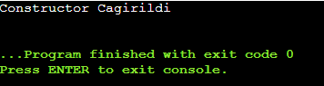

**Örnek**:

```cpp
class MyClass {
public:
	int x;
	// Default constructor
	MyClass() {
   		x = 0;
   		cout << "Default constructor called!" << endl;
	}
	// Parametreli constructor
    MyClass(int val) {
		x = val;
        cout << "Parameterized constructor called!" << endl;
	}
};

int main()
{
	MyClass obj1;        // Default constructor çağrılır
    MyClass obj2(10);    // Parametreli constructor çağrılır

    cout << "obj1.x = " << obj1.x << endl;  // 0
    cout << "obj2.x = " << obj2.x << endl;  // 10

	return 0;
}
```
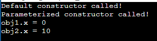


- Constructorlar, bir nesnenin doğru bir şekilde başlamasını garanti eder.
- Sınıflar arası bağımlılıkları yönetirken önemli rol oynar.

<a id="d7-s2"></a>
## Destructor

- Sınıf nesnesinin hayatını bitiren fonksiyondur.
- Bir sınıfın destructorının olmama ihtimali yok.
- Temel görevi, nesnenin kullanmış olduğu kaynakları (bellek, file descriptor) serbest bırakmak ve temizlik yapmaktır.
- Destructor, bir  nesnenin varlığı sona erdiğinde çağrıldığı için manuel olarak çağrılmasına gerek yoktur, otomatik çalışır.
- Sınıf ismiyle aynı isme sahiptir sadece önünde ~işareti bulunur.
- Destructor, hiçbir zaman parametre almaz ve overload edilemez. (Birden fazla destructor olmaz!)
- Return tipi yoktur.
- Eğer bir sınıf içerisinde dinamik bellek(heap) kullanıyorsa, destructor bu bellek alanını serbest bırakmak zorundadır.
- Private, protected olabilir ama çoğunlukla public olacak.
- Non cost olmak zorundadır.
- İsmi ile çağrılabilir ancak bunu yalnızca özel bir bağlamda gerçekleştirilir. Onun dışında biz destructor fonksiyonunu çağırmayız.

**Örnek:**

```cpp
class MyClass {
public:
	int* ptr;

    // Constructor: Bellek ayırıyor
    MyClass(int size) {
       	ptr = new int[size];  // Dinamik bellek ayırma
       	cout << "Constructor called! Memory allocated." << endl;
    }

    // Destructor: Bellek serbest bırakıyor
    ~MyClass() {
       	delete[] ptr;  // Dinamik belleği serbest bırakma
       	cout << "Destructor called! Memory freed." << endl;
    }
};

int main() {
    MyClass obj(10);  // Constructor çağrılır, 10 elemanlık dinamik bellek ayırılır

    // Nesne `obj` işlev bloğu sona erdiğinde (main fonksiyon bittiğinde) yok edilir
    // ve destructor otomatik olarak çağrılır
    return 0;
}
```
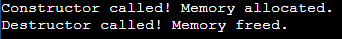

- Destructor ne zaman çağırılır ?
  - **Otomatik Ömürlü Nesneler :** Bir fonksiyon içinde tanımlanan yerel bir nesne, fonksiyon sona erdiğinde destructor tarafından yok edilir.
  - **Dinamik Olarak Oluşturulan Nesneler :** new ile dinamik olarak oluşturulan nesneler delete kullanıldığında destructor tarafından yok edilir.
  - **Sınıfın Dışına Çıkıldığında :** Bir sınıfın nesnesi kapsam dışına çıktığında ( örneğin, fonksiyon bloğu sona erdiğinde) destructor çağrılır.
  - Destructor, özellikle dinamik bellek yönetimi ve kaynak yönetimi gerektiren durumlarda kritik öneme sahiptir. Kaynak sızıntılarının önlenmesinde yardımcı olur.

**Örnek:**

```cpp
class Myclass {
public:
    Myclass() {
        cout << "Myclass default ctor cagirildi : " << this << "\n";
    }

    Myclass(int x) {
        cout << "Myclass int ctor cagirildi : " << this << "\n";
    }

    ~Myclass() {
        cout << "Myclass destructor cagirildi : " << this << "\n";
    }
};

int main() {
    Myclass m1;
    Myclass m2(3);
    return 0;
}
```

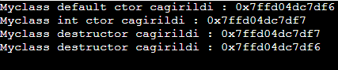

- Yukarıdaki koda baktığımızda sanki m1’in destructorunun önce olması gerektiği anlaşılabilir ancak bu doğru değil. Son yaratılan ilk ölür.. (Hayatın şartları .. ☹)

- Derleyiciye boş bir constructor yaz diye ricada bulunabiliriz;

```cpp
class Myclass {
public:
	Myclass() = default; //derleyiciye rica ediyoruz. bos bir contructor yaz diye.
};

int main()
{
	Myclass m1;
}
```

- Bir fonksiyon çağrıldığında syntax hatası vermesini sağlamak için **`delete`** keywordü kullanılır. Derleyiciye şu mesaj verilir: *"Bu fonksiyonu benim yerime otomatik üretme ve eğer birisi bunu kullanmaya çalışırsa derleme zamanında (compile-time) hata ver."*
- Belki bazı sınıflar sadece utility amaçlıdır. O sınıfdan bir nesne oluşturulmasını istemeyebiliriz. Ayrıca copy constructor da delete'e eşitlediğimizde bu sınıfın kopyalanamaz olduğunu bildirmiş oluruz.
- Burada aklımıza *"Neden private kısma yazmıyoruz ? "* sorusu gelebilir. `delete` yazarak kimseye ayrıcalık tanımıyoruz. Kendi sınıfımız içinde bile çağıramıyoruz. 

```cpp
class Myclass {
public:
	Myclass() = delete;
};

int main()
{
	Myclass m1; //syntax hatasi.. O fonksiyon cagirilinca syntax hatasi ver demek!
}
```

- Eğer bir sınıf nesnesi, hayatı bitmesi sürecinde (ölürken) yapmamız ya da yaptırmamız gereken özel bir işlem yoksa bu durumda derleyicinin destructor yazmasında hiçbir sıkıntı yoktur. Ancak özel bir işlem varsa destructoru biz yazarız;
  - Dosyanın kapatılması
  - Veri bağlantısının kesilmesi
  - Bellek bloğunun free edilmesi
  - Bir network soket bağlantısının kapatılması
  - Bir veri tabanının sonlanması

- C++ da pointer ve referanslar için constructor ve destructor çağrılmaz. Constructor ve destructorların yalnızca nesneler için çalıştığını bilmemiz gerekir. Pointer veya referanslar, nesneleri işaret eden veya referans veren araçlardır, kendileri birer nesne değildir. Kendi başlarına bir sınıfın özelliklerini ve davranışlarını barındırmazlar.

**Örnek**:

```cpp
class Myclass{
public:
	Myclass()
	{
		cout << "Myclass default constructor \n" ;
	}
	~Myclass()
	{
		cout << "Myclass destructor \n" ;
	}
};

int main()
{
	cout << "main basliyor.. \n" ;
	Myclass m1, m2;

	Myclass m3;
	Myclass* p = &m3; //Bunlar icin constructor ve destructor cagirilmiyor.
	Myclass& r = m3; //Referanslar icin de constructor ve destructor cagirilmiyor.

	Myclass a[10]; // 10 constructor ve destructor cagirilir.

	//constructorlar (m1, m2, a[])..

	cout << "main devam ediyor.. \n";
	//destructorlar (m1, m2, a[])...
}
```
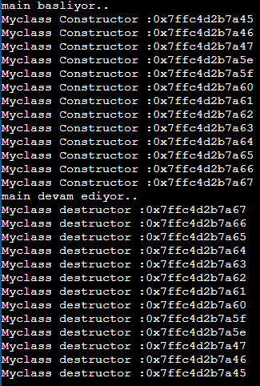

- Statik bir sınıf nesnesi tanımlandığında;
  - Constructor için ; bulunulan fonksiyon ilk kez çağrıldığında bir defaya mahsus constructor çağrılır.
  - Destructor için; Program sona erdiğinde çalışır. Otomatik ömürlü olmadığı için programın herhangi bir yerinde yok edilmez, program sonlandığında yok edilir.

**Örnek**:

```cpp
class MyClass {
public:
    MyClass() {
        cout << "Constructor çağrıldı." << endl;
    }
    ~MyClass() {
        cout << "Destructor çağrıldı." << endl;
    }
};

void func() {
    static MyClass obj;  // Statik nesne
    cout << "func çağrıldı." << endl;
}

int main() {
    func();  // İlk çağrıda constructor çağrılacak
    func();  // İkinci çağrıda constructor çağrılmayacak
    cout << "Program sona eriyor..." << endl;
    return 0;
}
```

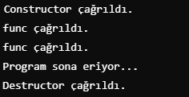

- Yukarıdaki özellik neden ve ne zaman kullanılır ?
  - Program boyunca yalnızca bir kez oluşturulması gereken nesneleri veya kaynakları yönetmek için tercih edilir.

  - **Tekton(singleton) Design Pattern :** Bu design pattern, belirli bir sınıfın yalnızca bir tane nesnesinin olmasını ve bu nesneye global olarak erişilmesini sağlar. Bir nesnenin tüm program boyunca yalnızca bir kez oluşturulması gereken durumlarda statik nesneler kullanılabilir. Statik nesne, yalnızca ilk çağrıldığında oluşturulacak ve program sonlanana kadar yaşamaya devam edecek.

  - Programın tamanında kullanılacak ve yalnızca bir kez başlatılması gereken nesneleri yönetmek için statik nesneler tercih edilebilir. Örneğin **logger**;

**Örnek: Logger**

```cpp
class Logger {
public:
    Logger() {
        cout << "Logger başlatıldı." << endl;
    }
    ~Logger() {
        cout << "Logger kapatıldı." << endl;
    }

    void log(const string& message) {
        cout << "Log: " << message << endl;
    }
};

void functionUsingLogger() {
    static Logger logger;  // Statik logger nesnesi yalnızca ilk çağrıda oluşturulacak
    logger.log("Bu bir test mesajıdır.");
}

int main() {
    functionUsingLogger();
    functionUsingLogger();  // Logger tekrar oluşturulmaz
    return 0;
}
```

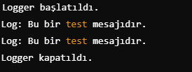

**Örnek:**

```cpp
class Myclass{
int mx, my;
public:
	Myclass()
	{
		cout "Myclass Default Constructor : " << this << "\n";
	}

	Myclass(int x)
	{
		cout <<"Myclass(int) Constructor :" << this << "\n" ;
	}

	int getMx()const
	{
		return mx;
	}
};

int main()
{
	Myclass m1;
	Myclass m2{}; //uniform initialization.
	Myclass m3(); //Function decleration, bir nesne olusturmuyoruz.. Geri dönüş değeri Myclass olan bir function decleration.

	//Asagidaki fonksiyonlarda myclass(int x) constructor kullanilir
	Myclass m4(12); //direct initialization x = 12
	Myclass m5{40}; //brace initialization x = 40
	Myclass m6 = 50; // copy init x = 50
}
```
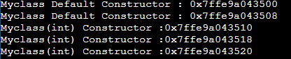

**Örnek**:

```cpp
	class Myclass {
		int mx, my;
	public:
		Myclass()
		{
			cout <<"default ctor \n";
		}
		Myclass(int x)
		{
			cout <<"Myclass(int) ctor \n";
		}
		Myclass(double x)
		{
			cout <<"Myclass(double) ctor \n";
		}
	};

	void func(Myclass m)
	{
		cout << "func cagirildi \n";
	}

	int main()
	{
		Myclass m1; //Myclass()
		Myclass m2(12); //Myclass(int)
		Myclass m3(1.2f); //Promotion Myclass(double)
		Myclass m4(1u); // HATA! ambigious call unsigned int hem int’e hem de doublea dönüşebilir!

		Myclass mx;
		Myclass my = mx; //copy constructor. my hayata gelirken mxden kopyalanarak hayata geliyor.

	}
```

[↑ İçindekiler](#icindekiler)

---

<a id="ders-8"></a>
# Ders 8

<a id="d8-s1"></a>
## Member Initializer List (Üye Başlatıcı Listesi) (MIL) (Constructor Initializer List)

- C++da bir sınıfın üye değişkenleri constructor fonksiyon içinde başlatmanın özel bir yoludur.
- Bu, bir sınıfın constructorında doğrudan üye değişkenlerini ilk değerlerini belirlemek için kullanılır.
- Özellikle const, referans ya da başka sınıf türleri başlatmak için kullanılır.
- Constructorun en önemli işlemlerinden biri: Kullanılabilir hale getirilen sınıfların memberlarını initialize eder.
- Sınıfın elemanlarına zorunlu olarak ilk değer vermem gerektiğinde;
  - Sınıfın veri ögesi const, referans ya da pointer(syntax hatası değil ama vermek iyi olur) ise;
    - C++ da const degerleri init etmemek syntax hatasıdır.
    - Bir referansın neye referans olduğunu bilmemekte syntax hatasıdır.
- Tüm constructorlar bu syntaxı kullanabilir.

**Örnek:**

```cpp
class Myclass
{
 	int mx, my, mz; //cop degerde bunu istemeyiz!
 	const int a;
 	int& r;
public:
 	 Myclass() : mx(10), my(20), mz(30), a(500), r(&mx) //bu noktada mx my mz initialize edildi.
 	 {
		//body
 	 }
};

int main()
{
 	Myclass m1;
 	Myclass a;
}
```

- Aşağıdaki ifade bir MIL değil!!! Myclass() : mx(10), my(20), mz(30) olmalı.

```cpp
Myclass()
 {
 	mx = 10;
 	my = 20;
	mz = 30;
 }
```

**Örnek:**

```cpp
class Date{
int md, mm, my;
public:
	Date(int d, int m, int y): md{d}, mm{m}, my{y} { }

 	void displayDate()const
 	{
 		cout << " Day: "<<md<< " Mon: "<<mm<< " Year: "<<my;
	}
};
int main()
{
 	Date mydate(11,12,1985);
 	mydate.displayDate(); // Çıktı :  Day: 11 Mon: 12 Year: 1985
}
```

- Küme parantezi ve normal parantez ile başlatmak arasında ne gibi fark var ?
  - **Parantez() ile Başlatmak**
    - Direct initialization olarak adlandırılır.
    - C++98 ve c++01ten itibaren kullanılan geleneksel başlatma yöntemidir.
    - Parantezler kullanılarak üye değişkenlerin veya nesnelerin değerleri atanır.

**Örnek:**

```cpp
class MyClass {
public:
    int x;
    MyClass(int val) : x(val) {}
};
```

  - **Küme Parantezi {} ile Başlatmak**
    - Uniform initialization ya da Braced initialization olarak adlandırılır.
    - C++11 ile birlikte gelen ve tür dönüşümlerini daha sıkı bir şekilde denetleyen yöntemdir.
    - Narrowing Conversions engellenir. Örneğin, double bir değerin int’e dönüştürülmesi gibi kayıplı dönüşümlerde compile-time hatası üretir.
    - Genellikle, daha güvenli ve hata önleyici olduğu için bu yöntem kullanılır.

Örnek:

```cpp
class MyClass {
public:
    int x;
    MyClass(int val) : x{val} {}  // Küme parantezi ile başlatma
};
```

- MIL Kullanmanın avantajları nelerdir ?
  - Performans
  - Const ve Referanslar yalnızca bir kez initialize edilir, sonradan değiştirilemezler. MIL olmadan bu tür veri üyelerini başlatmak imkansızdır.
  - Inheritance

**Örnek**: Değişkenleri yazdığımız sıra önemlidir. Derleyicinin oluşturacağı kodda önce mx geliyor.

```cpp
class Myclass{
	int mx;
	int my;
public:
	Myclass(int x, int y) : my{x}, mx{my * 20} //RUNTIME HATASI! my mx'den sonra geliyor. my daha initialize edilmemis, once onu 10 yapmak dogru degil! tanim siralamasi onemli.
	{

	}
	void display()const
	{
		cout << "mx = " << mx << " my = " << my <<"\n";
	}
};

int main()
{
	Myclass m1(2, 3);
	m1.display(); //mx = -16 cikiyor mesela NALAKA ?? Demekki tanim siralamasindan..
}
```

**Örnek**: len yerine önce mp tanimlansa idi runtime hatası olurdu.

```cpp
class Name{
	size_t mlen; //once len'li kisim calisir.
	char* mp;
public:
	Name(const char* ptr) : mlen(strlen(ptr)+1), mp(static_cont<char*>(malloc(mlen)))
	{
		strcpy(mp, ptr);
	}
	~Name()
	{
		free(mp);
	}

	void print()const
	{
		cout << mp;
	}
};

int main()
{
	Name str("samet");
	str.print();
}
```

**Örnek:**

```cpp
//in class initializer
class Myclass{
	int mx = 10;
	int my = mx;
public:
};

//member initializer list syntaxi
//Bu daha kullanisli.
class Myclass2{
	int mx, my;
public:
	Myclass2(int a, int b) : mx(a), my(b)
	{}

};
```

- Eğer bizim yazdığımız programda special member function yazılmaması ( yani default constructor ve destructor ile idare etmek)herhangi bir sorun oluşturmuyorsa bunları derleyicinin yazma işlemine **Rule of Zero** denir.

- RAII – Resource Acquisition Is Initialization : Kaynak yönetimi idiomudur.
- RAII, bir nesnenin yaşam süresi boyunca bir kaynağı edinip, bu kaynak yok edildiğinde otomatik olarak serbest bırakılmasını sağlar.
  - Kaynak Edinmek : Dosyanın açılması, bellek ayrılması
  - Kaynakların Serbest Bırakılması : Dosyanın kapanması, bellekten free edilmesi
  - Log mekanizması mesela..

**Örnek**:

```cpp
class Logger {
 	 FILE* fp;
 public:
 	 Logger(const char *pfname) : fp(fopen(pfname, "w"))
 	 {

 	 }

 	 void logWrite(const char* data)
 	 {
 	 	 fprintf(fp, "Data: %s", data);
 	 }

 	 ~Logger()
 	 {
 	 	 fclose(fp);
 	 }
 };

int main()
{
	if(1)
	{
		Logger log("logITDep");
		log.logWrite("Internet baglantisi koptu");
	}
}
```

<a id="d8-s2"></a>
## Copy Constructor

- C++’da copy constructor, bir sınıfın başka bir nesnesinden kopya alınarak yeni bir nesne oluşturulduğunda çağrılan özel bir constructordır.
- Bu constructor, mevcut nesneyi kullanarak aynı sınıftan başka bir nesneyi başlatmak amacıyla kullanılır.
- Syntax: `ClassName(**const ClassName&** other);`
- Referans türünde olmasının nedeni, orijinal nesnenin üzerine kopya oluşturulurken bir kopyasının alınmasının önüne geçmektir.
- Const eklenmesi, copy constructorın orijinal nesneyi değiştirmesini engeller.

```cpp
MyClass obj1;
MyClass obj2 = obj1;  // Copy constructor çağrılır

void foo(MyClass obj);  // Kopya yapılır
MyClass obj1;
foo(obj1);  // obj = obj1 Copy constructor çağrılır

MyClass foo()
{
	MyClass obj;
	return obj;  // Copy constructor çağrılır
}
```

**Örnek**:

```cpp

class Fighter{
    string mCharacterName;
	int mLevel;
	double mMoney;
public:
	Fighter()
	{
		cout << "Default ctor" << "\n";
	}

	~Fighter()
	{
		cout << "destructor" << this << "\n";
	}

	Fighter(string name) : mCharacterName(name), mLevel(1), mMoney(0)
	{
		cout << "Fighter (string name)" << "\n";
	}
	void increaseLevel()
	{
		++mLevel;
		mMoney += 1000;
	}
	int getLevel()const
	{
		return mLevel;
	}
	double getMoney()const
	{
		return mMoney;
	}
	string getCharacterName()const
	{
		return mCharacterName;
	}
};
int main()
{
	Fighter f1("samet");
	f1.increaseLevel();
	f1.increaseLevel();
	f1.increaseLevel();
	Fighter f2(f1); //copy constructor
	f2.getLevel(); //4
	f2.getMoney(); //3000
	f2.getCharacterName(); //samet

}
```

**Örnek**:

```cpp

class Myclass{
	int mx = 10;
	int my = 20;
public: 
	Myclass() = default;
	Myclass( const Myclass &r): mx(r.mx), my(r.my)
	{
		cout << "Copy ctor cagirildi \n";
	}

	void display()const
	{
		cout << "mx = " << mx << " my= " << my ;
	}

};
int main()
{
	Myclass m1;
	Myclass m2(m1); //m1 in data memberları m2ye kopyalaniyor.
	m2.display(); // m2.mx = 10, m2.my = 20
}
```

- Mecbur olmadıkça, copy constructoru bizim yazmamız lazım.
- Hangi durumlarda copy constructor yazılmalı ?
  - Sınıfın data memberlarından biri eğer pointer ise gerekli.
    - Farklı sınıfların pointerlarının aynı olmasını istemeyiz
    - Malloc ile baska bir alan aloke edip mesela ismi strcpy olan fonksiyon ile alacağız. Aynı adresi almamamız lazım.
  - Nesne, başka bir nesneyle başlatıldığında
  - Call by value
  - Bir nesne bir standart kapsayıcıya(container) eklenirken
  - İstisnalar(exceptions) fırlatıldığında 🡪 throw MyClass();
  - Copy elisiosn ve optimizasyonlar.

[↑ İçindekiler](#icindekiler)

---

<a id="ders-9"></a>
# Ders 9

- **Shallow Copy :** Her şeyin kopyalanmasına denir. Pointerlar dahildir. Kopyalan nesne içindeki bir alt nesne değiştirildiğinde orijinal nesne de etkilenebilir.
- **Deep Copy :** Kopyalanan nesne, orijinal nesneden bağımsızdır ve iç nesnelerde yapılan değişiklikler birbirine etkilemez.

**Örnek**:

```cpp
class Name{
  	  size_t mlen;
  	  char* mp;
public:
	Name(const char* ptr) : mlen(strlen(ptr)+1), mp(static_cast<char*>(malloc(mlen)))
	{
		strcpy(mp, ptr);
	}
	~Name()
	{
		free(mp);
	}
  	size_t length()const
  	{
  	  	return mlen;
  	}
  	void reverse()
  	{
		_strrev(mp); //extension
  	}
  	void print()const
  	{
		cout << mp << "\n" ;
  	}
  	Name(const Name& r): mlen(r.mlen), mp(static_cast<char*>(malloc(mlen)))
  	{
  	  	if(!mp)
		{
  	  		cout << "bellek yetersiz";
			exit(EXIT_FAILURE);
		}
		strcpy(mp, r.mp);
  	}
  	void append(const char* str)
  	{
  	  	char buffer[50];
  	  	strcpy(buffer, mp);
  	  	auto len=strlen(str);
  	  	mp = static_cast<char*>(malloc(mlen+len));
  	  	if(!mp)
  	  	{
  	  		cout << "bellek yetersiz";
			exit(EXIT_FAILURE);
		}
		strcpy(mp, buffer);
  	  	strcat(mp, str);
  	  	mlen += len ; //Bu olmasaydı n1 ve n2 nin length i ayni gozukurdu.
  	
  	  	cout <<n1.length() << "\n" ;
  	  	cout <<n2.length() << "\n" ;
  	}
  int main()
  {
  	  Name n1("samet");
  	  Name n2(n1);
  	  n1.reverse();
  	  n1.append("akcalar");

  	  n1.print(); //temasakcalar
  	  n2.print(); //samet

  	  cout <<n1.length() << "\n" ; //13
  	  cout <<n2.length() << "\n" ; //6
  }
```

<a id="d9-s1"></a>
## Delete Anahtar Kelimesi

- Dinamik bellek yönetimiyle de kullanılabilir.
- Fonksiyonların sonuna da delete yazabiliyoruz!
- `void func() = delete;` ifadesi O fonksiyonun kullanılmasını engellemek anlamına geliyor.
- Bir fonksiyonu “silme” olarak bilinir ve programcıya o fonksiyonun yanlışlıkla veya kasıtlı olarak çağrılmasını engelleme imkanı verir.
- Belirli senaryolarda fonksiyonların kullanımını sınırlamak için faydalıdır.
- Mesela, copy constructor yapılmasını engellemek için;

```cpp
class MyClass {
public:
    MyClass() = default;        		// Varsayılan yapıcı
    ~MyClass() = default;       		// Varsayılan yıkıcı
    MyClass(const MyClass&) = delete;  // Kopyalama yasak
};
```

- Genellikle kopyalama, taşıma veya belirli veri türleri için fonksiyon çağrılarını sınırlamak için kullanılır.
- Belirli veri türlerinin kullanımı engellemek;

```cpp
void func(double) {
    // double parametre ile çağrılabilir
}

void func(int) = delete;  // int parametre ile çağrılamaz

int main() {
    func(3.14);  // Bu geçerlidir
    // func(10); // Bu derleme hatası verir
}
```

- Thread’in kopyalanması mantıklı değil, bu yüzden thread ile ilgili copy constructorlar yasaklı olur genellikle..

<a id="d9-s2"></a>
## Copy Assignment Operatörü

- Bu işlem, bir nesnenin başka bir nesneye kopyalanması için kullanılan operatördür.
- Varsayılan olarak C++ her sınıf için bir kopyalama operatörü sağlar.
- Ancak sınıfımız özel bellekte(heap) bir bellek alanına sahip kaynaklar (malloc) içeriyorsa, özel bir copy assignment operatörü yazmamız gerekir.
- Amacımız; zaten var olan bir nesneye başka bir nesnenin değerlerini atamak. Hayata gelmesini sağlamak değil.

**Örnek**:

```cpp
class MyClass {
public:
    int x;
    double y;
};

int main() {
    MyClass obj1;
    obj1.x = 5;
    obj1.y = 3.14;

    MyClass obj2;
    obj2 = obj1; // Varsayılan copy assignment kullanılır

    // Artık obj2'nin x ve y değerleri, obj1'deki değerlere eşittir.
}
```

**Örnek**:

```cpp
string str3; //default ctor
string str1("samet"); //parametreli ctor (const char*)
string str2(str1); // copy ctor (const referans) //hayata bu sekilde geliyor

str3 = str2 ;  //atama, copy assignment function cagrisi (Hayatta iken cagriliyor.)
```

**Örnek**:

```cpp
class Myclass{
public:
	int mx = 30; //in class initilazor
	int my = 40; //in class initilazor

	void set(int x, int y)
	{
		mx = x;
		my = y;
	}

	void display()const
	{
		cout << "mx = " << mx << "my =" << my << "\n";
	}

	Myclass& operator=(const Myclass& r)
	{
		mx = r.mx;
		my = r.my;

		cout << "copy assignment function cagirildi \n" ;
		return *this; //myclass nesnesinin adresi
	}
};

int main()
{
	Myclass m1;
	Myclass m2;

	m2.set(100, 200);
	m1 = m2; //copy assignment function operator= fonksiyonu  m1 icin operator= cagirilcak. Aslında bu da bir operator overloading.

	m1.display(); //100 200
	m2.display(); //100 200

	(m1 = m2).display() ; //tek satırda da yapılabilir. m1.display yapmıs oluyoruz aslında.
}
```

<a id="d9-s3"></a>
## Operator Overloading – Giriş

- İleride detaylı görülecek, şimdilik fikrimiz olsun.
- C’de olmayan bir araç.
- Sınıf nesneler üzerinde operatör düzeyinde işlem yapmamızı sağlayan araç

```cpp
	string str1 = "samet";
	string str2 = "akcalar";
	string str3 = str1 + str2; //operator overloading
```

- Yukarıdaki örnekte (copy assignment içinde) m1 = m2 yapmıştık, o da aslında bir operatör overloading.
- Derleyici arka planda m1.operator = m2; yapıyor.

**Örnek**:

```cpp
Name& Name::operator=(const Name& r)
{
    if (this == &r) { // Kendine atamayı önlemek için , Self Assignment Control!!
    //nesne kendine ataniyorsa gereksiz bellek islemlerini onlemeliyiz.
        return *this;
    }

    // Eski belleği serbest bırak memory leak onlenmis olur.
    free(mp);

    // Yeni bellek tahsis et
    mlen = r.mlen;
    mp = static_cast<char*>(malloc(mlen));

    if (!mp) { // Bellek tahsisi başarısızsa
        cout << "bellek yetersiz";
        exit(EXIT_FAILURE);
    }

    // Veriyi kopyala
    strcpy(mp, r.mp);

    return *this; // Kendini döndür (atamayı zincirlemek için)
}

int main()
{
	Name n1("Fatmagul");
	Name n2("hatice");

	n1 = n2; //copy assignment
	n1.print(); //hatice
	n2.print(); //hatice
}
```

<a id="d9-s4"></a>
## Move Constructor

- Bir nesnenin kaynaklarının kopyalanmadan, bir başka nesneye taşınmasını sağlar.
- Bu, özellikle büyük veri yapılarıyla çalışırken bellek ve performans açısından avantaj sağlar.
- C++11 ile gelen move constructor, rvalue reference(&&) ile çalışır ve bir nesnenin kaynaklarını başka bir nesneye taşımak için kullanılır.

```cpp
string str1 = "tugbayilmaz";
string str2(move(str1)) ; //str2 = tugbayilmaz, str1 bosalmıs olacak.
```

**Örnek**:

```cpp
Name::Name(Name&& r) noexcept : mlen(r.mlen), mp(r.mp)
{
	// Orijinal nesnenin kaynaklarını yeni nesneye taşır
	r.mp = nullptr;   // Orijinal nesne boş hale gelir
	r.mlen = 0;
	cout << "Move constructor called!" << endl;
}

int main()
{
    Name n1("Hello");
    Name n2 = move(n1); // Move constructor çağrılır

    n2.print();  // "Hello" yazdırır
    n1.print();  // Boş nesne (nullptr) yazdırır

    return 0;
}
```

- Hangi durumlarda kullanılır ?
  - **Büyük veri yapıları :** Eğer sınıfınız büyük miktarda bellek tahsisi gerektiriyorsa move constructor kullanımı performansı iyileştirir.
  - **Kaynak Yönetimi :** Bellek, file descriptor gibi sınırlı ve pahalı kaynakları yönetirken gereksiz kopyalamayı ve kaynak sızıntılarını önlemek için.
  - **Function Return Value :** Fonksiyonların gecici değerler döndürdüğünde move constructor kaynakların taşınarak verimli bir şekilde kullanılmasını sağlar.

- Sağ taraf referansı(&&) kullanarak geçici nesnelerden kaynaklar taşınır ve orijinal nesne geçici bir duruma (genellikle nullptr) getirilir.

<a id="d9-s5"></a>
## Move Assignment Operatörü

- Move constructor gibi çalışır ancak zaten var olan bir nesneye başka bir nesnenin kaynaklarını taşımak için kullanılır.
- Syntax 🡪 ClassName& operator=(ClassName&& other);

**Örnek**:

```cpp

Name& Name::operator=(Name&& r) noexcept {
    // Kendine atamayı önlemek için kontrol
    if (this == &r) {
        return *this;
    }

    // Önce mevcut nesnenin kaynaklarını serbest bırak
    free(mp);

    // Sağdaki nesnenin (r) sahip olduğu kaynakları al
    mp = r.mp;
    mlen = r.mlen;

    // Sağdaki nesneyi geçersiz hale getir (kaynaklarını serbest bırakmasın)
    r.mp = nullptr;
    r.mlen = 0;

    // Nesnenin kendisini döndür
    return *this;
}

int main() {
    Name n1("First");
    Name n2("Second");

    // Move assignment ile n2'ye n1'in kaynaklarını taşıyoruz
    n2 = move(n1);  // Move assignment operator burada çağrılır

    n2.print();  // "First" yazdırır
    n1.print();  // Boş hale gelmiş "Empty Name" yazdırır

    return 0;
}
```

**Örnek:** Custom Vektor Sınıfı

```cpp
class Vector{
	int* mData; //push_back ile eleman eklendigi icin dinamik bellek ayrilmali. Dinamik bellek ayirmak icin de int* tanimlandi.
	size_t mVecSize;
	size_t mVecCapacity;

	void reserve(size_t newCapacity) //Kapasite artirmak icin helper function. Disaridan bu fonksiyona erismemek gerekli.
	{
		int* newData = new int[newCapacity];
		for (size_t i=0; i<mVecSize; ++i)
			newData[i] = mData[i] ;

		delete[] mData; //eski data bellegiyle bir isimiz kalmadi. 
		mData = newData;
		mVecCapacity = newCapacity;
	}
public:
	//Default Constructor
	Vector(): mData(nullptr), mVecSize(0), mVecCapacity(0) {}

	//Parametreleri Constructor. Henuz eleman eklenmedigi icin vec_size 0 olarak initialize edildi.
	Vector(size_t capacity) : mData(new int[capacity]), mVecSize(0), mVecCapacity(capacity) {}

	//Copy Constructor
	Vector(const Vector& otherVector) : mData(new int[otherVector.mVecCapacity]), mVecSize(otherVector.mVecSize), mVecCapacity(otherVector.mVecCapacity)
	{
		for (size_t i=0; i<mVecSize; ++i)
			mData[i] = otherVector.mData[i];
	}
	
	//Copy Assignment Operator : Yeni kapasite kadar bellek alınır, diger vektorun elemanları kopyalanır.
	Vector& operator=(const Vector& otherVector)
	{
		mVecSize = otherVector.mVecSize;
		mVecCapacity = otherVector.mVecCapacity;
		mData = new int[mVecCapacity];
	
		for (size_t i=0; i<mVecSize; ++i)
			mData[i] = otherVector.mData[i];
	
		return *this;
	}

	//Move Constructor
	Vector(Vector&& otherVector) : mData(otherVector.mData), mVecSize(otherVector.mVecSize), mVecCapacity(otherVector.mVecCapacity)
	{
		otherVector.mData = nullptr;
		otherVector.mVecSize = 0;
		otherVector.mVecCapacity = 0;
	}

	//Move Assignment Operator
	Vector& operator=(Vector&& otherVector)
	{
		mData = otherVector.mData;
		mVecSize = otherVector.mVecSize;
		mVecCapacity = otherVector.mVecCapacity;

		otherVector.mData = nullptr;
		otherVector.mVecSize = 0;
		otherVector.mVecCapacity = 0;

		return *this;
	}

	//Fill Constructor (Kapasite Ayarlama)
	Vector(size_t capacity, bool set_capacity_only) :mData(new int[capacity]), mVecSize(0), mVecCapacity(capacity)
	{
		if(!set_capacity_only)
			for(size_t i=0; i<capacity; ++i)
				mData[i] = 0;
	}

	//Fill Constructor (Deger ile doldurma)
	Vector(size_t capacity, int value) : mData(new int[capacity]), mVecSize(capacity), mVecCapacity(capacity)
	{
		for(size_t i=0; i<mVecSize; ++i)
			mData[i] = value;
	}

	//Destructor
	~Vector()
	{
		delete[] mData;
	}

	size_t getSize() const
	{
		return mVecSize;
	}

	size_t getCapacity() const
	{
		return mVecCapacity;
	}

	//Vectore eleman eklemek. Eger kapasite dolu ise, iki katina cikarildi.
	void pushBack(const int& value)
	{
		if(mVecSize >= mVecCapacity)
			reserve(mVecCapacity == 0 ? 1 : mVecCapacity * 2);

		mData[mVecSize++] = value;
	}

	//vektoru ters cevirmek
	void reverse()
	{
		for(size_t i = 0; i<mVecSize/2 ; ++i)
		{
			int temp = mData[i];
		mData[i] = mData[mVecSize – 1 - i];
		mData[mVecSize – 1 – i] = temp;
		}
	}
}; //class brace
```

- **Reserve :** Kapasiteyi artırmak için kullanılır. Vector’un mevcut kapasitesi dolduğunda veya önceden belirli bir kapasiteye ihtiyaç duyulduğunda kapasiteyi artırarak daha fazla eleman eklenebilmesi için bellek alanını sağlar.
  - newCapacity boyutunda yeni bir dinamik bellek oluşturur.
  - Eski dizideki elemanları(mData), yeni diziye (newData) kopyalar.
  - Eski belleği(mData) serbest bırakır ve yeni diziyi sınıf elemanına atar.
  - mVecCapacity yeni kapasite değeriyle güncellenir.
- **Default Constructor**: Boş bir vektör oluşturur, başlangıçta bir kapasite veya eleman eklenmez.
- **Parametreli Constructor**: Belirli bir kapasite ile bir Vector oluşturur.
  - capacity boyutunda yeni bir bellek alanı ayrılır.
  - mVecSize sıfır olarak ayarlanır çünkü henüz eleman eklenmemiştir.
  - mVecCapacity, belirtilen capacity değerine ayarlanır.
- **Copy Constructor :** Başka bir Vector nesnesinin kopyasını oluşturur.
  - otherVector nesnesinin kapasitesi kadar yeni bellek alanı oluşturur.
  - otherVectordeki elemanlar bu yeni diziye kopyalanır.
  - mVecSize ve mVecCapacity degerleri otherVectordaki fieldlar ile güncellenir.
- **Copy Assignment Operator :** Mevcut Vector nesnesine başka bir Vector nesnesinin değerlerini atar.
  - otherVector kapasitesi kadar yeni bellek alanı tahsis edilir.
  - otherVector’deki elemanları kopyalar.
  - mVecSize ve mVecCapacity, otherVectorün değerleriyle güncellenir.
- **Move Constructor :** Diğer Vector nesnesinin kaynaklarını mevcut nesneye taşır. Kaynakları devralır.
  - mData, otherVector’un mData pointarını devralır.
  - otherVector.mData, nullptr yapılarak eski nesne belleğinden sorumlu olmaktan çıkar.
  - mVecSize ve mVecCapacity, otherVector’den alınır.

- **Move Assignment Operator :** Mevcut nesneye, diğer Vektor nesnesinin kaynaklarını atar.
  - otherVector’un kaynaklarını alır.
  - otherVector.mData, nullptr yapılarak kaynaklarından sorumlu olmaktan çıkar.
- **Fill Constructor (Kapasite Ayarlama) :** Verilen kapasiteyi ayarlayan ve isteğe bağlı olarak 0 ile dolduran bir Vektör oluşturur.
- **Fill Constructor (Değer ile Doldurma) :** Verilen kaiasite kadar bir Vektor oluşturur ve tüm elemanları belirtilen value ile doldurur.
- **pushBack :** Vektor’e sona bir eleman ekler.
  - Kapasite doldugunda reserve ile kapasiteyi artırır.
  - Yeni elemanı sona ekler ve mVecSize 1 artırılır.
- **Reverse :** Vektor içindeki elemanların sırasını tersine çevirir.

- Sınıf içerisine member function olarak aşağıdakini eklersek (ileride detaylı işlenir), test ederken vec[i] gibi kullanabiliriz

```cpp
const int& operator[](size_t index) const 
{
    return mData[index];
}
```

- Test edelim;

```cpp
int main() {
    // 1. Default Constructor testi
    Vector vec;
    std::cout << "Initial size: " << vec.getSize() << ", capacity: " << vec.getCapacity() << std::endl;

    // 2. pushBack ve otomatik kapasite artırımı testi
    vec.pushBack(10);
    vec.pushBack(20);
    vec.pushBack(30);
    std::cout << "After pushBacks: size: " << vec.getSize() << ", capacity: " << vec.getCapacity() << std::endl;

    // 3. Elemanları yazdırma
    for (size_t i = 0; i < vec.getSize(); ++i) {
        std::cout << "Element at index " << i << ": " << vec[i] << std::endl;
    }

    // 4. Kapasiteyi elle artırma testi (reserve fonksiyonu)
    vec.pushBack(40);
    vec.pushBack(50);
    std::cout << "After more pushBacks: size: " << vec.getSize() << ", capacity: " << vec.getCapacity() << std::endl;

    // 5. Ters çevirme (reverse) testi
    vec.reverse();
    std::cout << "After reverse:" << std::endl;
    for (size_t i = 0; i < vec.getSize(); ++i) {
        std::cout << "Element at index " << i << ": " << vec[i] << std::endl;
    }

    // 6. Copy Constructor testi
    Vector vecCopy(vec);
    std::cout << "Copied Vector (vecCopy):" << std::endl;
    for (size_t i = 0; i < vecCopy.getSize(); ++i) {
        std::cout << "Element at index " << i << ": " << vecCopy[i] << std::endl;
    }

    // 7. Move Constructor testi
    Vector vecMoved(std::move(vecCopy));
    std::cout << "Moved Vector (vecMoved) from vecCopy:" << std::endl;
    for (size_t i = 0; i < vecMoved.getSize(); ++i) {
        std::cout << "Element at index " << i << ": " << vecMoved[i] << std::endl;
    }

    return 0;
}
```

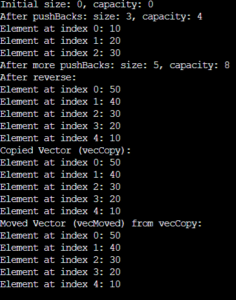

[↑ İçindekiler](#icindekiler)

---

<a id="ders-10"></a>
# Ders 10

<a id="d10-s1"></a>
## C++ Initializer – Tekrar

```cpp
int x = 10;
int y(20); //value init
int z{30}; //uniform initializer
int a[] {3,5,2,1}; //C++11 ile = yazılmadan yapılabiliyor.
```

- Uniform initializer da veri kaybı olacağı anlaşılacağı zaman syntax hatası olur.

```cpp
double dval = 8.78 ;
int ival{ dval2 };
int ival{static_cast<int>(dval2)} ; --> Bilerek isteyerek yapıyoruz diyoruz.
```

- Most Vexing Parse 🡪 Bu istenmeyen bir durum. Bir ifadenin derleyici tarafından beklenmeyen bir şekilde yorumlanmasına yol açan bir durumdur.
- C++da nesne oluşturma gibi görünen bir ifadenin derleyici tarafından fonksiyon bildirimi olarak yorumlanmasıdır.

```cpp
std::vector<int> v(); // Bu bir nesne yaratmak gibi görünebilir. Bunu fonksiyon bildirimi olarak algılar.
std::vector<int> v{}; // Bu bir nesne tanımıdır.
```

<a id="d10-s2"></a>
## Conversion Constructor

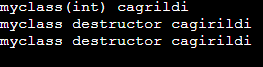

- Conversion Contructor, başka bir türdeki veriyi, sınıfın türüne dönüştürmek için kullanılan fonksiyondur.
- Otomatik dönüşümler için kullanışlıdır ancak beklenmedik otomatik dönüşümleri engellemek için “**explicit**” anahtar kelimesiyle sınırlandırılabilir.
- Yukarıdaki örneğe baktığımızda; int türünden argüman alarak Myclass türünde bir nesne oluşturulmasına izin verir. Bu tür conversion constructorları, sınıf nesnesini doğrudan bir int değeri ile başlatmaya veya int türünden myclass türüne dönüştürme işlemi yapmaya imkan tanır.
- Kısaca conversion constructor, sınıf türüne dönüştürme yapmayı gerektiren durumlarda kullanılır.

**Örnek:**

```cpp

 class Myclass{
 public:
 	 Myclass(bool a);
 };

 int main()
 {
 	 bool bx = true;
 	 Myclass x = bx; //normalde böyle bir dönüşüm yok ama conversion ctor ile dönüşüyor. User        defined conversion.
 }
```

**Örnek**: Explicit

```cpp

 class Myclass{
 public:
 	explicit Myclass(bool a);
 };

 int main()
 {
 	 bool bx = true;
 	 Myclass x = bx; //HATA : Kafasına göre dönüşüm yapmasını engellemek için kullanılır.
 }
```

- String sınıfının conversion constructoru explicit değil ancak chrono, vector, atomic, unique_ptr gibi sınıflarda explicit.

**Örnek:** Explicit ama..

```cpp
class Myclass{
 public:
 	explicit Myclass(bool a);
 };

 int main()
 {
 	 bool bx = true;
 	 Myclass x{bx}; // Burada derlyici hata vermez.
 }
```

**Örnek**:

```cpp
class Myclass{
 public:
 	Myclass() = default;
 	Myclass(int x);
 };

 int main()
 {
 	 Myclass m;
 	 m = 30;
 }
```

**Örnek:**

```cpp
vector<int> ivec = 200; //Syntax Hatasi. Demekki bu explicitmis. Felaket! Anlamsız hareket.
vector<int> ivec{200}; //Syntax Hatasi yok..... 200 elemanlı dizi olulşturur. Bu da anlamsız hareket.
vector<int> ivec(200); //Syntax Hatasi yok, vektorun boyunu belirtir.
string s1 = "samet"; //anlamlı hareket.
```

<a id="d10-s3"></a>
## Dinamik Ömürlü Nesneler ile Tanışma – New & Delete

- Malloc, storage elde ediyor. Free elde edilen storage i geri veriyor.
- Malloc’un nesneyi hayata getirmekle bir ilgisi yok, yani constructor çağrılmaz.
- **New** : C++ da dinamik bellek ayırmak için kullanılır. Sınıf nesnesini oluşturur ve constructor çağırır.
- New, belirli bir tür için bellekte yer ayırır ve bu bellek adresini bir pointera döndürür.
- C++ da new kullanarak ayrılan bellek, programın **runtime** zamanında ayrılır.
- Bu bellek, program kapanana kadar geçerli  kalır ya da manuel olarak delete ile serbest bırakılır.

**Örnek**:

```cpp
class MyClass {
public:
    MyClass() { std::cout << "Constructor called" << std::endl; }
};

int main() {
    MyClass* obj = new MyClass(); // Bellek ayırma ve constructor çağrısı
    delete obj;                   // Bellek serbest bırakma ve destructor çağrısı
    return 0;
}
```

**Örnek:**

```cpp
int* ptr = new int;          // int türünde tek bir bellek bloğu ayırır
*ptr = 10;                   // Bellekteki değeri 10 yapar
```

**Örnek**:

```cpp
 int* arrayPtr = new int[5];  	// 5 elemanlı int dizisi için bellek ayırır
 arrayPtr[0] = 1;             	// Dizi elemanlarına erişim sağlanır
 delete[] arrayPtr;  		// Diziyi serbest bırakır
```

**Örnek**:

```cpp
int* ptr = new int;
delete ptr;
delete ptr; // Tanımsız davranış, çift delete
```

**Örnek**:

```cpp
int* ptr = nullptr;
delete ptr; // Güvenli, nullptr üzerinde delete işlemi yapılabilir
```

- New, dinamik bellek ayırır ve bir işaretçiye belleğin adresini döndürür. Dizi ayırmak için new[] kullanılır.
- Delete, new ile ayrılan belleği serbest bırakır. Dizi serbest bırakmak için delete[] kullanılır.
- Bellek sızıntısını önlemek için new ile ayrılan her bellek alanı delete ile serbest bırakılmalıdır.
- **Operator new** : Bellek ayırmak için kullanılan fonksiyondur. Malloc gibi sadece bellek ayırır.
- Operator new ‘u yeniden tanımlayarak özel bellek ayırma stratejileri oluşturulabilir ve sınıfımıza özgü bellek yönetimini kolayca yapabiliriz.
- New ifadesi önce operator new’ e, ardından constructor’a çağrı yapıyor.

**Örnek**: operator new ve operator delete

```cpp
int main() {
    void* rawMemory = operator new(sizeof(int)); // int boyutunda bir bellek ayırır, ancak başlatmaz
    int* intPtr = static_cast<int*>(rawMemory);
    *intPtr = 42; // Bellekteki değeri 42 yapar
    operator delete(intPtr); // Belleği serbest bırakır
    return 0;
}
```

**Örnek**:

```cpp
class Myclass{
	int a[20] = { 0 };
	char* mp;
public:
	Myclass()
	{
		//mp = static_cast<char*>(malloc(1000));
		//mp = static_cast<char*>(operator new(1000));
		 mp = new char[1000];
		cout <<" constructor kaynak ediniyor... \n";
	}
	~Myclass()
	{
		//free(mp);
		//operator delete(mp);
		delete []mp;
		cout << "kaynak geri veriliyor .. \n";
	}
};

int main()
{
	Myclass m1;
}
```
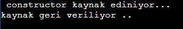

- Yukarıdakilerin 3 satırları da aynı anlamda. New char[1000] de neden ctor yok ? Çünkü bir sınıf nesnesi değil, doğal bir tür!

<a id="d10-s4"></a>
## Sınıfların Static Data Memberları

- Sınıfın statik veri elemanı öyle bir değişkenki, sınıf nesnesinin içinde tutulmuyor.
- Yani sınıf türünden nesne ile alakası YOK.
- Sınıfın statik veri elemanı sınıf başına tek olan bir nesne.
- Class’ı ilgilendiren bir variable, nesneyi ilgilendiren değil!
- Class scope’a tabî.
- Nerelerde kullanılır ?
  - Oyun programın da o an kaç tane oyuncu olduğu tüm sınıfı ilgilendiriyor.. Sayaçlar.. Bunlar statik mesela.
  - Tüm nesneler arasında ortak olan durum bilgilerini veya ayarları tutmak için kullanılır.
  - Bir sınıfla ilgili yardımcı işlevleri statik üye fonksiyon olarak tanımlayarak, sınıfın bir nesnesi oluşturmadan bu işlevlere erişim sağlayabiliriz.

**Örnek**:

```cpp
//myclass.h
class Myclass {
public:
	int a;  //her myclass nesnesinin bu elemanı farklıdır.
	int b; //her myclass nesnesinin bu elemanı farklıdır.
	static int x; //her myclass nesnesinin statik elemanları aynı.
	Myclass(): a(0), b(0)
	{

	}
};

//myclass.cpp
int Myclass::x = 250;

//main.c
int main()
{
	Myclass m1, m2;
	m1.a = 200;
	m1.x = 500; // m2.x de 500 oldu. Yani nesneye özel bir variable degil!
	cout << "m1.x = " << m1.x << "\n"; 	// 500
	cout << "m2.x = " << m2.x << "\n";	// 500
}
```

**Örnek**: Oyundaki toplam oyuncu sayısı

```cpp
class Warrior{
	string mPlayerName;
	int mPlayerHealth;
	int mPlayerAmmo;
	static int mPlayerCounter;
public:
	Warrior()
	{
		++Warrior::mPlayerCounter;
	}
	~Warrior()
	{
		--Warrior::mPlayerCounter;
	}
};

int Warrior::mPlayerCounter = 0;

int main()
{
	Warrior w1; //emir
	Warrior w2; //ali
	Warrior w3; //veli
}
```

[↑ İçindekiler](#icindekiler)

---

<a id="ders-13"></a>
# Ders 13

<a id="d13-s1"></a>
## Operator Overloading

- C++ dilinde tanımlı olan operatörlerin(+, -, *, =) bir sınıf için özel davranışlar sergilemesi amacıyla yeniden tanımlanmasına operatörlerin aşırı yüklenmesi denir.
- Bu, bir sınıfa özel anlamlar eklemek veya operatörlerin sınıf nesneleri üzerinde daha anlamlı şekilde çalışmasını sağlamak için kullanılır.
- Sınıfın kullanımını daha anlamlı ve kolay hale getirmek için kullanılır.

**Örnek:**
```cpp
string str1 = "mustafa";
string str2 = "topaloglu";
string str3 = str1 + str2; //OPERATOR OVERLOADING

if (str1 == str2) //OPERATOR OVERLOADING
```

- Operatörler, sınıfın bir üyesi olarak ya da sınıf dışı bir “friend” fonksiyon olarak aşırı yüklenir.
- Aşağıdaki operatörler overload edilemez;
  - :: (Scope Resolution)
  - . (member access)
  - .* (pointer to member access)
  - Sizeof (size operator)
  - Typeid

- Operator overloading, bir fonksiyon tanımlayarak gerçekleştirilir. Operatörün adı “operator” anahtar kelimesi ve ilgili operatör sembolü ile tanımlanır. Operator+, operator-, operator<<, operator== …
- Operatorun en az bir operandı sınıf türünden olması lazım.

**Örnek:**
```cpp
class Myclass{
public:
	bool operator>(Myclass x)const;
	Myclass& operator+(Myclass x);
};

int main()
{
	Myclass m1, m2;
	m1 + m2; //arka planda m1.operator+(m2) cagrisi yapiliyor.
	5 + m1 ; //**SYNTAX HATASI 5.operator+(m1) 5 sınıf degil!. Bunu global yapacagiz.**
}
```

- Arity, programlama fonksiyonunun ya da işleminin aldığı argüman sayısını ifade eder.
  - Unary : Tek operand alırlar: (++, --, !)
  - Binary : İki operand alırlar: (+, -, *, /)
  - Ternary : 3 operand alır ( ?: )

**Örnek :** Karmaşık Sayı
```cpp
#include <iostream>
using namespace std;

class ComplexNumber {
    int mReal, mImg;

public:
    // Constructor initializer list ":" ile başlar.
    ComplexNumber() : mReal{0}, mImg{0} {}

    ComplexNumber(int real, int img)
        : mReal{real}, mImg{img} {}

    void set(int r, int i)
    {
        mReal = r;
        mImg = i;
    }

    // Değer döndürdükleri için dönüş tipi int olmalı.
    int getReal() const
    {
        return mReal;
    }

    int getImg() const
    {
        return mImg;
    }

    // n1 + n2
    // Nesneleri değiştirmez, yeni nesne döndürür.
    ComplexNumber operator+(const ComplexNumber& r) const
    {
        ComplexNumber res;

        res.mReal = mReal + r.mReal;
        res.mImg  = mImg + r.mImg;

        return res;
    }

    // n1 += n2
    // Sol taraftaki nesneyi değiştirir.
    ComplexNumber& operator+=(const ComplexNumber& r)
    {
        mReal += r.mReal;
        mImg  += r.mImg;

        return *this;
    }

    // n1 + 5
    ComplexNumber operator+(int value) const
    {
        ComplexNumber res(*this); // Otomatik copy constructor çağrılır.

        res.mReal += value;

        return res;
    }

    bool operator==(const ComplexNumber& r) const
    {
        return mReal == r.mReal &&
               mImg  == r.mImg;
    }

    void display() const
    {
        cout << mReal << "+" << mImg << "i\n";
    }

    // 5 + n1 işlemini gerçekleştirecek global fonksiyona
    // private alanlara erişim izni veriyoruz.
    friend ComplexNumber operator+(
        int x,
        const ComplexNumber& r
    );
}; // Class tanımından sonra noktalı virgül zorunlu.

// Bu bir member function değil, global operator fonksiyonudur.
ComplexNumber operator+(int x, const ComplexNumber& r)
{
    ComplexNumber res;

    res.mReal = x + r.mReal;
    res.mImg  = r.mImg;

    return res;
}

int main()
{
    ComplexNumber n1(3, 5);
    ComplexNumber n2(6, 8);

    ComplexNumber res = n1 + n2;

    n1.display();
    n2.display();
    res.display();

    ComplexNumber s1(10, 20);
    ComplexNumber s2(20, 30);

    s1 += s2;
    s1.display();

    ComplexNumber cres = s1 + 5;
    cres.display();

    ComplexNumber c1(3, 4);
    ComplexNumber c2(6, 8);

    if (c1 == c2)
        cout << "c1 ve c2 esit\n";
    else
        cout << "c1 ve c2 esit degil!\n";

    (5 + c1).display();
}
```
<a id="d13-s2"></a>
## Global Operator Fonksiyonları (Friendlik Bildirimleri)

- s1+5 yapıyoruz ama 5+s1 yapamıyoruz. Çünkü 5.operator(s1) diye bir şey yok.
- Bu işlemi gerçekleştirmek için global alanda tanımlama yapmalıyız.
- Friendlik bildirimi ile sınıfın üye olmayan fonksiyonlarına, sınıfın private ve protected kısmına erişim verdiriyoruz.
- 3 farklı friendlik bildirimi var;
  - Global fonksiyona friendlik verebiliriz.
  - Bir sınıf, başka bir sınıfın üye fonksiyonuna friendlik verebilir.
  - Bir sınıfın bazı üye fonksiyonlarına friendlik verebiliriz.
- Friend fonksiyonlar, sınıfın üyesi değildir. Bu yüzden sınıf nesnesi olmadan çağrılabilirler.
- Friend fonksiyonlar, sınıfın veri kapsülleme ilkesine bir istisna getirir. Bu nedenle dikkatli kullanılmalıdır.
- Karşılaştırma operatör fonksiyonları genellikle global yazılır. Bunun yegane sebebi, sol operandın sınıf türünde olmama ihtimalidir.

**Örnek:**
```cpp
int func(int x)
{
	Myclass a;
	a.mx = 20;
	return 5;
}

class Myclass{
	int mx = 20;
public:
	friend int func(int); //myclass sınıfının bir fonksiyonu degil! Global fonksiyondur.
};
```

**Örnek:**
```cpp
class Myclass{
	int mx;
public:
	//friend Class A;
	friend void A::foo();
};

class A{
public:
	A() {}
	int func(int x)
	{
		return 5;
	}
	void foo()
	{
		Myclass Z;
		Z.mx = 20;
	}
};
```
- Karmaşık sayı örneğinde “yeşil” ile işaretli yerler bu konu işlendikten sonra yazıldı.
- Bazı nesnelerin STL kaplarında tutulabilmesi için operand<= veya operator== işlevlerinin bulunması gerekiyor.

[↑ İçindekiler](#icindekiler)

---

<a id="ders-14"></a>
# Ders 14

<a id="d14-s1"></a>
## Operator Overloading – Devam

- Binary search tree algoritmasında operator<’e ihtiyaç duyuluyor.
- Find algoritması da operator== var mı ona bakacak.
- Çift operandlılar dışarıda, tek operandlılar içeride tanımlanır.

**Örnek:** Counter Sınıfı
```cpp
#include <iostream>

using namespace std;

class Counter {
private:
    int mx{0};

public:
    Counter() = default;

    explicit Counter(int val)
        : mx{val}
    {
    }

    Counter& operator+=(int x);

    friend ostream& operator<<(ostream& os, const Counter& c);

    // Counter nesnesi değişeceği için c const olamaz.
    friend istream& operator>>(istream& is, Counter& c);

    friend bool operator==(const Counter& c1, const Counter& c2);
    friend bool operator!=(const Counter& c1, const Counter& c2);
    friend bool operator<(const Counter& c1, const Counter& c2);
    friend bool operator<=(const Counter& c1, const Counter& c2);
    friend bool operator>(const Counter& c1, const Counter& c2);
    friend bool operator>=(const Counter& c1, const Counter& c2);

    // Prefix increment: ++c1
    Counter& operator++()
    {
        ++mx;
        return *this;
    }

    // Prefix decrement: --c1
    Counter& operator--()
    {
        --mx;
        return *this;
    }

    // Postfix increment: c1++
    Counter operator++(int)
    {
        // Artırılmadan önceki değerin kopyasını oluştur.
        Counter temp{*this};

        // Asıl nesneyi artır.
        ++(*this);

        // Eski değeri döndür.
        return temp;
    }

    // Postfix decrement: c1--
    Counter operator--(int)
    {
        // Azaltılmadan önceki değerin kopyasını oluştur.
        Counter temp{*this};

        // Asıl nesneyi azalt.
        --(*this);

        // Eski değeri döndür.
        return temp;
    }
};

bool operator<(const Counter& c1, const Counter& c2)
{
    return c1.mx < c2.mx;
}

bool operator<=(const Counter& c1, const Counter& c2)
{
    return !(c2 < c1);
}

bool operator>(const Counter& c1, const Counter& c2)
{
    // c2, c1'den küçükse c1, c2'den büyüktür.
    return c2 < c1;
}

bool operator>=(const Counter& c1, const Counter& c2)
{
    return !(c1 < c2);
}

bool operator==(const Counter& c1, const Counter& c2)
{
    // Class dışı fonksiyon olduğu için sona const yazılmaz.
    return c1.mx == c2.mx;
}

bool operator!=(const Counter& c1, const Counter& c2)
{
    return !(c1 == c2);
}

Counter& Counter::operator+=(int x)
{
    mx += x;
    return *this;
}

// Inserter: cout << counter
ostream& operator<<(ostream& os, const Counter& c)
{
    return os << c.mx;
}

// Extractor: cin >> counter
istream& operator>>(istream& is, Counter& c)
{
    return is >> c.mx;
}

int main()
{
    // explicit olduğu için aşağıdaki kullanım hatalıdır:
    // Counter ival = 10;

    Counter c1;
    Counter c2{10};
    Counter c3{30};

    c3 += 30;

    cout << "c3: " << c3 << '\n';

    cout << "Bir Counter değeri giriniz: ";
    cin >> c1;

    cout << "Counter nesnesi: " << c1 << '\n';

    if (c1 == c2) {
        cout << "Esit\n";
    } else {
        cout << "Esit degil\n";
    }

    ++c1;
    --c1;

    return 0;
}
```
<a id="d14-s2"></a>
## String Sınıfı

- Metinleri yönetmek için kullanılan bir sınıftır.
- Bu sınıf C tarzı (char*) dizilerde yaşanan bellek yönetimi ve sınır problemlerini kolaylaştırmak amacıyla geliştirilmiştir.
- String, gerekli bellek yönetimini kendisi yapar. Kullanıcı bellek tahsisi veya serbest bırakma işlemleriyle ilgilenmez.
- Bir string nesnesi, metin uzunluğuna göre otomatik olarak büyüyebilir ya da küçülebilir. Dinamiktir!
- C tarzı dizilerin aksine, metin işleme için güçlü yöntemler ve operatörler sağlar.
- +, +=, ==, <, > gibi bir çok operatör, string üzerinde anlamlı bir şekilde çalışacak şekilde aşırı yüklenmiştir.

**Örnek:**
```cpp
string str; //default constructor.
cout <<"Yazi uzunlugu: "<<str.length();

string str2("emirhan"); //c string constructor. //direct initialization
cout <<"Yazi uzunlugu: "<<str2.length(); // 7

string str3 = "alican"; //c string  constructor. //copy initialization
string str4(str3); // copy constructor
```

**Örnek:**
```cpp
string str2("emirhan cam");
string str5(str2, 8); //cam --> substring constructor
string str6(str2, 8, 2); //ca --> substring constructor
string str7("samet", 3); //sam --> Sequence constructor
string str8(10, 'A'); // AAAAAAAAAA --> Fill Constructor.
string str9(move(str3)); // move constructor
string str9(str2.begin()+3, str2.end() ) ; //range constructor. iteratorler gorulunce daha anlamli olacak.
```

**Ornek:**
```cpp
string str1 = "emirhan";
string str2 = "cam";
str1 = str2 ; //copy assignment operator.
str2 = "Ali Kaya"; //copy assignment operator
```
- size ve length aynı işi yapıyor gibi. Ancak kapasite biraz farklı.
- Append işlevi;
```cpp
string name = "samet";
string surname = "akcalar";
name.append(surname); //name = sametakcalar oldu.
string fullname = "samet akcalar";
string company = "radikal yazilim";
company.append(fullname, 5);  //radikal yazilim akcalar
string str;
for(int i=0; i<100; ++i)
{
	str.append(1, 'A');
	cout<<"size : " << str.size() << "capacity: "<< str.capacity << "\n";
	// 0 15, 1-15 ... 15-15 16-31.... 31-31, 32-47 ... 47-47, 48-70 ... 1.5kat gibi artiyor.
}
```
- Vektor ve string sınıfları dinamik dizilerdir aynı zamanda.

[↑ İçindekiler](#icindekiler)

---

<a id="ders-15"></a>
# Ders 15

<a id="d15-s1"></a>
## String Sınıfı – Devam

**Reserve Metodu**
- String için bellekte önceden belirli bir kapasiteyi ayırmak amacıyla kullanılır.
- Bu, performans açısından faydalıdır çünkü stringe veri eklendikçe kapasiteyi artırmak için yeniden bellek tahsisi yapmak gerekebilir.

**Örnek:**

string str;

str.reserve(100000); //kapasiteyi pesin olarak ayarla dedik.

auto cap = str.capacity();

for(i=0; i<100000; ++i)

{

str+= 'A';

auto newCap = str.capacity();

if(newCap > cap) //Bu if'e girmeyeceğiz. Onceden reserve ettik cunku. 100000 olarak.

{

cout<<"New Capacity is " <<newCap <<"\n";

cap = newCap;

}

}

**Örnek**:

std::string s = "Merhaba";

std::cout << "Başlangıç kapasitesi: " << s.capacity() << std::endl;

// Bellekte kapasite artırılır

s.reserve(50);

std::cout << "Kapasite arttıktan sonra: " << s.capacity() << std::endl;

// Uzunluk hala aynı

std::cout << "Uzunluk: " << s.length() << std::endl;

**Element Access Fonksiyonları**

operator[]	: Yazının bir karakterine ulaşmanın yolu.

at		: Get character in string

back		: Access last character of string

front		: Access string first character

data		: Access data

**Örnek:**

string str = "samet akcalar";

char f = str.front();

cout << "Front : " << f; //s

char b = str.back();

cout << "back : " << b; //r

for(size_t i = 0; i<str.size(); ++i)

cout << str[i] <<" "; // s a m e t  a k c a l a r

**Örnek:**

const string str2 = "samet akcalar";

str2[2] = 'X' ; //syntax hatasi. Cunku Const!

**Örnek:**

str.at(3) = 'X' ; //karakteri degistiriyor.

for(size_t i = 0; i<str.size(); ++i)

cout << str.at(i) <<" "; // s a m X t  a k c a l a r

**Örnek:**

string str = "Hello";

char* rawData = str.data(); //Modern C++ da bu tercih edilir.

rawData[0] = 'Y'; // String değiştirilebilir.

cout << str; // "Yello"

**Örnek: empty**

string str;

if (str.empty())

cout << "String boş\n";

**Örnek: clear**

string str = "Hello";

str.clear();

cout << "String boş mu? " << str.empty(); // true

- begin() ve end(), bir stringin(container) içinde konum gösteriyor.

**Örnek:**

string str{"0123456789ABCDEF}; //uniform initializer

for(auto iter = str.begin(); iter!=str.end() ; ++iter)

cout << *iter << " "; // 0 1 2 3 4 5 6 7 8 9 A B C D E F

- substr, bir stringin belli bir yerden alıp kullanma isidir. Yazının tamamını almak için str.substr(0) yapılır ama bunu yapmaya gerek yok. Copy constructor kullanılır bu tarz işlemler için.

**Örnek**:

string str{ "Samet Akcalar Radikal Yazilim" };

string newString = str.substr(6) ;

cout<< newString; //Akcalar Radikal Yazilim

string newString2 = str.substr(0, 3);

cout<< newString2; //Sam
- c_str : get C string equivalent. c_str ile normal bir string farklı anlamlarda;

const char* cs = "samet akcalar"; // C String. Bunun sonunda null karakter var.

string str = "samet akcalar"; // Normal string. Bunun sonunda null karakter yok.

const char* cs2 = str; //SYNTAX HATASI. BOYLE BIR DONUSUM YOK.

- Bu dönüşümü yapmanın bir yolu var;

string str{ "samet akcalar" };

char s[100];

strcpy( s, str.c_str() );

puts(s); //samet akcalar

- Reserve fonksiyonu kapasiteyi değiştiriyordu, **resize** ise containerde kullanılan öğelerin sizeını değiştiriyor.

**Örnek**:

string str = "Hello";

cout << "Before resize: " << str << " (size: " << str.size() << ")\n"; //Hello 5

// Uzunluğu 10'a genişlet

str.resize(10);

cout << "After resize: " << str << " (size: " << str.size() << ")\n"; //Hello     10

**Örnek**:

string str{ "samet" };

cout << str.size() << "\n" ; // 5

//str.resize(50);

//cout << str.size() << "\n" ; // 50 Yazıyı null charakterler ile buyuttu. samet+(45 tane space)

//str.resize(50, '*');

//cout << str; //samet (45 tane *)

str.resize(3):

cout << str; //sam --> son 2 karakter gitti.

| Özellik | Size | Capacity |
| --- | --- | --- |
| Anlam | Stringin şuanki uzunluğu | Bellekte string için ayrılan kapasite |
| Dinamik Davranış | Karakter eklenip çıkarıldıkça değişir | Kapasite dolduğunda artırılır (2x) |
| Kullanım Amacı | String uzunluğunu öğrenmek | Perf. optimizasyonu ve kapasite yönetimi |
| Varsayılan Değer | Boş string için 0 | Boş string için küçük bir başlangıç değeri ( 15 gibi) |
| Manuel Kontrol | Kontrol edilmez | Reserve, shrink_to_fit ile kontrol edilebilir. |

**Stringlerde Karşılaştırma İşlemleri**

==	Eşit mi?			"abc" == "abc" → true

!=	Eşit değil mi?		"abc" != "xyz" → true

<	Daha küçük mü?	"abc" < "xyz" → true

\>	Daha büyük mü?	"xyz" > "abc" → true

<=	Küçük veya eşit mi?	"abc" <= "abc" → true

\>=	Büyük veya eşit mi?	"xyz" >= "abc" → true

**Örnek:**

string str1 = "samet";

string str2 = "akcalar";

str1.compare(str2); //strcmp gibi.

**Örnek:**

string str1 = "apple pie";

string str2 = "apple";

int result = str1.compare(0, 5, str2); // İlk 5 karakteri karşılaştır

**Örnek:**

string str1 = "akcalar";

string str2 = "samet akcalar";

auto res = str2.compare(6, 3, str1, 0, 3); //akc ile akc karsilastiriliyor.

//str2'de 6.karakterden ba slayarak 3 karakter alınır.

//str1'in de 0.karakterinden baslayarak 3 karakter alınır.

if(res == 0)

cout << "esit" ;

else

cout << "esit degil";

**Stringlerde Arama Fonksiyonları**

| find | İlk eşleşmeyi bulur (soldan sağa) |
| --- | --- |
| rfind | İlk eşleşmeyi bulur (sağdan sola) |
| find_first_of | Belirtilen karakterlerden ilk geçen konumu bulur |
| find_last_of | Belirtilen karakterlerden son geçen konumu bulur |
| find_first_not_of | Belirtilmeyen karakterlerden ilk geçen konumu bulur |
| find_last_not_of | Belirtilmeyen karakterlerden son geçen konumu bulur. |

- Eğer aranan karakter veya substring bulunamazsa, tüm bu fonksiyonlar std::string::npos döner.

**Örnek:**

string str="cpp is the best programming language in the world. \n";

str.find('t') ;

if(res == string::npos)

cout << "aranan karakter yok";

else

cout <<"aranan karakter var ve index : " << res;  //7

**Örnek:** Kaç tane i var ?

string str = "cpp is the best programming language in the world. \n";

char target = 'i';

size_t pos = 0;

int count = 0;

// find fonksiyonu ile tüm i leri bul.

while ( (pos = str.find(target, pos) ) != string::npos)

{

count++;

pos++; // Bir sonraki karakterden itibaren ara. Buldugumuz yerden bir daha aratacaz.

}

cout << "String içerisindeki '" << target << "' harflerinin sayısı: " << count << endl;

**Örnek:** Stringin yerini bulup * ile degistirmek

string str = "bugun hava cok guzel";

size_t found = str.find_first_of("aeiou") ; //bu karakterler var mı ?

while(found != string::npos)

{

str[found] = '*';

found = str.find_first_of("aeiou", found + 1);

}

cout << str << "\n"; // b*g*n h*v* c*k g*z*l ;

**Örnek:**

string str = "kar";

cout << str << "\n"; //kar

str += "han"; //karhan

cout << str << "\n";

str.push_back('X'); //karhanX

cout << str << "\n";

str.append(5, 'L');

cout << str << "\n"; //karhanXLLLLL

string name("akarsu");

str.append(name, 2, 3); karhanXLLLLLars

**Örnek:**

string str2 = "0123456789";

//str2.insert(3, "irem"); //012irem3456789

//str2.insert(0, 5, 'A'); // AAAAA0123456789

//str2.insert( str2.size() / 2, 5, 'A'); //ortasına 5 tane A ekler.

//str2.insert(str2.begin(), 'X') ; //X012345789

//str2.insert(str2.begin()+3, 'X') ; //012X345789

//str2.insert(3, 'X') ; SYNTAX HATASI!. iteratorlerde begin end kullanılır. X bir char deger!

str2.assign("abcd", 2); //ab

**Silme İşlemleri**

**Örnek:**

string str = "0123456789";

//str.erase(5); //01234

//str.erase(1, str.size()-2); //09

// str.erase(str.begin() + 1, str.end() -1 ) ; //09

// str.erase() ; //stringi tamamen siler ama oyle bir nesne halen durmaya da devam eder.

// str.erase(str.begin() ; //ilk karakter silinir sadece. 123456789

[↑ İçindekiler](#icindekiler)

---

<a id="ders-16"></a>
# Ders 16

<a id="d16-s1"></a>
## String Sınıfı – Devam

- **Getline** , bir giriş akışından (cin veya dosya girişi) bir satırı okuyarak stringe yerleştiren işlevdir.
- **Replace**, bir stringin belirli bir kısmını başka bir string veya karakterlerle değiştirmek için kullanılır.

**Örnek: Girilen string içindeki bir yeri c++ ile değiştirmek.**

string str;

cout<<"bir yaazi giriniz : " ;

getline(cin, str);

cout<<str;

string skey;

cout <<"\n bir sozcuk giriniz:";

cin >> skey;

auto idx = str.find(skey);

if(idx != string::npos)

{

str.replace(idx, skey.size(), "c++");

cout << "Degistirme islemi yapildi: " << str << "\n";

}

else

cout << "aranan bulunamadi \n”;

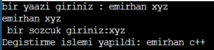

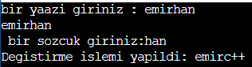

- **shrink_to_fit**, kapasite değerini düşürmek için kullanılır. Tersi reserve metodudur.

**Örnek:**

strint str;

str.reserve(100000);

cout << "capacity:"<< str.capacity();  //100015

str.shrink_to_fit();

cout << "capacity after: "<< str.capacity(); //15

- **at()** ile ilgili bir not;

string str = "samet"; //5 diye bir yer yok.

str.at(5); //program patladı. Hata isleme konusunda exception konusunu gorecegiz. Runtime hatasi.

str[5]; //burada exception fırlatılmıyor. Yukaridakinde ise hata alıyoruz runtime da!.

- **to_string(x),** girilen girdiyi stringe çevirmek.  **stoi()** de atoi gibi.

string str;

cout << "bir yazi giriniz : ";

cin >> str; //256

int ival = stoi(str);

cout << ival; //256

int x = 200;

string str2 = to_string(x);

<a id="d16-s2"></a>
## Algorithm Başlık Dosyası

- `<algorithm>` başlık dosyası, STL(Standart Şablon Kütüphanesi) içerisindeki birçok genel amaçlı algoritmayı içerir.
- Bu algoritmalar, dizi, vektör, liste gibi STL kapsayıcıları üzerinde çalışabilir ve sıralama, arama, dönüşüm, birleştirme gibi çeşitli işlemleri kolayca yapmamızı sağlar.
- Yani, türü ne olursa olsun, buradaki fonksiyonlar koşturulabiliyor. İşin güzel tarafı da bu zaten.
- STL konusunda daha detaylı göreceğiz.

**Örnek:**

string str;

cout << "bir yazi giriniz:" ;

getline(cin, str); //samet akcalar

reverse( str.begin(), str.end() );

cout << str ; //ralacka temas

**Örnek:**

`vector<int>` ivec{ 2,4,6,8,10 };

reverse(ivec.begin(), ivec.begin() );

for(auto i: ivec)

cout << i << " "; //10 8 6 4 2

**Örnek:**

string str;

cout << "bir yazi giriniz:" ;

getline(cin, str); //samet

sort(str.begin(), str.end());

cout << str; //aemst

<a id="d16-s3"></a>
## initializer_list

- initializer_list bir sınıftır. Bu sınıf, bir liste başlatıcısı oluşturmak için kullanılır.
- Bu sınıf, sabit uzunlukta bir dizi şeklinde elemanlarını sağlar ve bir kapsayıcı veya fonksiyon için birden çok elemanı tek bir ifadede sağlamayı mümkün kılar.
- Sabit bir diziye benzer şekilde çalışır, eleman sayısı ve türü statik olarak belirlenir.
- Derleyici arka planda kopyalama semantiğine kapanmış const bir dizi oluşturuyor.

**Örnek:**

`initializer_list<int>` x = { 2,4,6,8,10 }; //bu listeye artık oge ekleme sansimiz yok!

cout << x.size(); // 5

for(auto iter = x.begin(); iter != x.end(); ++iter )

cout <<*iter << " " ; //2 4 6 8 10 iter adres belirtiyor *ile kullaninca o nesneyi verecek.

**Örnek:**

void `func(initializer_list<int>` x)

{

cout << "func fonksiyonuna gelen listede oge sayisi :" << x.size() << "\n";

for(auto val:x)

cout << val << " ";

}

int main()

{

`initializer_list<int>` x = { 2,4,6,8,10 };

func(x); //oge sayisi 5,  degerler 2 4 6 8 10

func( {1,3,5,7,9,11} ); //boyle de kullanilabilir.

}

- Daha çok parametreleri constructorlarda kullanılıyor.

`vector<int>` ivec{2,4,6,8,10}; //initializer list parametreleri constructor cagiriliyor.

- Değişken sayıda bir fonksiyona arguman gerçemizi, bir constructora değişken sayıda arguman geçmemizi sağlıyor.

**Örnek:**

class Student {

string m_name;

string m_sname;

`vector<int>` m_vec; //notları tutan vector

public:

Student() = default;

Student(string name, string sname, `initializer_list<int>` grade_list) : m_name{name}, m_sname{sname}, m_vec{grade_list}

{}

void display() const

{

if(m_name.empty())

cout << "ogrencinin ismi henuz belli degil \n";

else

cout << "ogrencinin adi : "<<m_name << "\n";

if(m_sname.empty())

cout << "ogrencinin soyadi henuz belli degil \n";

else

cout << "ogrencinin soyadi : "<<m_sname << "\n" ;

if(m_vec.empty())

cout << "ogrenci henuz herhangi bir sinava girmedi \n";

else

{

cout << "Notlar: \n";

for(auto g:m_vec)

cout << g <<" ";

}

}

};

int main()

{

Student s1{"samet", "akcalar", {98,48,100} };

s1.display();

Student s2{"kubra", "yildiz", {5,27,0} };

`vector<Student>` allStudents{ s1, s2}; //vectorun initializer list constructoru cagirilyior.

string str{'T', 'B', 'B', 'M'} ; //stringin parametreleri ctor'unda char initializer_listimis.

}

**Örnek**:

class A{

public:

A(int x)

{

cout << "A(int x) x=” << x <<"\n" ;

}

`A(initializer_list<int>` x)

{

cout << `"initializer_list<int>` ctor" << "\n";

cout << "size:" << x.size() << "\n";

for(auto val : x)

cout << val << " ";

}

};

int main()

{

A a(12); //tek parametreleri ctor.

A b{ 25 }; //initializer_list ctor. Eger bu olmasaydi tek parametreli de cagrilirdi ama..

A c{ 25,35} ; //initializer_list ctor

A ma = 25; //explicit olmadıgından bu atama yapilir. Tek parametreli ctor.

}

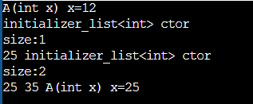

<a id="d16-s4"></a>
## Type Members

- Sınıfların, şablonların veya STL yapıların içinde tanımlanan tür isimleridir.
- Bunlar, bir sınıfın içinde özel bir türü temsil eder ve bu türleri kod içinde daha okunabilir ve esnek bir şekilde kullanmamızı sağlar.
- Amacı, tür bağımsız kod yazmayı sağlamak, kod okunabilirliğini artırmak ve karmaşlık tür ifadelerini soyutlaştırmak.

**Örnek:**

class String{

public:

typedef size_t size_type;

};

int main()

{

string::size_type x;

}

**Örnek:**

typedef int BOOL; //herkese acik, file scope

typedef uint8_t Byte; //herkese acik , file scope

class Myclass{

public:

typedef int Word; //class scope. Nested Type (Type Member) denir bunlara. Sınıf ismiyle niteleyecegiz..

using Myword = int; //yukaridakiyle asagidaki ile hic bir farki yok. C++ yazilimcileri using kullanir genelde.

};

int main()

{

BOOL mystate;

//Word x; //Hata! Class Scope'a tabi. Sınıf disi kullanilmaz.!

Myclass::Word x; //Bu dogru kullanim..

}

- string::npos 🡪 public static member constanttır. Bir member type değildir!
- using bildirimi illa sınıf içi yapılacak bir kural yok. Sınıf dışı da yapılabilir.

**Örnek**:

**using** StringVector = std::vector<std::string>; // `std::vector<std::string>` için bir takma isim.

int main() {

**StringVector** names = {"Ahmet", "Mehmet", "Ayşe"};

for (const auto& name : names) {

std::cout << name << std::endl;

}

return 0;

}

**Örnek**: Tür alliasını sınıf içinde de kullanabiliriz;

class MyClass {

**public**:

using StringVector = `std::vector<std::string>;` // Tür alias'ı

void addName(const std::string& name) {

names.push_back(name);

}

void printNames() const {

for (const auto& name : names) {

std::cout << name << std::endl;

}

}

**private**:

StringVector names; // Tür alias'ı burada kullanıldı

};

<a id="d16-s5"></a>
## Namespace (İsim Alanı)

- İsim çakışmalarını önlemek ve kodu daha düzenli hale getirmek için kullanılan bir yapılandırma aracıdır.
- Farklı projelerde veya kütüphanelerde aynı isimlerin kullanılmasını kontrol altına almak amacıyla bir kapsam oluşturur.
- Bir isim kümesi oluşturur ve bu isimlerin yalnızca o kümede geçerli olmasını sağlar.
- getLength(x) 🡪 a.h ‘dan gelsin

getLength(x) 🡪 x.h ‘dan gelsin

Bu durumda bir isim çakışması olur.

- Global alanda farklı header dosyalarından gelen headerlerlardaki isimlerin çakışmasını engellemek için namespace kullanılır.

**Örnek:**

namespace Samet {

//diger isimlerle cakismasini engelleyecek ayri bir bolge olusturulmus.

int x = 10;

double y = 20.5;

}

namespace Custom{

int x = 200; //samet icindeki x ile hic bir alakasi yok.

int y = 300;

}

using namespace Samet; //artık Samet::x yazmaya gerek yok. Direkt x yazabiliriz.

//using namespace Custom; //ambigious call x ve y icin. Kullanmaya kalkısırken Customdaki mi Sametteki mi ?

int main()

{

//x = 20; //SYNTAX HATASI. Bu tanimi gormuyor.

//Samet::x = 20; // DOGRU. bu x ismi, samet namespace inde araniyor.

std::cout << "samet: " << Samet::x << "\n" ; //10

std::cout << "custom: " << Custom::x << "\n" ; //200

}

**Örnek:**

namespace Samet{

int cout = 10;

}

using namespace std; //buradan da cout gelecek.

using namespace Samet; //burada da cout var.

int main()

{

//cout = 20; //ambigious call!!

Samet::cout = 20; //sıkıntı yok.

}

- Kısaca her :: operatoru gördüğümüzde sınıf dememek gerekiyor. Namespace de olabilir.
- iç içe namespaceler de olabiliyor.

[↑ İçindekiler](#icindekiler)

---

<a id="ders-17"></a>
# Ders 17

<a id="d17-s1"></a>
## Namespace – Devam & ADL Akronimi

**Örnek :**

namespace Samet{

int x = 20;

int y = 30;

void foo();

}

int main()

{

Samet::x = 30;

}

**Örnek:**

namespace Samet{

int x = 20;

int y = 30;

void foo();

}

using Samet::y;

using Samet::foo;

int main()

{

y++;

//x++; //syntax hatasi. Bunu kullan dememişiz!

}

- ADL(Arguman Depent Lookup) Akronim
  - Bir işlevi veya bir operatörü çağırırken, işlev veya operatörün bulunduğu operatörün namespaceini otomatik olarak belirlemek için kullanılır.
  - Eğer bir fonksiyona gönderilen argüman bir namespace içinde tanımlanan sınıflardansa bu durumdur.
  - Bu durumda, bu fonksiyonun ismi, normal arandığı yerlerin yanı sıra o namespace içinde de aranır.
  - Yani argüman olan ifadenin ait olduğu sınıfın namespace içinde aranır.

**Örnek:**

namespace Samet{

class Myclass{

};

void func();

void foo(Myclass x);

}

int main()

{

Samet::func();

Samet::Myclass m;

foo(m); **//ADL. Argumani olan sınıf nesnesi samet namespace inde yer alıyor.**

}

<a id="d17-s2"></a>
## INHERITANCE (Kalıtım)

- Kalıtım, bir sınıfın özelliklerini ve davranışlarını miras almasını sağlayan bir nesne yönelimli programlama kavramıdır.
- Kalıtım, yeniden kullanılabilrliği artırmak ve kod tekrarını azaltmak için kullanılır. Anahtar mantığı şudur;
  - Ortak özellikler ve işlevler bir üst sınıfta (base, parent) tanımlanır.
  - Alt sınıflar(derived, child) bu özellikleri ve işlevleri miras alır ve gerekirse bu işlevleri özelleştirebilir (override edebilir).
- Bu, bir nesne yönelimli hiyerarşi oluşturmayı mümkün kılar.
- A diye bir sınıf var. Amacımız başka bir sınıf elde etmek; ama elde ettiğimiz yeni sınıf A'nın interfacesini tamamen alacak.
- B sınıfı, A sınıfından kalıtılırsa A gibi kullanılacak B sınıfı elde ettik.
- Syntax olarak;

class Base {

...

};

class Der: public Base {

...

};

- Kalıtımın amacı, sınıflar arasındaki ortak davranışları ve özellikleri bir taban sınıfta toplamak ve bu özellikleri türemiş sınıflar arasında paylaşmaktır.

class Car {

...

};

class Mercedes :Car { //Buradaki mercedes sınıfı, car sınıfının interfaceini aldı.

...

};

//Mercedes sınıfını, car sınıfından türettik. Buna inheritance deniyor.

class Bmw :Car {

...

};
- “is a relation” : Bir varlığın aynı zamanda başka bir türden varlık olarak görülmesini sağlayan yaklaşım.
- Her mercedes bir arabadır. Buna is a relation ilişkisi deniyor. Ama her araba mercedes değildir!!

**Örnek:**

class Car{

public:

void start();

void stop();

void run();

};

class Mercedes : public Car {

public:

void open_sunroof();

void close_sunroof();

};

int main()

{

Mercedes a200; //kendi interfacei + üretilmis olduğu base sınıfının özeliklerine sahip.

a200.start();

a200.run();

a200.open_sunroof();

a200.close_sunroof();

a200.stop();

}

- Bir hiyerarşı düşünelim;

Animal → Genel özellikleri içerir.

Mammal → Animal'dan türetilmiş, memelilere özgü özellikleri içerir.

Dog → Mammal'dan türetilmiş, köpeklere özgü özellikleri içerir.

**Örnek:**

// Taban sınıf

class Animal {

public:

void eat() {

cout << "This animal eats food." << endl;

}

};

// Türemiş sınıf (Animal'dan türetiliyor)

class Mammal : public Animal {

public:

void breathe() {

cout << "This mammal breathes air." << endl;

}

};

// Daha alt türemiş sınıf (Mammal'dan türetiliyor)

class Dog : public Mammal {

public:

void bark() {

cout << "The dog barks." << endl;

}

};

int main() {

Dog dog;

// Tüm seviyelerden miras alınan işlevler kullanılabilir

dog.eat();     // Animal'dan

dog.breathe(); // Mammal'dan

dog.bark();    // Dog'dan

return 0;

}

- Kalıtımda taban sınıfın private bölümü sadece kendisine açıktır. (public inheritance varsayarsak)

**Örnek:**

class Car{

int mx;

public:

void start();

void stop();

void run();

protected :

int ma; //SADECE TURETILMIS SINIFLAR ERISEBILIR.

};

class Mercedes : public Car {

int my;

public:

//mx = 20; //syntax hatası. Base sınıfın private memberi

ma = 300; //HATA YOK.

void open_sunroof();

void close_sunroof();

};

int main()

{

Mercedes a200;

//a200.ma = 500 ; //HATA!!

}

- Protected memberlar, client kodlara kapalı (main kısma) ancak o sınıftan türetilenlere açıktır.
- Türemiş sınıfın clientlarının (a200), base sınıfın protected bölümüne erişimi yok (a200.ma)
- Türemiş clientlar türemiş sınıfın kendi implementasyonuna erişebilir.
- Bir sınıfta protected varsa KESİN kalıtılmıştır.

- **Upcasting**, bir türetilmiş sınıf nesnesini taban sınıf türüne dönüştürmek anlamına gelir. Bu işlem genellikle otomatik olarak yapılır ve güvenlidir. Türetilmiş sınıf, taban sınıfın tüm özelliklerini içerdiği için, türetilmiş sınıfın bir taban sınıf referansına veya pointerına atanması mümkündür.

**Örnek:**

class Base {

...

};

class Der : public Base {

...

};

int main()

{

Der myder;

Base* ptr = &myder; //turemis sınıftan taban sinifa bir donusum yapiliyor. (UPCASTING)

//**upcasting, referans ya da pointer yoluyla yapilir!**

Base &r = myder; //burada da upcasting var.

Base mybase = myder; // gecerli ama yanlis kullanim..

Base mybase2;

Der myder2;

//myder2 = mybase2 : // Bu direkt hata! downcasting . Kabul edilebilir bir sey değil. Mercedes'e Car atamak gibi bir sey bu. Her araba bir mercedes mi ???????

}

**Örnek:**

class car{

};

class Mercedes : public Car{

};

void f1(Car c);

void f2(Car* cptr);

void f3(Car& r);

int main()

{

Mercedes mymerco;

f1(mymerco); //upcasting ama kötü bir kullanımdır bu. **object slicing** e neden oluyor. ileride görücez.

}

- İsim arama önce türemiş sınıf, orada bulamazsa base sınıf. Herkesin scope’u da kendine ☺

**Örnek:**

class Base{

public:

void foo()

{

std::cout << "base::foo cagrildi \n";

}

};

class Der :public  Base {

public:

void foo()

{

std::cout << "der::foo cagrildi \n";

}

};

int main()

{

Der myder;

Der* ptr = &myder;

ptr->foo(); //der::foo cagrildi. Der de olmasaydi base de bulacakti.

}

- Yukarıdaki örnekte basedeki double argüman, der’deki int argüman alsın. Mainde de double ile çağrılsaydı yine Der’deki intli olan çağrılırdı. Önce nerede bulduysa!
- Function overloading yoktur, scope’ları farklı çünkü.

**Örnek:**

class Base{

public:

static void func()

{

std::cout << "static";

}

};

class Der :public Base{

public:

void func() //HATA

{

std::cout << "non static";

}

};

int main()

{

Der::func(); //HATA

}
- Burada derleme hatası var. Static data memberların nesneye ihtiyacı yoktur!! (Eski konularda geçiyor bu not)
- Bu fonksiyon, sınıfın bir örneğine gerek duymadan çalışabilir.
- Statik fonksiyonlar doğrudan sınıf adı ile çağrılır ancak derived class üzerinden çağrılmak istendiğinde sorun yaşanır.
- Sizeof’lara bakalım;

class Base{

int x, y;

public:

};

class der : public Base{

int a, b;

public:

};

int main()

{

Base mybase;

Der myder;

std::cout << "sizeof(Mybase):: " << sizeof(mybase) << std::endl; //8

std::cout << "sizeof(Myder):: " << sizeof(myder) << std::endl; //16

}

- Her der nesnesi hayata geldiğinde base’de geliyor. Der ölünce base de ölüyor.
- Önce base sınıf, sonra türetilmiş sınıf üretilecek. Yani önce base’in constructoru, sonra der’in constructoru çağrılacak.

**Örnek:**

class Base{

int x, y;

public:

Base()

{

std::cout <<"base constructor cagrildir \n";

}

};

class Der : public Base{

public:

Der()

{

std::cout << "der ctor cagrildi \n";

}

};

int main()

{

Base mybase; //sadece base ctor

der myder; //base ctor + der ctor

}

**Örnek:** Default constructor yerine parametreli olani çağırmak için özel bir çağırma yöntemi yapılmalı

class Base{

int x, y;

public:

Base()

{

std::cout <<"base constructor(def) cagrildir \n";

}

Base(int x)

{

std::cout <<"base constructor(int) cagrildir \n";

}

};

class Der : public Base{

public:

Der() :Base(5)

{

std::cout << "der ctor cagrildi \n";

}

};

int main()

{

der myder; //base ctor(parametreli) + der ctor

}

- Destructorlarına bakalım;

class Base{

int x, y;

public:

Base()

{

std::cout <<"base constructor(def) cagrildir \n";

}

Base(int x)

{

std::cout <<"base constructor(int) cagrildir \n";

}

~Base()

{

std::cout << "Base desttor cagrildi \n";

}

};

class Der : public Base{

public:

Der() :Base(5)

{

std::cout << "der ctor cagrildi \n";

}

~Der()

{

std::cout << "der desttor cagrildi \n";

}

};

int main()

{

der myder; //base ctor(parametreli) + der ctor + Der destructor + Base destructor

}

- Daha sonra hayata gelen nesne ilk ölür. Bunu destructor konusunda da demiştik.. ☹

[↑ İçindekiler](#icindekiler)

---

<a id="ders-18"></a>
# Ders 18

<a id="d18-s1"></a>
## Inheritance – Devam

- Copy constructor ve copy assignment durumlarına bakalım;

**Örnek:**

class Base{

int mx, my;

public:

Base() = default;

Base(const Base &r)

{

std::cout << "Base copy ctor cagrildi \n";

}

Base& operator=(const Base& r)

{

std::cout << "base copy assignment \n";

mx = r.mx;

my = r.my;

return *this;

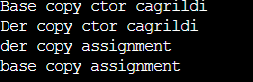

}

};

class Der :public Base{

int da;

public:

Der() = default;

Der(const Der &r):Base(r), da(r.da)

{

std::cout << "Der copy ctor cagrildi \n";

}

Der& operator=(const Der& r)

{

std::cout << "der copy assignment \n";

Base::operator=(r); //call base class assignment operator

da = r.da;

return *this;

}

};

int main()

{

Der der1;

Der der2(der1); //copy constructor, once base, sonra der

der2 = der1; //copy asignment, önce der sonra base

}

<a id="d18-s2"></a>
## Runtime Polymorphism

- Runtime polymorphism, bir nesnenin çalışma zamanı sırasında hangi işlevin çağrılacağına karar verilmesini ifade eder.
- Bu genellikle virtual functions ve function overriding ile gerçekleştirilir.
- Runtime polymorphism, c++ da dynamic dispatch(dinamik yönlendirme) mekanizması ile uygulanır.
- Runtime polymorphism için gerekli şartlar:
- **Virtual Functions (Sanal Fonksiyonlar)**

\- Taban sınıfta bir işlev virgual olarak tanımlanırsa, türetilmiş sınıflar bu işlevi yeniden tanımlayabilir. (override)

\- İşlevin çalışma zamanında çağrılacak versiyonu, nesnenin türüne değil, işaretçi veya referansın türüne bağlıdır.

- **Function Overriding(İşlevin Yeniden Tanımlanması)**

\- Türetilmiş sınıf, taban sınıftaki sanal bir işlevi aynı imzayla yeniden tanımlayabilir.

- **Base Class Pointer veya Reference**

\- Runtime polymorphism, taban sınıfın bir pointer veya referansı üzerinden türetilmiş sınıfın davranışlarına erişim sağlar.

class Airplane{

public:

void takeoff(); //1.kategori. turemis sinirlara hem interface hemde implementasyon veriyor.

virtual void land(); //2.kategori. interface veriyor, def implementasyon veriyor.

virtual void fly() = 0; //3.karegori. yalnizca interface veriyor.

};

- En az 1 tane virtual fonksiyonu olan sınıflara **polimorfik sınıf** denir.
- Eğer bir sınıfın en az 1 tane pure virtual fonksiyonu varsa (0 a eşitlenen) buna **abstract class** denir.
- Abstract class için, bu sınıftan bir nesne oluşturamayız!

**Örnek:**

class Airplane{ //polymorfik sinif, ayni zamanda abstract sinif

public:

void takeoff(); //1.kategori. turemis sinirlara hem interface hemde implementasyon veriyor.

virtual void land(); //2.kategori. interface veriyor, def implementasyon veriyor.

virtual void fly() = 0; //3.karegori. yalnizca interface veriyor.

};

int main()

{

//Airplane boeing230; **//SYNTAX HATASI. cannot instantiate abstract class.**

}

**Örnek:**

class Airplane{ //polymorfik sinif

public:

void takeoff(); //1.kategori. turemis sinirlara hem interface hemde implementasyon veriyor.

virtual void land(); //2.kategori. interface veriyor, def implementasyon veriyor.

};

int main()

{

Airplane boeing230; //SYNTAX HATASI YOK.

}

**Örnek:**

class Airplane{ //polymorfik sinif, ayni zamanda abstract sinif

public:

void takeoff(); //1.kategori. turemis sinirlara hem interface hemde implementasyon veriyor.

virtual void land(); //2.kategori. interface veriyor, def implementasyon veriyor.

virtual void fly() = 0; //3.karegori. yalnizca interface veriyor.

};

class Boeing :public Airplane{

public:

};

int main()

{

//Airplane a1; // **SYNTAX HATASI!** abstract class oldugu icin nesne olusturulamaz.

//Boeing b250; // **SYNTAX HATASI!** Taban sinifi abstract class oldugu icin, kalitim yoluyla elde edilen yeni tur 3.kategoriyi override etmezse o da abstract class olur!!!! Yani flyini kendin tanimlaman lazim.

}

**Örnek:**

class Airplane{ //polymorfik sinif, ayni zamanda abstract sinif

public:

void takeoff(); //1.kategori. turemis sinirlara hem interface hemde implementasyon veriyor.

virtual void land(); //2.kategori. interface veriyor, def implementasyon veriyor.

virtual void fly() = 0; //3.karegori. yalnizca interface veriyor.

};

class Boeing :public Airplane{

public:

void fly()override //override yazmasan da olur ama, yazmak daha iyi.

{

std::cout <<"fly \n";

}

void land()override  //bunu da biz yazalim. Yazmasaydik base siniftan gelecekti.

{

std::cout <<"land \n";

}

};

int main()

{

Boeing b250; // Hata yok.

b250.takeoff(); //airplane takeoff

b250.fly(); //boeing fly

b250.land(); //boeing land

}

**Örnek: Rastgele arabalar geldikçe start fonksiyonu çağrılıyor ama tofaş için basedeki çalışıyor. Diğer arabalar kendi startlarını çağırıyor. Hangi fonksiyonun çağrıldığı runtime da belli oluyor.**

class Car{

public:

virtual void start()

{

std::cout <<"car engine has started \n";

}

};

class Mercedes:public Car{

public:

void start()override

{

std::cout <<"Mercedes engine has started \n";

}

};

class Audi:public Car{

public:

virtual void start()override

{

std::cout <<"Audi engine has started \n";

}

};

class A3:public Audi{

public:

};

class Bmw:public Car{

public:

void start()override

{

std::cout <<"Bmw engine has started \n";

}

};

class Togg:public Car{

public:

void start()override

{

std::cout <<"Togg engine has started \n";

}

};

class TofASK:public Car{

public:

};

**void carGame(Car* p) //pointer ile yapabiliriz.**

**{**

**p->start();**

**}**

**void carGame2(Car& p) //reference ile yapabiliriz.**

**{**

**p.start();**

**}**

//Yukaridakik iki fonksiyonu duz yapcaydık hep "car engine has started" yazardi. Object slizing..

// void carGame3(Car p) olsaydı sanallik devreye girmez! OBJECT SLICING!

int main()

{

srand(static_cast<unsigned int>(time(nullptr)));

for(;;)

{

switch ( rand() % 6 )

{

case 0:

std::cout <<"mercedes.... \n";

carGame(new Mercedes);

//carGame2(*new Mercedes);

break;

case 1:

std::cout <<"Bmw.... \n";

carGame(new Bmw);

//carGame2(*new Bmw);

break;

case 2:

std::cout <<"TofASK.... \n";

carGame(new TofASK); --> DIKKAT car sinifindaki cagrilir.

//carGame2(*new TofASK);

break;

case 3:

std::cout <<"Audi.... \n";

carGame(new Audi);

//carGame2(*new Audi);

break;

case 4:

std::cout <<"Togg.... \n";

carGame(new Togg);

//carGame2(*new Togg);

break;

case 5:

std::cout <<"A3.... \n";

carGame(new A3); //--> DIKKAT Audi sinifinindaki cagrilir..

//carGame2(*new A3);

break;

default:

break;

}

_getch(); //bir tusa bastikca yeni arabalar gelecek.

}

}
- Bazı sınıfların varlık nedeni, o sınıfın kalıtım yoluyla kullanılmasıdır.
- Kalıtımın amacı %95 runtime polymorphisimden faydalanmak.
- Nesnelerin türleri farklı olsa da bunlar aynı türdenmiş gibi işleme olanağına sahibiz.
- Eski kodlar, yeni kodlar tarafından kullanılabiliyor.

**Örnek:**

class Employee { //employee.h

enum TitlePosition{EMPTY, Cleaners, Developers, Managers};

public:

virtual int getSalary();

protected:

int m_hour;

int m_experienceYear;

};

int Employee::getSalary() //employee.c	. Buraya virtual yazilmaz. prototipte yazilir.

{

return m_hour * 250;

}

class Developers: public Employee {

public:

virtual int getSalary()override

{

return m_hour * 500 + 20000 + (m_experienceYear * 2000);

}

};

class Cleaners: public Employee {

public:

//base sınıfın maas hesaplamasi calisacak. Deneyime para vermiyor!

};

class Managers: public Employee {

public:

virtual int getSalary()override

{

return m_hour * 1000 + 50000 + (m_experienceYear * 5000);

}

};

void timeToGetSalary(Employee &r)

{

r.getSalary();

}

int main()

{

Developers dev;

dev.m_hour = 160; // Developer works 160 hours

dev.m_experienceYear = 5;

timeToGetSalary(dev);

}
- Sanallık mekanizmasının devreye girmediği durumlar;

void timeToGetSalary(Employee e) //& olmadigindan sanallik devreye girmez. OBJECT SLICING

{

e.getEmployee();

}

**Örnek:**

class Car{

public:

virtual void start()

{

std::cout << "Car engine has started \n";

}

virtual void run()

{

std::cout << "Car is running \n";

}

void getMaintance()

{

start() ;

}

};

class Audi :public Car {

public:

void start()override

{

std::cout << "Audi engine has started \n";

}

};

class AudiA3 :public Audi {

public:

void start()override

{

std::cout << "AudiA3 engine has started \n";

}

void run()override

{

std::cout << "AudiA3 is running \n";

}

};

class Bmw :public Car {

public:

void start()override

{

std::cout << "Bmw engine has started \n";

}

void openSunroof()

{

std::cout << "Bmw sunroof opened \n";

}

void g()

{

start(); //sanallik mekanizmasiyla alakasi yok. Kendi startı.

Car::start(); //sanallik mekanizmasiyla alakasi yok.

}

};

int main()

{

Bmw mybmw;

//mybmw.g(); //Bmw engine has started, Car engine has started

mybmw.getMaintance(); //bmw engine has started. NON-VIRTUAL FUNCTION. bmw nesnesiyle cagriyoruz ama o da car icin degil bmw ye gidiyor.

//sanal olmayan fonksiyon, sanal fonksiyonu cagirdi.

}

- Sanallık mekanizmasının devreye girmediği durumlar;
  - Object slicing
  - Sınıf üye fonksiyonu içerisinde çözünürlük operatörü ile sanal fonksiyona yapılan çağrılar
  - Taban sınıfın constructoru içinde yapılan çağrılar
  - Taban sınıfın destructoru içinde yapılan çağrılar

**Örnek:**

class Base{

public:

virtual void vfunc()

{

std::cout << "base::vfunc() \n"";

}

Base()

{

std::cout << "Base constructor \n";

vfunc();

}

~Base()

{

std::cout << "Base destructor \n";

vfunc();

}

};

class Der:public Base{

public:

virtual void vfunc()override

{

std::cout << "Der::vfunc() \n"";

}

};

int main()

{

Der myder; //Base constructor, base::vfunc(), Base Destructor, base::vfunc() --> YANI SANALLIK DEVREYE GIRMEDI.

}

[↑ İçindekiler](#icindekiler)

---

<a id="ders-19"></a>
# Ders 19

<a id="d19-s1"></a>
## Virtual Destructor

- Eğer bir sınıfın destructorı, virtual olarak tanımlanırsa, nesne yok edilirken doğru destructor sırası takip edilir.
- Sanal destructor, türetilmiş sınıfın destructorını çağırır ve ardından taban sınıfın destructorını çağırır. Bu sayede kaynaklar doğru sırada serbest bırakılır.

**Örnek:**

class Base{

public:

**virtual** ~Base()

{

std::cout << "Base Destructor called \n" ;

}

};

class Der:public Base {

public:

~Der()

{

std::cout << " Der destructor called \n";

}

};

int main()

{

Base* p = new Der; //upcasting (Der den Base e yapılan )

// some codes

delete p; //Der nesnesi için cagriliyor.

}

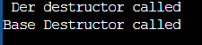

- Sonra oluşan önce ölür. Base oluşuyor der oluşuyor ancak ölürken önce der sonra base ölüyor.
- Pointer ya da referans ile oluşturulan objelerde nesne oluşmuyor. Yukarıdaki örnekte delete, p için değil Der için çağrılır.
- Eğer base sınıfın destructoru sanal olmasaydı ekrana “Base destructor called” yazar. Base sınıfının destructoru virtual olmadığından da şuan MEMORY LEAK oluştu!
- Eğer taban sınıfın destructoru sanal değilse, türetilmiş sınıfın destructoru çağrılmıyor. Çağrılmadığından da dinamik olarak oluşturduğu için memory leak oluşuyor.
- Türemiş sınıf nesnelerini çoğu zaman  dinamik oluşturmamızın sebebi runtime polymorphismden fayfalanmak.

**Örnek:**

class Base {

public:

virtual void test1() {

cout << "Base test1 \n";

}

virtual ~Base() { // Destructor sanal yapıldı

cout << "Base Destructor called \n";

}

};

class Der1 : public Base {

public:

virtual void test1() override {

cout << "Der1 test1 \n";

}

~Der1() {

cout << "Der1 Destructor called \n";

}

};

class Der2 : public Base {

public:

virtual void test1() override {

cout << "Der2 test1 \n";

}

~Der2() {

cout << "Der2 Destructor called \n";

}

};

// Polimorfik davranışın test edilmesi

void processDer(Base* p) {

p->test1(); // Türetilmiş sınıfın `test1` işlevi çağrılacak (runtime polymorphism)

}

int main()

{

Base* p1 = new Der2; // Der2 nesnesi oluşturuldu

Der1* p2 = new Der1; // Der1 nesnesi oluşturuldu

p1->test1(); // Der2'nin test1 fonksiyonu çağrılacak

p2->test1(); // Der1'in test1 fonksiyonu çağrılacak

delete p1; // Der2 ve Base destructor'ları doğru sırada çağrılır

delete p2; // Der1 ve Base destructor'ları doğru sırada çağrılır

}

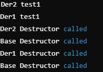

- Aksi bir durum yoksa, default olarak kalıtımda kullanılacak base sınıfın destructorını sanal yaparız.
- QMainWindow, QLineEdit ‘in de destructoru virtual olarak yapılmış QT tarafından.
- Bir sınıfın destructorının sanal olduğunu görüyorsak sadece bundan hareketle, bu sınıfın kalıtımda taban sınıf olarak kullanılacağı sonucunu çıkartabiliriz. Ve özellikle polimorfik sınıf olduğunu ortaya çıkarır.
- Virtual destructor ne zaman kullanılır ?
  - Base sınıfımız polimorfik sınıfsa, destructor da sanal yapılır.
  - Eğer sınıfımız polimorfik değilse ve türetilmiş sınıflardan türeyen nesneler yok edilecekse bu durumda da sanal yapılmalıdır.

Base *p = new myder2;

delete p;

**Örnek:**

class Base{

public:

~Base()

{

std::cout << "Base Destructor called \n"

}

};

class Der:public Base{

~Der()

{

std::cout << "Der Destructor called \n"

}

};

int main()

{

Der myder; //der destructor, base destructor. Memory leak yok.

Base *p = new myder2; **//sadece base destructor. Memory leak. Destructor sanal DEGIL!**

}

- C++ da sanal constructor diye bir kavram yok.

class Base{

public:

virtual Base(); //SYNTAX HATASI Virtual is not allowed.

};

- Constructorı override edin diye bir kavram da yok.
- Sanallık mekanizması bize ne katıyor?
  - Ortada çağrılacak bir fonksiyon olmalı. O fonksiyon runtime da hangi fonksiyonun çağrılacağını belirliyor. Hangi türemiş sınıfı gönderirsek, o türemiş sınıfın override ı çağrılıyor. Runtime polymorphism..

<a id="d19-s2"></a>
## Klon İdiomu

- C++ da bir nesnenin dinamik bir kopyasını oluşturmak için kullanılan tasarım desenidir.
- Polimorfizm ve kalıtım ile çalışırken, bir taban sınıfın pointer veya referansını kullanarak türetilmiş bir sınıfın tam anlamıyla kopyasını oluşturmak gerektiğinde bu desen kullanılır.

Örnek:

class Car{

int mcolor;

public:

Car(int color) :mcolor{ color }

{

}

virtual void start()

{

std::cout<<"Car engine has started \n";

}

virtual void run()

{

std::cout<<"Car engine has Runned \n";

}

virtual ~Car() = default;

virtual Car* clone() = 0; //pure virtual!

int getColor()const

{

return mcolor;

}

virtual void getCarInfo()const = 0;

protected:

bool Sunroof;

};

class Mercedes :public Car{

public:

Mercedes() = default;

Mercedes(int color):Car(color)

{

}

void start()override

{

std::cout <<"Mercedes engine has started \n";

}

void run()override

{

std::cout <<"Mercedes is running. \n";

}

Car* clone()override

{

return new Mercedes(*this); //copy constructor. Gonderilen Mercedes neyse, ayni nesnenin birebir kopyasini oluşturur.

}

void getCarInfo()const

{

std::cout <<"Araba Rengi: " << getColor() << " Araba Mercedes \n " ;

}

};

class Bmw :public Car{

public:

Bmw() = default;

Bmw(int color):Car(color)

{

}

void start()override

{

std::cout <<"Bmw engine has started \n";

}

void run()override

{

std::cout <<"BMW is running. \n";

}

Car* clone()override

{

return new Bmw(*this); //copy constructor

}

void getCarInfo()const

{

std::cout <<"Araba Rengi: " << getColor() << " Araba BMW \n " ;

}

};

void carRace(Car &r)

{

Car *pOther = r.clone(); //kopyasını cikarip car turunden nesneye atiyoruz. Ne gönderirsek onu klonlayacak.

pOther->start(); //klonlanmis nesnenin starti

pOther->run(); //klonlanmis nesnenin starti

r.start(); //orijinal nesnenin starti

r.run(); //orijinal nesnenin starti

delete pOther;

}

int main()

{

Mercedes sametMercedesE250{ 2 };

Bmw aliBmwX5{3};

carRace(sametMercedesE250); // Mercedes nesnesi klonlanır ve işlemler yapılır.

carRace(aliBmwX5);          // BMW nesnesi klonlanır ve işlemler yapılır.

}

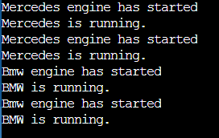

[↑ İçindekiler](#icindekiler)

---

<a id="ders-20"></a>
# Ders 20

<a id="d20-s1"></a>
## Multiple Inheritance (Çoklu Kalıtım)

- Bir sınıfın birden fazla taban sınıfı olduğunda kullanılan yapıdır.
- Yani bir sınıf, birden fazla sınıftan özellikler ve davranışlar miras alabilir.
- C++’ın güçlü ancak dikkatli kullanılması gereken bir özelliğidir.
- Bir sınıf biriden fazla kaynaktan özellikler ve davranışlar alabilir.
  - Örneğin, bir car sınıfı hem Engine hem de Wheels sınıfının işlevlerini miras alabilir.
- Büyük ve karmaşık sistemlerde mantıksal bağımlılıkları modellemek için kullanılır.
- Multilevel inheritance ile Multiple Inheritance farklı anlamlardır:
  - **Multilevel Inheritance :** Bir sınıf başka bir sınıftan, o sınıf da başka bir sınıftan miras alır
    - Vehicle -> Car -> SportsCar -> BMW
  - **Multiple Inheritance :** Bir sınıf birden fazla taban sınıftan miras alır
    - Car : public Engine, public Wheels

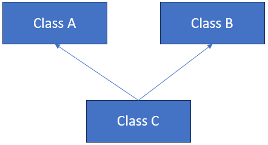

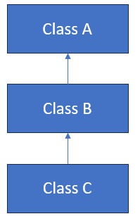

*Multiple Inheritance*					*Multilevel Inheritance*

**Örnek:**

```cpp
  class A{
  public:
 	 A()
 	{
 		 cout << "A ctor \n";
 	}
  };

  class B{
  public:
 	 B()
 	{
 		 cout << "B ctor \n";
 	}
  };

  class C: public A, public B{
  public:
 	 C()
 	 {
 		 cout << "C ctor \n";
 	 }

  };

  int main
  {
 	 C mx; //Yazdigimiz sira onemli. A ctor, B ctor, C ctor
  }
```

- Bu tip kullanımlarda compile time’a yönelik problemler olabilir.
- A’dan gelen ve B den gelen isimlere erişebiliyoruz. Burada isim çakışmasına dikkat edilmeli.

**Örnek**:

```cpp
class A{
  public:
 	 A()
 	{
 		 cout << "A ctor \n";
 	}
  protected:
 		int mx;
  };

  class B{
  public:
 	 B()
 	{
 		 cout << "B ctor \n";
 	}
  protected:
 		int mx;
  };

  class C: public A, public B{
  public:
 	 C()
 	 {
 		 cout << "C ctor \n";
 		 //mx = 20; //HATA. AMBIGIOUS
 		  A::mx = 20; //bu sekilde hata olmaz. isim cakismasina dikkat.
 	 }

  };

 void func(A&);
 void func(B&);

 int main()
 {
	C mx;
	//func(mx); //Burası da ambigious. C bir A dır, C bir B dir aynı zamanda.
	//A gereken yerde A kullanilir ama orada C de kullanilir. Ama B kullanilmaz.
	//B gereken yerde B kullanilir, C de kullanilir ama A kullanilmaz!

	 //Cozum:
	 func(static_cast<A&>(mx));
	 func(static_cast<B&>(mx));
 }

Örnek:
class A{
  public:
 	 void func(int x);
 	 A()
 	{
 		 cout << "A ctor \n";
 	}
  protected:

  };

  class B{
  public:
 	 void func(double);
 	 B()
 	{
 		 cout << "B ctor \n";
 	}
  protected:

  };

  class C: public A, public B{
  public:
 	 C()
 	 {
 		 cout << "C ctor \n";
 	 }

  };

 int main()
 {
	C mx;
	//mx.func(15.2); //HATA AMBIGIOUS. AYNI SINIFTA FUNCTION OVERLOADING OLUR. Burada Aynı isimli farklı sınıflardan gelen 2 fonksiyon var !!!
 }
```

<a id="d20-s2"></a>
## Diamond Problem (Elmas Problemi)

- Eğer iki taban sınıfın aynı taban sınıfı varsa, bu sınıfın birden fazla kopyası türetilmiş sınıfta yer alır.
- Bu, ambiguous(belirsizlik) sorunlarına yol açar.
- Virtual Inheritance (sanal kalıtım) kullanarak ortak taban sınıfın yalnızca bir kopyasını türetilmiş sınıfa miras bırakabiliriz.

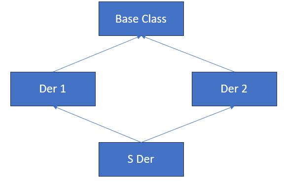

- Der1 ve Der2 içinde de Base var. Der1 = BMW, Der2 = Merco, Base = CAR
- Sder, Der1 ve Der2’den multiple inheritance ile oluşmuş. (BMW – Merco Karışımı).
- Bu durumda iki tane base sınıf var demektir.

**Örnek**:

```cpp
class A {
public:
    void display() {
        cout << "Class A\n";
    }
};

class B : public A {};
class C : public A {};
class D : public B, public C {};

int main()
{
    D obj;
    //obj.display(); // HATA: Hangi "display" çağrılacağı belirsiz. C’den Adaki mi B’den Adaki mi ?
    return 0;
}

Örnek:

class A {
public:
    void display() {
        cout << "Class A\n";
    }
};

class B : virtual public A {};
class C : virtual public A {};
class D : public B, public C {};

int main()
{
    D obj;
    obj.display(); // Sorun çözülür.
    return 0;
}

Örnek:
class Base{
	public:
		void base_func();
	};

	class Der1 :public Base {
	public:
	};

	class Der2 :public Base {
	public:
	};

	class SDer:public Der1, public Der2{
	public:
		void foo()
		{
			//base_func(); // HATA - AMBIGIOUS!!!!
			Der1::base_func(); //hata yok
			Der2::base_func(); //hata yok
		}
	};

Örnek:
Bir yazılım sistemi düşünelim, bu sistemde bir çalışan hiyerarşisini modellemek istiyoruz. Farklı türde çalışanlarımız var
Person	: Tüm çalışanların temel özelliklerini (isim, yaş) içeren taban sınıf.
Employee	: Bir çalışanın iş özelliklerini(maaş) ekleyen ara sınıf.
Manager	: Yönetim ile ilgili özelliklere sahip bir sınıf.
TeamLead	: Bir ekip liderinin özelliklerini ekleyen türetilmiş sınıf.
SeniorTeamLead : Hem manager, hem de TeamLead sınıflarının özelliklerini barındırır.

class Person {
public:
    string name;
    int age;

    Person(const string& personName, int personAge) : name(personName), age(personAge) {}

    void displayInfo() {
        cout << "Name: " << name << ", Age: " << age << endl;
    }
};

class Employee : public Person {
public:
    int salary;

    Employee(const string& personName, int personAge, int empSalary)
        : Person(personName, personAge), salary(empSalary) {}

    void displaySalary() {
        cout << "Salary: " << salary << endl;
    }
};

class Manager : public Person {
public:
    int teamSize;

    Manager(const string& personName, int personAge, int mgrTeamSize)
        : Person(personName, personAge), teamSize(mgrTeamSize) {}

    void displayTeamSize() {
        cout << "Team Size: " << teamSize << endl;
    }
};

class SeniorTeamLead : public Employee, public Manager {
public:
    SeniorTeamLead(const string& personName, int personAge, int empSalary, int mgrTeamSize)
        : Employee(personName, personAge, empSalary),
          Manager(personName, personAge, mgrTeamSize) {}
};
int main() {
    SeniorTeamLead lead("Alice", 35, 100000, 10);

    // lead.displayInfo(); // HATA: displayInfo() hangi Person'dan çağrılacak? Ambiguous

    return 0;
}

Çözüm için;
class Employee : virtual public Person;
class Manager : virtual public Person;

Bu, seniorTeamLead sınıfında Person sınıfının tek bir kopyasının bulunmasını sağlar.

int main() {
    SeniorTeamLead lead("Alice", 35, 100000, 10);

    // Artık diamond problem yok
    lead.displayInfo();
    lead.displaySalary();
    lead.displayTeamSize();

    return 0;
}
```

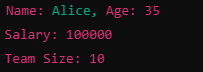

<a id="d20-s3"></a>
## Runtime Type Identification (RTTI) (Çalışma Zamanında Tür Belirlenmesi)

- C++’da RTTI, çalışma zamanında bir nesnenin gerçek türünü (yani hangi sınıftan türetildiğini) belirlememizi sağlayan bir mekanizmadır.
- RTTI, polimorfik sınıflar için kullanılır ve genellikle taban sınıf pointer’ı veya referansı üzerinden türetilmiş sınıfların türlerini belirlemek için kullanılır.
- RTTI, C++ da şu iki temel mekanizma ile gerçekleştirilir;
  - dynamic_cast
    - Tür dönüştürme işlemlerinde kullanılır.
  - typeid
    - Bir nesnenin veya türün tam adını almak için kullanılır.
- Nerelerde kullanılır ?
  - Farklı türde oyun karakterlerini veya araçlarını algılamak ve özel davranışlar atamak.
  - Çeşitli geometrik şekilleri işlemek.
  - Çalışan türlerine göre farklı işlem yapılması.
  - Veri tabanında farklı veri nesnelerinin işlenmesi

**Örnek**: Arabamız dacia ise lastiğini patlatacağız 😊 Merco ise hiçbir şey yapmayacağız.

```cpp
class Car{
 public:
	virtual void run() //polimorfik bir tur yaptik.
	{
		std::cout << "default run system is running \n";
	}
 };

class Dacia :public Car {
 public:
	void flat_tire()
	{
		std::cout << "Dacia flat tire \n";
	}
 };

class Mercedes :public Car {
 public:

 };

//dynamic_cast --> Pointer ile kullanim - dynamic_cast<Dacia*>(r) başarılı ise Dacia* döndürür.
 void carGame(Car* r)
 {
    if (Dacia* rdac = dynamic_cast<Dacia*>(r))
    {
        cout << "Dacia car detected!\n";
        rdac->flat_tire();
    }
    else //nullptr dondugu durum
    {
        cout << "Not a Dacia car.\n";
    }
}

//dynamic_cast --> Referans ile kullanim - try catch i ileride gorecegiz.
 void carGame2(Car& r)
 {
    try
    {
        // RTTI ile Dacia türüne dönüştürmeye çalışıyoruz
        Dacia& rdac = dynamic_cast<Dacia&>(r);
        cout << "Dacia car detected!\n";
        rdac.flat_tire();
    }
    catch (const std::bad_cast& e)
    {
        // Dönüşüm başarısızsa istisna yakalanır
        cout << "Not a Dacia car: " << e.what() << '\n';
    }
}

//typeid operatoru with reference
 void carGame3(Car& r)
 {
    if (typeid(r) == typeid(Dacia))
    {
        // `typeid` ile tür karşılaştırıldı, dönüşüm yapmalıyız
        Dacia& rdac = static_cast<Dacia&>(r);
        cout << "Dacia car detected!\n";
        rdac.flat_tire();
    }
    else
    {
        cout << "Not a Dacia car.\n";
    }
}

//typeid with pointer
void carGame4(Car* r)
{
    if (r == nullptr) {
        cout << "Invalid car object.\n";
        return;
    }

    if (typeid(*r) == typeid(Dacia)) {
        // `typeid` ile tür kontrolü yapıldı, dönüşüm yapıyoruz
        Dacia* rdac = static_cast<Dacia*>(r);
        cout << "Dacia car detected!\n";
        rdac->flat_tire();
    } else {
        cout << "Not a Dacia car.\n";
    }
}

int main()
 {
	Mercedes E250;
	Dacia sandero;
	carGame(&sandero); //dacia flat tire
	carGame(&E250); //hic bir sey olmaz.
 }

Örnek:
class Employee {
public:
    virtual ~Employee() {}
};

class Manager : public Employee {};
class Engineer : public Employee {};

void processEmployee(Employee* emp) {
    if (Manager* manager = dynamic_cast<Manager*>(emp)) {
        std::cout << "Processing Manager.\n";
    } else if (Engineer* engineer = dynamic_cast<Engineer*>(emp)) {
        std::cout << "Processing Engineer.\n";
    } else {
        std::cout << "Unknown Employee type.\n";
    }
}
```

[↑ İçindekiler](#icindekiler)

---

<a id="ders-21"></a>
# Ders 21

<a id="d21-s1"></a>
## Composition(Bileşim)

- Bir nesne veya sınıfın başka bir nesne ya da sınıfı, kendi özellikleri veya metotları olarak kullanmasıdır.
- Bu, iki sınıf arasında “has-a” (sahiplik) ilişkisi oluşturur.
- Composition, bir sınıfın ba şka sınıfların özellik ve davranışlarını bir araya getirmesini sağlar.
- Şimdiye kadar çoğunlukla bir sınıfın öğesi başka bir sınıf olmuyordu. Artık olacak!
- Sahip olan nesne hayata geldiğinde, sahip olduğu nesne de hayata geliyor. Hayatı bittiğinde, onun da hayatı bitiyor.
- Bir sınıfın özelliklerini diğer bir sınıfla paylaşmak için inheritance yerine composition tercih edilebilir.
- Composition, inheritance’a göre daha az bağımlılık yaratır. Bir sınıfın başka bir sınıfı miras alması yerine, onu bir özellik olarak barındırması daha az bağımlılık oluşturur.

**Örnek:** Bilgisayar; ram, ekran ve anakarttan oluşan bir üründür.

```cpp
class Ram{
};

class Screen{
};

class MainBoard{
};

class Computer{
	Ram mr;
	Screen ms;
	MainBoard mmb;
};
```

- Burada Computer nesnesi yok edildiğinde, onun içindeki Ram, Screen ve MainBoardda yok edilir.
- Inheritance’da “Is A” ilişkisi vardı.

**Örnek**:

Köpek bir hayvandır. 🡪 Is-a ilişkisi

Bir kişinin, ev adresi vardır. 🡪 Has-a ilişkisi

- Adres sınıfı, hem Kişi hemde Şirket sınıflarında kullanılabilir.
- Robot sınıfı, Kamera ve Sensör sınıflarını içerebilir ancak dışarıya sadece genel bir “algılama” işlevi sunar.
- Bir “Araç” sınıfının farklı “Motor” türleri (benzinli, dizel) arasında geçiş yapılması.
- Sipariş Yönetimi sistemi “Müşteri”, “Sipariş Detayları” ve “Fatura” sınıflarını içerir.

<a id="d21-s2"></a>
## Association (İlişkilendirme)

- İki sınıf arasındaki genel bir ilişkiyi ifade eder.
- Bu ilişki, sınıfların birbirleriyle nasıl etkileşimde bulunduğunu gösterir.
- “Uses-a”(Kullanır) ilişkisi : Genellikle bir sınıfın diğer bir sınıfın işlevlerini kullanmasına denir.
- Bir nesnenin varlığının anlam kazanabilmesi için, başka bir nesneye ihtiyaç duyması.
- Bir işi yapabilmek için iki sınıfa da ihtiyaç var. Biri olmadan diğeri anlam kazanmıyor. Ancak ve ancak ikisi birden kullanıldığında faydalı bir iş ortaya çıkıyor.

**Örnek:** Öğretmen, öğrenciyi eğitiyor ama öğretmen ve öğrenci birbirine bağımlı değil. Yani öğrenci, öğretmen var olmadan da var olabiliyor. Yani iki sınıf arasında bir ilişki var ama yaşam döngüleri birbirine bağlı değil.

```cpp
class Student {
public:
    string name;

    Student(const string& name) : name(name) {}

    void study() {
        cout << name << " is studying." << endl;
    }
};

class Teacher {
public:
    string name;

    Teacher(const string& name) : name(name) {}

    void teach(Student& student) {
        cout << name << " is teaching " << student.name << "." << endl;
    }
};

int main() {
    Student student("Ali");
    Teacher teacher("Ayşe");

    teacher.teach(student);
    student.study();

    return 0;
}
```


<a id="d21-s3"></a>
## Aggregation (Toplama)

- Bir sınıfın, başka bir sınıfı içerdiği ancak bu sınıfın kendisine bağlı olmadığı bir ilişki türüdür.
- Daha gevşek bir “has-a” ilişkisidir.
- İki nesne birlikte iş görecek. Birisi diğerinin sahibi durumunda olacak.
- Örneğin, araba motorun sahibi ama motoru kullanarak iş yapıyor.

Örnek: Bir sınıf, birden fazla öğrenciye sahip olabilir. Ancak öğrenciler, sınıftan bağımsız olarak da var olabilir.

```cpp
class Student {
public:
    string name;

    Student(const string& name) : name(name) {}

    void introduce() {
        cout << "Student: " << name << endl;
    }
};

class Class {
private:
    string className;
    vector<Student*> students; // Aggregation: Class contains multiple students

public:
    Class(const string& className) : className(className) {}

    void addStudent(Student* student) {
        students.push_back(student);
    }

    void listStudents() {
        cout << "Students in class " << className << ":" << endl;
        for (auto& student : students) {
            student->introduce();
        }
    }
};

int main() {
    // Öğrenciler bağımsız olarak oluşturuluyor
    Student s1("Ali");
    Student s2("Ayşe");

    // Sınıf oluşturuluyor
    Class mathClass("Math");

    // Sınıfa öğrenciler ekleniyor
    mathClass.addStudent(&s1);
    mathClass.addStudent(&s2);

    // Sınıfın öğrencileri listeleniyor
    mathClass.listStudents();

    return 0;
}
```

<a id="d21-s4"></a>
## ENUM Classlar

- Standart enum yapısının modern ve daha güvenli bir alternatifi olarak sunulmuştur.
- C++11 ile birlikte gelmiştir.
- Enum class, tamsayı değerlerini bir grup tanımlı isime bağlamanın bir yoludur.
- Enum Class ile tanımlanan üyeler, otomatik olarak kapsam içinde tutulur ve isim çakışmalarını önler.
- Enum class üyeleri, otomatik olarak tamsayıya dönüştürülmez. Bu, tür dönüşümü sırasında oluşabilecek hataları önler.
- Üyelere yalnızca enum ismi ile erişilir.

**Örnek:**

```cpp
enum class Color{Red, Green, Blue};
enum class TrafficLight{Red, Blue, Green};

int main()
{
	TrafficLight mycolor = TrafficLight::Blue;
	auto x = Color::Blue;
	//auto y = Green; //syntax hatasi

	//int ival = Color::Blue; //syntax hatasi. Dönüşüm yok.
	int ival = static_cast<int>(Color::Blue) ; //Dogru.
}
```

**NOT:** Enum classlar ile bellekte kaplanan alan değiştirilebilir. C++ buna izin veriyor:

```cpp
enum class Color:unsigned char{Red, Green, Blue};
```

<a id="d21-s5"></a>
## Template (Şablonlar)

- Farklı türler için tekrarlanan kod yazmayı önleyen, türden bağımsız bir programlama mekanizmasıdır.
- Şablonlar, fonksiyonların ve sınıfların genel bir yapı oluşturmasını sağlar.
- C++ Generic Programming paradigmasını destekler.
- Compile-Time Polymorphism sağlar.
- Derleyiciye kod yazdırmak için kullanılan bir araçtır.
- Meta Kod : Kodu yazdıran kod demektir.
- En çok kullanıldığı yerler:
  - Veri yapılarını implemente eden sınıflar 🡪 Vector, stack, link list
  - Algoritmaların büyük bir çoğunluğu türden bağımsız işlem yapıyor. 🡪 Örn. swap işlemi iki tane int, iki tane double, iki tane structure türden nesnelerde hep benzer algoritmalar koşuyor.

- 4 farklı template vardır. En fazla ilk ikisi karşımıza çıkıyor
  - Function Template
  - Class Template
  - Variadic Template (C++17)
  - Alias Template

- **Function Template :** Öyle bir meta kod ki, derleyici bu meta koddan faydalanırsa compile time’da fonksiyon kodu yazacak.
- **Class Template :** Derleyici compile time’da bir sınıf kodu yazdırmaya yönelik bir araç. List, String gibi sınıflar class templatedir.
- Tür sabit ve belirli ise 				🡪 Class

Birden fazla türle çalışacak bir yapı gerekiyorsa 	🡪 Class Template

Performans önemliyse (derleme süresi) 		🡪 Class

Kod yeniden kullanılabilirliği ön plandaysa 	🡪 Class Template

**Örnek**: Function Template Maximum Bulma

```cpp
template <typename T>
T findMax(T a, T b) {
    return (a > b) ? a : b;
}

int main() {
    cout << "Max of 10 and 20: " << findMax(10, 20) << endl; // int
    cout << "Max of 3.14 and 2.71: " << findMax(3.14, 2.71) << endl; // double
    cout << "Max of 'a' and 'z': " << findMax('a', 'z') << endl; // char

    return 0;
}
```

- Template’den gerçek kod yazılabilmesi için template’i instantiate etmesi lazım. Bunun için derleyicinin, template parametrelerini bilmesi gerekiyor. Bunun da iki yolu vardır;
  - Kodu yazan derleyiciye özel bir kod ile açık açık söylemek.
  - Sonra…

**Örnek**:

```cpp
template<typename T, size_t size>
void func(T x)
{
	cout <<"template func cagrildi \n";
}

int main()
{
	func<int, 20>(10); //T'nin ne olduğunu da söyledik, size'ın ne olduğunu da söyledik.
//size = 20, x = 10
}
```

**Örnek:**

```cpp
template<typename T, typename U>
void func(T x, U y)
{

}

template<typename T, typename U>
class Myclass{

};

int main()
{
	func<int, double>;
	Myclass<int, double> x;
}
```

**Örnek:**

```cpp
template < class T, size_t N >
class Array{
	T a[N];
};

int main()
{
	Array<int, 10> mA;
}

Örnek: Pair ve Bitset Sınıfları

int main()
{
	pair<string, int> px{"Ankara", 6};
	cout << px.first; //ankara

	bitset<16> x;
}
```

[↑ İçindekiler](#icindekiler)

---

<a id="ders-22"></a>
# Ders 22

<a id="d22-s1"></a>
## Template Argument Deduction (Şablon Argüman Çıkarımı)

- C++’da template kullanırken, derleyicinin çağrılan fonksiyonun ya da kullanılan sınıfın türüne göre şabmlon argümanlarını otomatik olarak belirlemesi işlemidir.
- Bu mekanizma, şablonun kullanıcı tarafından açıkça belirtilmesini gerektirmez.
- Derleyici, parametrelerin türlerini çıkarır ve uygun şablon argümanlarını doldurur.
- **Function Template**’de derleyici, fonksiyon çağrısındaki argümanların türlerini inceleyerek, şablon parametrelerinin türlerini çıkarır.
- C++17 ile birlikte **sınıf şablonlarından** da çıkarım yapılabilir.

**Örnek:**

```cpp
template <typename T>
void printValue(T value) {
    cout << "Value: " << value << endl;
}

int main() {
    printValue(42);          // T deduced as int
    printValue(3.14);        // T deduced as double
    printValue("Hello");     // T deduced as const char*

    return 0;
}
```

**Örnek:**

```cpp
 	 template<typename T>
 	 void func(T x, T y)
 	 {
 		 ++x;
 	 }

 	 int main()
 	 {
 		 func(12, 57.8); //ambigious. İkisiinn de türü aynı olmalı template e göre.
 	 }

Örnek:
 	 template<typename T>
 	 T func()
 	 {
 		 return T;
 	 }

 	 int main()
 	 {
 		 func(); //ambigious
 	 }

Örnek:
 	 template<typename T>
 	 void func()
 	 {
 		 T x;
 	 }

 	 int main()
 	 {
 		 func(); //template tür parametresini derleyici anlayamaz. Syntax hatası.
 	 }

Örnek:
  template<typename T, typename U>
 	 void foo(T a, U b)
 	 {

 	 }

 	 int main()
 	 {
 		 foo(15, true); //dogru. argument deduction

 		 foo<int, bool>(20, false); //deduction yok ama dogru.
 	 }

Örnek: Class Template Argument Deduction
template <typename T>
class Box {
public:
    T value;

    Box(T val) : value(val) {}
};

int main() {
    Box box1(42);          // T deduced as int
    Box box2(3.14);        // T deduced as double
    Box box3("Hello");     // T deduced as const char*

    cout << "Box1: " << box1.value << "\n";
    cout << "Box2: " << box2.value << "\n";
    cout << "Box3: " << box3.value << "\n";

    return 0;
}

Örnek: C++17 ile gelen deduction guide
template <typename T>
class Pair {
public:
    T first, second;

    Pair(T a, T b) : first(a), second(b) {}
};

// Deduction guide for Pair
template <typename T>
Pair(T, T) -> Pair<T>;

int main() {
    Pair p(10, 20);  // T deduced as int
    cout << "Pair: " << p.first << ", " << p.second << endl;

    return 0;
}
```

<a id="d22-s2"></a>
## Template Default Argument

- C++’da bir şablon parametresine varsayılan bir değer atanabilir.
- Bu özellik, şablon kullanımı sırasında tüm tür parametrelerinin belirtilmesini zorunlu kılmadan esneklik sağlar.

**Örnek: Function Template**

```cpp
template <typename T = int>
void func(T value) {
    // Şablonun varsayılan türü int
}
```

**Örnek: Class Template**

```cpp
template <typename T = double>
class MyClass {
    T data;
};
```

**Örnek:**

```cpp
template<typename T, typename U=int>
  class Myclass{

  };

  template<typename T, typename U=vector<T>>
  class Myclass2 {

  };

  int main()
  {
 	 Myclass<int> g;		//ayni anlam
 	 Myclass<int, int> g2;	//ayni anlam

 	 Myclass2<int> g3 ;
  }
```

**Örnek:**

```cpp
  template<size_t low, size_t high=100>
  class Range {

  };

  int main()
  {
 	 Range<10> x; //Burada low = 10, high = 100
 	 Range<20, 50> y; //default argumani alma dedik. high 50 oldu.
  }
```

**Örnek:** Göz korkutucu ama anlayınca basit bir örnek

```cpp
template<typename T>
class A {
public:
    void display() const {
        cout << "A instance of type: " << typeid(T).name() << endl;
    }
};

A<int> foo(A<double> y) {
    cout << "foo function called!" << endl;
    y.display(); // Parametre olarak verilen A<double> nesnesi üzerinde işlem
    return A<int>(); // A<int> türünde bir nesne döndürülür
}

int main() {
    A<double> aDouble; // A<double> türünde bir nesne
    A<int> aInt = foo(aDouble); // foo fonksiyonu çağrılır
    aInt.display(); // Dönen nesne üzerinde işlem yapılır

    return 0;
}
```

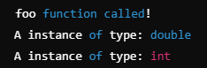

- Stringler de aslında basic_string sınıfının char açılımı olarak tasarlanmıştır.
  - `basic_string<char>` str; 	//aynı anlam
  - string str;			//aynı anlam

```cpp
Örnek:
template<typename T>
 	 class Myclass{

 	 };

 	 int main()
 	 {
 		 Myclass<int> mx;
 		 Myclass<double> my;

 		 mx = my; //syntax hatasi. Aynı tür template'in farklı tür argümanlarıyla ayni tür olmuş olmuyorlar! Farklı türden sınıflar. İkisi de int ya da double olursa problem yok.
 	 }

Örnek: Vektör sınıfından bir örnek
vector<int> ivec{ 3,5,7,8 };
	vector<int> ivec2; //double olsa atama yapamayiz!
	ivec2 = ivec;
	for(auto i:ivec2)
		cout << i << " "; //3 5 7 8
Örnek:
bitset<32> bsx{ 25 };
	bitset<16> bsy{ 12 };

	//bsx = bsy; //syntax hatasi. Farkli turdenler. biri 32lik biri 16lik.
	cout << bsx; //00000000000000000000000000011001
```

- Bir sınıf şablonundan sınıf kodu yazdırmakla, bir sınıfın kodunun doğrudan verilmesi arasında bir çok farklılık var:

```cpp
 	 template<typename T>
 	 class Myclass {
 		 //50 tane fonksiyon olsun.
 	 };

 	 int main()
 	 {
 		 string str;
 		 str.append("samet"); //bu fonksiyon dışında geri kalan str fonksiyonlarının kodunu derleyici yazmıyor. Kullandıkça yazılacak.
 		 //compile time turesini artırmıyor, program boyutunu azaltıyor.
 		 //Myclass sınıfı hic kullanmadigimiz icin class icindeki 50 tane fonksiyonu derlemedi. Kodunu yazmadi.
 	 }

Örnek:
 	 int main()
 	 {
 		 vector<vector<int>>ivec; //gayet normal bir durum. Templateden elde ettiğimiz sınıf, başka bir türe argüman olabiliyor. Vektörde int vektörler tutuluyor. Adeta iki boyutlu dizi gibi.. Bu öyle bir vektör ki, her bir elemani int bir vektör olan vektör.

 		 set<vector<list<int>>> myset;
 	 }
```

<a id="d22-s3"></a>
## Pair Başlık Dosyası

- Utility içerisinde bulunan bir sınıf şablondur.
- İki tane farklı ya da aynı türden olabilecek değeri tek bir türden nesneymiş gibi kullanmamızı sağlıyor.
- Sınıf şablonu olduğu için sonsuz sayıda değişkeni paketleyebiliyor.
- İki farklı değer döndürmek gerektiğinde kullanırız.
- Genellikle farklı türlerden iki veriyi bir araya getirerek işlemleri daha düzenli ve anlamlı hale getirmek için kullanılır.

**Örnek:**

```cpp
#include <utility> // Pair için gerekli

int main()
{
    // Tanımlama ve atama
    pair<int, string> student(101, "Ali");

    // Elemanlara erişim
    cout << "ID: " << student.first << "\n";
    cout << "Name: " << student.second << "\n";

    return 0;
}

Örnek: Map’de içinde pairler tutuyor aslında

  map<int, string> cities; //icinde anahtar deger ciftleri tutuyor.
 	 cities.insert({1, "Adana"});
 	 cities.insert({2, "Adiyaman"});
 	 cities.insert({3, "Afyon"});
 	 cities.insert({4, "Agri"});
 	 cities.insert({5, "Amasya"});
 	 cities.insert({6, "Ankara"});

 	 for(auto & r : cities)
 		 cout<<"Plaka Kodu:" << r.first << " Sehir:" << r.second << "\n";

Örnek:
int main() {
    vector<pair<int, string>> students;

    students.push_back(make_pair(101, "Ali"));
    students.push_back(make_pair(102, "Ayşe"));

    for (const auto &student : students) {
        cout << "ID: " << student.first << ", Name: " << student.second << "\n";
    }

    return 0;
}

Örnek:
pair<int, int> getMaxMinArray(const int *pa, size_t size);
 	{
 		int min = *pa, max = *pa;
 		for(size_t i = 1; i<size; ++i)
 			if(pa[i] > max)
 				max = pa[i];
 			else if(pa[i] < min)
 				min = pa[i];

 		return make_pair(min, max);

 	}
 	int main()
 	{
 		int a[5] = { 5, 78, 3, 67, 12 }
 		pair<int, int> px = getMaxMinArray(a, 5);

 		cout <<"min: " << px.first << " max:"<< px.second << "\n"; //3 78
 	}
```

<a id="d22-s4"></a>
## Template – Devam

- Bir sınıfın üye fonksiyonları template olabilir.

```cpp
class Myclass{
 public:
	template<typename T>
	void func(T x)
	{
		//...
	}
 };

 int main()
 {
	Myclass m;
	m.func(12); //T ye int geçilmiş oldu.
	m.func(true); //T ye bool geçilmiş oldu.
	m.func(15.5); // T ye double geçilmiş oldu.
 }
```

- Constructorlar da template olabilir.

```cpp
class Myclass{
 public:
	template<typename T>
	explicit Myclass(T x)
	{
		cout << "template ctor cagrildi \n" ;
	}
 };

 int main()
 {
	Myclass m1{ 12 };
 }
```

- Template copy constructor olabilir.

```cpp
template <typename T>
class MyClass {
    T value;

public:
    // Parametreli constructor
    MyClass(T val) : value(val) {}

    // Şablonlu copy constructor (farklı türlerden kopyalama)
    template <typename U>
    MyClass(const MyClass<U>& other) : value(static_cast<T>(other.getValue())) {
        std::cout << "Template copy constructor called!" << std::endl;
    }

    T getValue() const {
        return value;
    }

    void display() const {
        std::cout << "Value: " << value << std::endl;
    }
};

int main() {
    MyClass<int> obj1(42);          // Constructor çağrılır
    MyClass<double> obj2 = obj1;    // Template copy constructor çağrılır

    obj1.display();
    obj2.display();

    return 0;
}
```

- Bir varlık fonksiyon çağrı operatörünün operandı oluyorsa bu tür varlıklara “callable” denir.
- Function pointer, function call, operator overload mekanizmaları bunlara örnektir.

**Örnek:**

```cpp
template<typename T>
  void func(T f)
  {
 	 f(); //callable.
  }
```

- Fonksiyon çağrı operatörü de overload edilebiliyor. Buna da “Functor” deniyor.

**Örnek:**

```cpp
  class Myclass{
  public:
 	 void operator() ()
 	 {
 		cout << "myclass::operator()()" << "\n";
 	 }
  };

 int main()
 {
	Myclass f;
	f(); //fonksiyon çağrı operatör fonksiyonu çağrıldı.
 }
```

Örnek:

```cpp
class Rand{
	int mlow, mhigh;
public:
	Rand(int low, int high): mlow{low}, mhigh{high}
	{

	}

	int operator()() //fonksiyon çağrı operatör fonksiyonu
	{
		return rand() % (mhigh, mlow) + mlow;
	}
};

int main()
{
	Rand r1{ 450, 478 };
	Rand r2{ 10, 20 };
	Rand r3{ 1991, 1998 };

	for(int i=0; i<10; ++i)
	{
		cout << r1() << " ";
	}

	cout << "\n\n";

	for(int i=0; i<10; ++i)
	{
		cout << r2() << " ";
	}

	cout << "\n\n";

	for(int i=0; i<10; ++i)
	{
		cout << r3() << " ";
	}

	cout << "\n\n";
}
```

- STL’de en çok kullanılan araçlardan birisi functor’dır. Functional Object denecek o kısımda.

```cpp
Örnek: count if icin algorithm include edilmeli.

 class DividPred{
	int mval;
 public:
	DividPred(int ival):mval{ ival }
	{
	}
	bool operator()(int x)
	{
		cout <<"test \n"; //1000 kere cagrilir.
		return x % mval == 0;
	}
 };
 int main()
 {
	int ival;
	//STL containerinde ogelerden kactanesinin 3e tam bolundugunu sayisini bulunuz.. "Count if algoritması"
	 vector<int> ivec;
	 for(int i = 0; i<1000; ++i)
		 ivec.push_back(rand());

	 cout << " kaca tam bolunenler sayilsin: ";
	 cin >> ival

	 auto n = count_if(ivec.begin(), ivec.end(), DividPred{ival});
	 cout << "oge sayisi: " << n;
 }
```

- Predicate görüyorsak functional object ile kullanılır çoğunlukla.

[↑ İçindekiler](#icindekiler)

---

<a id="ders-23"></a>
# Ders 23

- Bir valık, fonksiyon çağrı operatörünün operandı oluyorsa callable nesne denir.
- Koşul fonksiyonu 🡪 Predicate

> Pred şablonu sayesinde, koşul fonksiyonu (f) hem fonksiyon pointer’ı hem functor hem de lambda olabilir.

**Örnek**:

```cpp
using namespace std;
	template<typename Iter, typename Pred>
	void print_if(Iter beg, Iter end, Pred f)
	{
		while(beg != end)
		{
			if(f(*beg))
				cout << *beg << " ";

			++beg;
		}

		cout << "\n------------------ \n";
	}

	bool iseven(int ival)
	{
		return ival % 2 == 0 ;
	}

	class DivPred{
		int mx;
	public:
		DivPred(int ival): mx{ ival }
		{

		}

		bool operator()(int val)const
		{
			return val % mx == 0;
		}
	};

	class LendPred{
		size_t mlen;
	public:
		LendPred(size_t len): mlen{len}
		{
		}

		bool operator()(const string &s)const
		{
			return s.length() == mlen;
		}
	};

	int main()
	{
		int a[10] = {3,5,2,4,9,15,1,10,8,81};
		int n;
		print_if(a, a+10, iseven); //2 4 10 8
		//------------------------------------

		cout << " Kaca tam bolunen sayilar:"; //3
		cin >> n;
		print_if(a, a+10, DivPred{n}); //3 9 15 81
		//-------------------------------------

		size_t len;
		vector<string> svec = {"ali", "veli", "memati", "hayri", "selami", "ayse", "fatma", "naciye", "selin", "tugce", "kubra", "emine", "can"};
		ofstream ofs{"isimler.txt"};

		cout << " uzunlugu kac olan isimler:" ; //3
		cin >> len;

		vector<string>::iterator iter1 = svec.begin();
		vector<string>::iterator iter2 = svec.end();
		print_if(iter1, iter2, LendPred{ len } ); //ali can
	}
```

- **Range Kavramı:**
  - STLde karşımıza çok çıkacak.
  - [konum1, konum2)
  - Konum1 : Containerların begin fonksiyonlarının döndürdüğü iterator.
  - End container son öge demek değil! End, containerdeki son öğeden sonra gelen, containerde olmayan öge.
  - Algoritmalar, range’e göre yazılmış fonksiyon şablonlarıdır.

<a id="d23-s1"></a>
## Lamba Expressions (Anonim Fonksiyonlar)

- Genellikle kısa ve geçici fonksiyonlar oluşturmak için kullanılır.
- Lambda ifadeleri, adlandırılmamış fonksiyonlardır ve bir kod bloğunu başka bir yere aktarmamızın gerektiği durumlarda çok kullanışlıdır.
- Genel sentaks şu şekildedir:
  - [ capture_list ] ( Parameters ) -> return_type { Function Body };
- **Capture_List []**
  - Lambda ifadesinin dışında tanımlanmış değişkenleri içeri aktarmak için kullanılır.
  - Örnek: [x, &y] 🡪x değeri kopyalar, y referans olarak aktarılır.

- **Parameters ()**
  - Fonksiyonun alacağı parametreleri belirler. Normal bir fonksiyon parametreleri gibidir.
  - Örnek: (int a, int b)

- **Return Type ->**
  - Fonksiyonun dönüş tipini belirtir. Genellikle otomatik olarak belirlenir, bu yüzden çoğu zaman yazılmaz.

- **Function Body {}**
  - Lambda fonksiyonunun içindeki kod bloğu.

**Örnek:**

```cpp
int main() {
    auto sum = [](int a, int b) -> int {
        return a + b;
    };

    cout << "5 + 3 = " << sum(5, 3) << endl; // 5 + 3 = 8
    return 0;
}

Örnek:
  [](int x)
  {
 	 if (x > 10)
 		 return 34;
 	 return 50;
  };
```

- Derleyici, return değerini int mi double mi alayım ? bilemediği durumda return tipinin açıkça belirtilmesi gerekir.

```cpp
Örnek:
[](int x)
  {
 	 if (x > 10)
 		 return 34;
 	 return 50.3; //HATA
  };

Örnek:
  [](int x) -> double
  {
 	 if (x > 10)
 		 return 34;
 	 return 50.3; //DOGRU
  };

Örnek:
int main() {
    []() {
        cout << "merhaba dunya" << endl;
    }(); // Lambda burada hemen çalıştırılır

    return 0;
}
```

- Otomatik ömürlü değişkenler lambda expression ile capture yapılmadan kullanılamaz.

```cpp
Örnek:
int g1=10, g2=20;
 	 int main()
 	 {
 		 //g1 ve g2 burada tanimlanirsa syntax hatasi oluyor.
 		 //otomatik omurlu degiskenler lambda expression ile kullanılmaz.
 		 auto f = [](int x){return x *(g1 + g2);};
 	 }

Örnek: Otomatik ömürlü değişkenler capture edilmeli.

 	 int main()
 	 {
 		 int g1=10, g2=20;

 		 auto f = [g1,g2] (int x) {return x * (g1+g2);};
 		 cout << f(2);

 	 }
```

- Capture alanı içerisinde kullanılan “=” ifadesi capture all anlamına gelir.

**Örnek:**

```cpp
 	 int main()
 	 {
 		 int g1=10, g2=20, g3=40;
 		 auto f = [=] (int x) {return x * (g1+g2+g3);};
 		 cout << f(2);
 	 }
```

- Lambda ifadelerinde “mutable” anahtar kelimesini görebiliriz. Varsayılan olarak, lambda içinde kopyalanan değişkenler const olarak kabul edilir ve değiştirilemez. Ancak “mutable” bu kısıtı kaldırır ve kopyalanan değişkenin değiştirilebilmesine izin verir.

```cpp
Örnek:
int main() {
    int x = 10;

    auto f = [x]() mutable {
        ++x;
        cout << "Lambda içindeki x: " << x << endl; //11
    };

    f(); // x'in kopyası artırılır
    cout << "Ana x: " << x << endl; // Orijinal x hala 10'dur

    return 0;
}
```

### Capture by Copy & Capture by Reference

- **Capture by Copy**
  - Bu yöntemle, dışarıdaki değişkenlerin bir kopyası lambda içine aktarılır.
  - Lambda bu kopyayı kullanır ve orijinal değişkenle herhangi bir bağlantısı olmaz.
  - Lambda içinde değişiklik yapılsa dahil orijinal değişkenler etkilenmez.

**Örnek:**

```cpp
int main()
 	 {
 		 int x = 10;
 		 auto f = [x](int ival)mutable -> double {++x; return 1.2;};

 		 f(20);
 		 cout << "x =" << x; //xin degeri degismedi yani 10. Capture by copy
 	 }
```

- **Capture by Reference**
  - Bu yöntemle, dışarıdaki değişkenler lambda içine bir referans olarak aktarılır.
  - Lambda, orijinal değişkenin kendisi üzerinde işlem yapar.
  - Değişkenlerin kopyası alınmaz, doğrudan orijinal değişkenlere bağlanır.

```cpp
Örnek:
	 int main()
 	 {
 		 int x = 10;
 		 auto f = [&x](int ival)mutable -> double {++x; return 1.2;};

 		 f(20);
 		 cout << "x =" << x; //xin degeri 11 oldu. Capture by reference
 	 }

Örnek: Eğer tüm capture edileceklerin referansları gönderilecekse tek & yeterlidir.
int main()
 	 {
 		 int x = 10, y = 20, z = 30;
 		 //auto f = [&x, &y, &z]{++x, ++y, ++z;}; //&x, &y, &z yerine sadece & yazılabilir.
 		 auto f = [&]{++x, ++y, ++z;};
 		 f();
 		 cout << x << y << z ; // 11 21 31

 	 }

NOT: auto f = [=, &z]{ ++z;}; //burada x ve y yi degistirmeye calisirsan hata. z yi degistir.
          auto f = [=, &z]()mutable{ ++x; ++z;}; //Burada hata yok.
```

[↑ İçindekiler](#icindekiler)

---

<a id="ders-24"></a>
# Ders 24

<a id="d24-s1"></a>
## STL (Standart Template Library)

- STL, genellikle daha hızlı, daha güvenilir ve yeniden kullanılabilir kod yazmayı sağlayan hazır veri yapıları ve algoritmalar sunar.
- Modern C++ ‘ın temel taşlarından biri olan STL’nin temel amacı, yaygın programlama görevlerini tekrar yazmak yerine, güvenli ve optimize edilmiş bir şekilde hazır bileşenler sunmaktır.
- STL’in mantığı, genel amaçlı ve esnek veri yapıları ve algoritmalar sağlamaktır.
- Yazılım geliştiricilerin “nasıl” yapılacağıyla değil “ne yapılacağı” ile ilgilenmesine olanak tanır.
- STL 3 ana bileşenden oluşur:
  - **Containers** : Verilerin tepolanması ve düzenlenmesi için veri yapıları sağlar.
    - Vector, list, set,map, stack, queue

  - **Algoritmalar**: Containerler üzerinde çalışan genel işlevlerdir. STL algoritmaları genellikle iterator kullanarak veri yapıları üzerinde işlem yapar.
    - sort, find, reverse, accumulate

  - **Iterators** : Containerlar içinde gezinmek ve öğelere erişmek için kullanılır. STLnin soyutlanmasını sağlar.

### Iterators

- İteratörler, C++’da STL containerleri (vector, list, map) üzerinde dolaşmak için kullanılan araçlardır.
- Bir anlamda, gelişmiş bir pointer gibi çalışırlar ve containerin elemanlarına erişim sağlarlar.
- İteratörler, STL algoritmaları ile containerlar arasında köprü görevi görür.
- **İteratör türleri:**
  - **Input Iterator**
    - Sadece veri okuma görevi için kullanılır.
    - İleriye doğru hareket eder.
    - **Örnek:** istream_iterator
  - **Output Iterator**
    - Sadece veri yazmak için kullanılır.
    - İleriye doğru hareket eder.
    - **Örnek:** ostream_iterator
  - **Forward Iterator**
    - Hem okuma hem yazma işlemlerini destekller
    - Sadece ileriye doğru hareket eder.
    - **Örnek:** forward_list
  - **Bidirectional Iterator**
    - Hem ileri hem de geri hareket edebilir.
    - **Örnek:** List, set, map
  - **Random Access Iterator**
    - Rastgele erişim sağlar (tıpkı bir dizi gibi)
    - Doğrudan indekse erişmek mümkündür.
    - **Örnek**: vector, deque

- **Iteratörlerin Temel İşlevleri**
  - **Dereferencing(*) :** İteratörün işaret ettiği elemanı döndürür.
  - **Artırma (++) :** Bir sonraki elemanı işaret eder.
  - **Azaltma (--) :** Bir önceki elemanı işaret eder. (Sadece bidirectional ve random access iteratörler)
  - **Eşitlik Kontrolü (==, !=) :** İki iteratörün aynı elemanı işaret edip etmediğini kontrol eder.
  - **İndeksleme ( [ ] ) :** İndex ile elemanlara erişim sağlar. (Sadece random access iteratörler)

**Örnek:**

```cpp
int main() {
    std::vector<int> nums = {10, 20, 30, 40, 50};

    // İteratör tanımlama
vector<int>::iterator it;

    // İteratör ile dolaşma
    for (it = nums.begin(); it != nums.end(); ++it) {
        cout << *it << " "; // İteratörün işaret ettiği eleman 10 20 30 40 50
    }
    return 0;
}:
```

**Örnek:** Yukarıdaki örneği auto kullanarakta yapabiliriz.

```cpp
int main() {
    vector<int> nums = {10, 20, 30, 40, 50};

    for (auto it = nums.begin(); it != nums.end(); ++it) {
        cout << *it << " ";
    }

    return 0;
}
```

**Örnek:**

```cpp
int main()
{
list<int> x = { 2,4,6,8,10 };
list<int>::iterator iter;
list<int>::const_iterator iter2;

iter = x.begin();
iter2 = x.end();

cout << *iter; //2
//cout << *iter2; //RUNTIME HATASI. Containerin bittigi yeri gosteriyor. Son elemanı degil! Yani olmayan bir yeri. 10'dan sonraki yeri gösteriyor. Bu da tanımsız.
}
```

- İnput operatörler sadece okuma amaçlı kullanılırlar. Bunlara bir değer assign edemezsin.
  - *iter = 20 yapılamaz. Ancak n = *iter yapılabilir.

- **Const iteratörler**, const olan bir pointer gibidirler. Containerı değiştirmemize izin verilmez. Sadece okuma yapılır.
  - *iter = n gibi bir ifade geçersizdir. Ancak *n = *iter yapabiliriz.

```cpp
Örnek:
int main() {
vector<int> nums = {10, 20, 30, 40, 50};
vector<int>::const_iterator it;

for (it = nums.cbegin(); it != nums.cend(); ++it) {
    cout << *it << " ";
        // *it = 100;  // Bu hata verecektir çünkü const_iterator kullanılıyor.
}
return 0;
}
```

- **Reverse Iteratörler,** container üzerinde ters sırada dolaşmak için kullanılır. rbegin() ve rend() metodlarıyla çalışır. Bu tür iteratörler ++ ile geriye, -- ile ileriye gider.

**Örnek:**

```cpp
int main() {
    std::vector<int> nums = {10, 20, 30, 40, 50};

    for (auto it = nums.rbegin(); it != nums.rend(); ++it) {
        cout << *it << " "; // 50 40 30 20 10
    }

    return 0;
}

Örnek:
int main()
{
list<int> x;
 	list<int>::reverse_iterator riter;

 	for(int i = 0; i<100; ++i)
 		x.push_back(i); // 0 1 2 3 ... 95 96 97 98 99

 	for(riter = x.rbegin(); riter != x.rend(); ++riter)
 		cout << *riter << '\n'; //99 98 97 96 95 ... 3 2 1 0

 	list<int>::iterator iter = x.end(); //son eleman degil. sonu gosteriyor!
 	--iter;
 	for( ;iter != x.begin(); --iter)
 		cout << *iter << '\n'; //99 98 97 96 95 ... 3 2 1

 	cout << *iter; //0
}

Örnek:

int main()
  {
 	 int a[5] = { 1,2,3,4,5 };
 	 int* ptr1 = a;
 	 int* ptr2 = ptr1;

 	 vector<int> ivec = { 2,4,6,8,10 };
 	 list<int> ilist = { 1,3,5,7,9 };

 	 vector<int>::const_iterator begin = ivec.cbegin() + 2; //Buradaki +2 geçerli.
 	 vector<int>::const_iterator end = ivec.cend();
```

> +2 yi burada yapamayiz. Bagli liste pointer aritmetigi desteklemiyor. Bidirectional.

```cpp
 	 list<int>::const_iterator ibeg = ilist.cbegin();

 	 for(auto iter{begin}; iter != end; ++iter)
 		 cout << *iter << " "; //6 8 10
  }
```

- Bir containerı bir yerden başka bir yere belirttiğimiz bir şekilde kopyalayabiliriz.

**Örnek:**

```cpp
  template<typename InputIterator, typename OutputIterator>
  OutputIterator mycopy(InputIterator sourcefirst, InputIterator sourcelast, OutputIterator dest)
  {
 	 while(sourcefirst != sourcelast)
 		 *dest++ = *sourcefirst++;

 	 return dest;
  }

  int main()
  {
 	 vector<int> ivecsource = { 1,2,3,4,5,6,7,8,9,10 };
 	 vector<int> ivecdest(ivecsource.size());
 	 //list<int> ivecdest(ivecsource.size()); //C++'ın gucu. Vektordeki ogeleri bagli listeye bile atayabiliryoruz.

 	 mycopy(ivecsource.begin(), ivecsource.end(), ivecdest.begin());

 	 for(auto val: ivecdest)
 		 cout << val << " "; // 1 2 3 4 5 6 7 8 9 10
  }
```

### advance Fonksiyonu

- Advance fonksiyonu, bir iteratörün konumunu belirli bir sayıda ileriye veya geriye hareket ettirmek için kullanılır.
- Bu fonksiyon `<iterator>` headerında tanımlıdır.
- Sentaks:
  - void advance(Iterator& it, Distance n);
    - it : Hareket ettirilecek iteratör
    - n : Pozitif bir n, iteratörü ileriye taşır. Negatif bir n, iteratörü geri taşır (destekliyorsa).
- Bidirectional, forward iteratör gibi yerlerde kullanılır. İnput ya da output iteratörlerde geri yönlü advance kullanılamaz. Orada böyle bir hareket yok zaten.

**Örnek:** Random Access Iterator

```cpp
int main()
{
    vector<int> vec = {1, 2, 3, 4, 5, 6, 7, 8, 9, 10};
    auto it = vec.begin();
    advance(it, 4); // İteratörü 4 adım ileri taşı
    cout << "4 adım ilerideki eleman: " << *it << endl; // Çıktı: 5
}
```

**Örnek:** Bidirectional Iterator

```cpp
int main()
{
    list<int> lst = {10, 20, 30, 40, 50};
    auto it = lst.begin();

    advance(it, 3); // 3 adım ileri taşı
    cout << "3 adım ilerideki eleman: " << *it << std::endl; // Çıktı: 40

    advance(it, -2); // 2 adım geri taşı
    cout << "2 adım gerideki eleman: " << *it << std::endl; // Çıktı: 20
}
NOT: 4 önceki örnekte “list<int>::const_iterator ibeg = ilist.cbegin()+ 2;” yapılamayacağından konuşmuştuk. Bunu advance ile yapabiliriz.
```

**Örnek:** Input Iterator

```cpp
int main()
{
    forward_list<int> flist = {100, 200, 300, 400};
    auto it = flist.begin();

    advance(it, 2); // 2 adım ileri taşı
    cout << "2 adım ilerideki eleman: " << *it << endl; // Çıktı: 300
}
```

### iter_swap Fonksiyonu

- İki iteratörün işaret ettiği değerlerin yerini değiştirmek için kullanılır.
- `<iterators>` başlık dosyasında tanımlıdır.
- Sentaks
  - void iter_swap(ForwardIterator1 iter1, ForwardIterator2 iter2);
- İteratörlerin işaret ettiği değerlerin türleri birbirleriyle uyumlu olmalıdır.

**Örnek:**

```cpp
int main()
{
    vector<int> vec = {1, 2, 3, 4, 5};
    auto it1 = vec.begin();     // İlk elemanı işaret eder
    auto it2 = vec.begin() + 3; // Dördüncü elemanı işaret eder
    iter_swap(it1, it2);   // 1 ile 4'ün yerini değiştir
    for (int val : vec)
        cout << val << " "; // Çıktı: 4 2 3 1 5

    return 0;
}
```

### for_each Fonksiyonu

- for_each, bir containerin elemanları üzerinden tek tek işlem yapmamıza olanak tanır.
- Bu işlem, her bir eleman üzerinde bir işlev veya functor(fonksiyon nesnesi) uygulamak için kullanılır.
- `<algorithm>` içerisinde yer alır.
- Sentaks:
  - for_each(InputIterator first, InputIterator last, Function fn);

**Örnek:**

```cpp
void print_element(int x) {
    cout << x << " ";
}

int main() {
    vector<int> vec = {10, 20, 30, 40, 50};

    // Serbest fonksiyonu kullanarak elemanları yazdır
    for_each(vec.begin(), vec.end(), print_element);

    return 0;
}
```

**Örnek:**

```cpp
int main() {
    std::vector<int> vec = {1, 2, 3, 4, 5};

    // Elemanların değerlerini iki katına çıkar
    for_each(vec.begin(), vec.end(), [](int &x) { x *= 2 });

    // Güncellenmiş vektörü yazdır
    for (int val : vec) {
        cout << val << " "; //2 4 6 8 10
    }
    return 0;
}

Örnek: Functor
class MultiplyBy {
private:
    int factor; // Çarpan değeri (private)
public:
    // Constructor ile çarpan değerini ayarla
    MultiplyBy(int f) : factor(f) {}

    // Functor işlevi
    void operator()(int &x) const {
        x *= factor;
    }
};

int main() {
    vector<int> vec = {1, 2, 3, 4, 5};

    // Her elemanı 3 ile çarp
    for_each(vec.begin(), vec.end(), MultiplyBy(3));

    // Güncellenmiş vektörü yazdır
    for (int val : vec) {
        cout << val << " "; //3 6 9 12 15
    }
    return 0;
}
```

### İteratörün Ok Operatörü (->)

- İteratörlerin -> operatörü, bir iteratörün işaret ettiği nesnenin bir üyesine erişmek için kullanılır.
- Bu operatör pointerların -> operatörüyle benzer şekilde çalışır ancak iteratörlere özel bir yetenek sağlar.
- -> Operatörünün Mantığı
  - İteratör genellikle bir containerın elemanını işaret eder.
  - -> kullanıldığında iteratörün işaret ettiği elemanın bir üyesine doğrudan erişim sağlanır.

- Sentaks:
  - iter->member

**Örnek:**

```cpp
class Person {
public:
    string name;
    int age;

    Person(string n, int a) : name(n), age(a) {}
};

int main() {
    list<Person> people = {{"Alice", 30}, {"Bob", 25}, {"Charlie", 35}};

    for (auto it = people.begin(); it != people.end(); ++it) {
        // İteratörün işaret ettiği nesnenin üyelerine erişim
        cout << it->name << " is " << it->age << " years old.\n";
    }
    return 0;
}
```

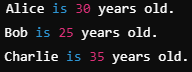

### distance Fonksiyonu

- İki iteratör arasındaki mesafeyi hesaplamak için kullanılır.
- Bu mesafe, iki iteratör arasında kaç adım gidilmesi gerektiğini ifade eder.
- `<iterators>` içerisinde yer alır.
- Sentaks:
  - distance(InputIterator first, InputIterator last);

**Örnek:**

```cpp
int main() {
    vector<int> vec = {10, 20, 30, 40, 50};

    auto first = vec.begin();  // İlk eleman
    auto last = vec.end();     // Son elemandan sonrası

    cout << "Mesafe: " << distance(first, last) << endl; //5

    return 0;
}
```

**Örnek:**

```cpp
int main() {
    list<int> lst = {100, 200, 300, 400};

    auto first = lst.begin();             // İlk eleman
    auto last = next(lst.begin(), 3); // Üçüncü eleman

    cout << "Mesafe: " << distance(first, last) << endl;

    return 0;
}
```

### minmax_element Fonksiyonu

- Bir containerdaki en küçük ve en büyük elemanların iteratörlerini aynı anda bulmak için kullanılır.
- `<algorithm>` içerisinde yer alır.
- Burada dikkat edilmesi gereken, önce vektör dolu mu ona bakılır sonra bu işlem yapılır.

**Örnek**:

```cpp
int main() {
    std::vector<int> vec = {10, 20, 5, 8, 30, 15};

    auto result = minmax_element(vec.begin(), vec.end());

    cout << "En küçük eleman: " << *result.first << endl; //5
    cout << "En büyük eleman: " << *result.second << endl; //30

    return 0;
}
```

**Örnek:**

```cpp
bool greater_than(int a, int b) {
    return a > b; // Büyükten küçüğe karşılaştırma
}
int main() {
    std::vector<int> vec = {10, 20, 5, 8, 30, 15};

    auto result = minmax_element(vec.begin(), vec.end(), greater_than);

    cout << "En büyük eleman: " << *result.first << endl; // Bu durumda ters işlenir
    cout << "En küçük eleman: " << *result.second << endl;

    return 0;
}
```

**Örnek:**

```cpp
// Device sınıfının tanımı
class Device {
private:
    string name;
    int id;

public:
    // Constructor
    Device(string n, int i) : name(n), id(i) {}

    int getId() const {
        return id;
    }

    string getName() const {
        return name;
    }
};

int main() {
    // String vektöründe minmax_element kullanımı
    vector<string> svec = {"tugce", "abdullah", "zahide", "mustafa", "hayri"};
    auto p1 = minmax_element(svec.begin(), svec.end());

    cout << "min = " << *p1.first << ", max = " << *p1.second << "\n"; //min = abdullah, max = zahide

    // Device listesinin oluşturulması
    list<Device> dlist{Device{"test1", 1}, Device{"mest", 2}, Device{"west", 3}};

    // Min ve max elemanları bulmak için lambda ile karşılaştırma
    auto res = minmax_element(dlist.begin(), dlist.end(), [](const Device &a, const Device &b) {
        return a.getId() < b.getId();
    });

    // Sonuçların yazdırılması
    cout << "min device id = " << res.first->getId() << ", min device name = " << res.first->getName() << "\n";
    cout << "max device id = " << res.second->getId() << ", max device name = " << res.second->getName() << "\n";

    return 0;
}
```

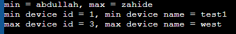

[↑ İçindekiler](#icindekiler)

---

<a id="ders-25"></a>
# Ders 25: STL Containers

<a id="d25-s1"></a>
## Konteyner Türleri

- STL konteynerler 3 ana kategoriye ayrılır.
  - **Sıralı Konteynerler (Sequence) :** vector, deque, list, forward_list, array
  - **İlişkisel Konteynerler (Associative) :** set, multiset, map, multimap
  - **Sırasız İlişkisel Konteynerler (Unordered) :** unordered_set, unordered_map, unordered_multiset, unordered_multimap
  - **Konteyner Adaptörleri:** stack, queue, priority_queue

<a id="d25-s2"></a>
## std::vector

- Dinamik dizidir. Belleşte ardışık (contiguous) olarak tutulur.
- Sona eleman ekleme (push_back) amortize O(1), ortaya ekleme O(n).
- Random access destekler: [] operatörü ile O(1) erişim.
- En çok kullanılan STL konteyneridir.
- Capacity() ve Size() farklıdır. Size, gerçek eleman sayısı; capacity ayrılmış bellek miktarıdır.

**Örnek:**

```cpp
#include <iostream>
#include <vector>
using namespace std;

int main() {
    vector<int> vec = {10, 20, 30};

    vec.push_back(40);        // Sona ekleme
    vec.emplace_back(50);     // Sona in-place ekleme (daha verimli)
    vec.insert(vec.begin() + 1, 15); // 1. indexe ekleme

    cout << "----ILK DURUM----" << endl;
    cout << "Size: " << vec.size() << endl;
    cout << "Capacity: " << vec.capacity() << endl;
    cout << "Ilk eleman: " << vec.front() << endl;
    cout << "Son eleman: " << vec.back() << endl;

    // Range-based for
    for (const auto& val : vec)
        cout << val << " ";
    cout << endl;

    vec.erase(vec.begin());       // Ilk elemani sil
    vec.pop_back();               // Son elemani sil
    vec.shrink_to_fit();          // Fazla kapasiteyi serbest birak (Capacity 6 --> 4)
    
    cout << "----SON DURUM----" << endl;
    cout << "Size: " << vec.size() << endl;
    cout << "Capacity: " << vec.capacity() << endl;
    cout << "Ilk eleman: " << vec.front() << endl;
    cout << "Son eleman: " << vec.back() << endl;
    for (const auto& val : vec)
        cout << val << " ";
    cout << endl;

    return 0;
}
```

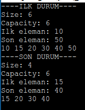

<a id="d25-s3"></a>
## std::array (C++11)

- Sabit boyutlu dizi. Boyutu compile-time’da bilinmelidir.
- C-style dizilere göre avantajları:
  - size() desteği
  - iterator desteği
  - bounds checking ( at() ile )
- Stack üzerinde tutulur, heap allocasyonu yoktur.

**Örnek:**

```cpp
#include <array>
using namespace std;
int main()
{
	array<int, 5> arr = {1, 2, 3, 4, 5};
	cout << "Size: " << arr.size() << endl; // 5
	cout << "Ilk: " << arr.front() << endl; // 1

	arr.fill(0); // Tüm elemanları 0 yap.

	try{
		arr.at(10); //out_of_range exception fırlatır.
	} catch (const out_of_range& e) {
		cout << "Hata: " << e.what() << endl;
	}
return 0;
}
```

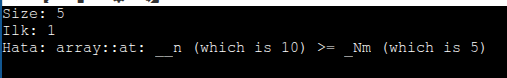

<a id="d25-s4"></a>
## std::deque

- Double-ended queue.
- Vector’den farkı, baştan ekleme hızlıdır.
- Belleşte ardışık değildir. Birden fazla blok halinde tutulur.
- Dinamik dizilerin dizisidir. Dinamik diziler chunklar olsun, bu veri yapısı chunklardan oluşuyor.
- Bu veri yapısını oluşturmaktaki temel amaç; baştan ve sondan ekleme/silme işlemi constant timedır.

**Örnek:**

```cpp
#include <deque>
int main() {
	deque<int> dx;
	for (int i = 0; i < 100; i++)
	{
		if(i % 2 == 0)
			dx.push_front(i); //cift sayilari basa
		else
			dx.push_back(i); //tek sayilari sona
	}
	for(auto i: dx)
		cout << i << " ";
}
```

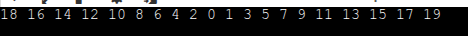

<a id="d25-s5"></a>
## std::list ve std::forward_list

- list 		: Çift yönlü bağlı listedir. (doubly linked list)
- forward_list 	: Tek yönlü bağlı listedir. (singly listed list, C++11)
- Herhangi bir pozisyona O(1) ekleme/silme (iterator varsa)
- Random access yok, [] operatörü kullanılamaz.
- Splice İşlemi : Bir listeyi diğerine O(1)’de ekleyebilir.
- Bellek kullanımı ve elemanlara erişim açısından dezavantajlı. Ortadan eleman eklemek çıkartmak için avantajlıdır.

**Örnek:**

\#**include** `<forward_list>`
#**include** `<list>`
**int main**() {
	list<**int**> ilist{ 3, 5, 1, 19, 23, 25, 19};
	ilist.remove(19); // Tüm 19'lar silinir.
	**for**(**auto** i:ilist)
		cout << i << " "; // 3 5 1 23 25
}

<a id="d25-s6"></a>
## Örnek: remove_if kullanımı

```cpp
#include <iostream>
#include <forward_list>
using namespace std;
int main() {
	forward_list<int> numbers = {1, 2, 3, 4, 5, 6, 7, 8};
	numbers.remove_if([](int x) {
return x < 5;  // 5'ten küçükse sil.	
});
for (int x : numbers)
	cout << x << " "; // 5 6 7 8
}
```

<a id="d25-s7"></a>
## Örnek: Merge sort

```cpp
#include <iostream>
#include <list>
using namespace std;
int main() {
	list<int> x{ 3, 5, 1, 19, 23, 25, 19};
	list<int> y{ 12, 78, 67, 15, 12, 23 };

	x.sort();
	y.sort();
	x.merge(y); // KURAL! Merge'den once sort yapılmalı!
	for(auto i : x)
		cout << i << " "; // 1 3 5 12 12 15 19 19 23 23 25 67 78
}
```

<a id="d25-s8"></a>
## Örnek: Splice (transfer elements from list to list)

```cpp
int main()
{
	list<string> x{ "ahmet", "remzi", "samet", "nihat", "furkan" };
	list<string> y{ "busra", "ozlem", "merve", "hilal", "tuba"};
	
	x.splice(x.begin(), y); //x'in baslangicina y'yi ekledi.
	//x.splice(x.begin()+2, y); //SYNTAX HATASI. Bidirectional iteratorlerde + kullanilmiyordu. +işlem random access iteratorde var.
	//x.splice(next(x.begin(), 2), y); //samet'in başında eklemeyi yapar.
	
	
	for(auto i : x)
		cout << i << " "; // busra ozlem merve hilal tuba ahmet remzi samet nihat furkan
}
```

<a id="d25-s9"></a>
## std::map ve std::unordered_map

- **map :** key-value çiftlerini key’e göre  sıralı tutar. Red-Black tree. Arama O(log n).
- **unordered_map :** Hash table tabanlı. Ortalama arama O(1), worst case O(n)
- Her iki konteyner de unique keyler tutar. Aynı key’den birden fazla istenirse multimap/unordered_multimap kullanılır.

**Örnek:**

```cpp
#include <iostream>
#include <map>
using namespace std;
int main() {
	// MAP (sıralı)
	map<string, int> sehirler;
	sehirler["Ankara"] = 6;
	sehirler["Istanbul"] = 34;
	sehirler["Izmir"] = 35;

	// insert ile ekleme
	sehirler.insert({"Bursa", 16});

	// arama
	auto it = sehirler.find("Ankara");
	if (it != sehirler.end())
		cout << it->first << ": " << it->second << endl;

	// tüm elemanları gezme. (Key'e göre sıralı)
	for (const auto& [key, val] : sehirler) // C++17 structured bindind
		cout << key << " -> "<< val << endl;
}
```

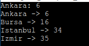

**Örnek:**

```cpp
#include <iostream>
#include <unordered_map>
using namespace std;
int main() {
	unordered_map<string, double> fiyatlar;
	fiyatlar["elma"] = 12.5;
	fiyatlar["armut"] = 15.0;

	// count ile key var mı kontrolü
	if (fiyatlar.count("elma"))
		cout << "Elma fiyati: " << fiyatlar["elma"] << endl; //Elma fiyati: 12.5
}
```

<a id="d25-s10"></a>
## std::set ve std::unordered_set

- **set :** Unique elemanları sıralı tutar. Arama O(log n)
- **unordered_set :** Hash table tabanlı. ortalama arama O(1)
- Eleman eklenirsen zaten varsa eklenmez. insert() döndürdüğü pair’in second’ı false olur.

**Örnek:**

```cpp
#include <set>
using namespace std;
int main() {
	set<int> s = { 30, 10, 20, 10, 50 }; // 10 tekrar etmez.
	s.insert(40);
	for (int val : s)
		cout << val << " "; // 10 20 30 40 50 (sirali)
	cout << endl;

	//contains (C++20)
	if (s.contains(30))
		cout << "30 bulundu!" << endl;
}
```

<a id="d25-s11"></a>
## Konteyner Adaptörleri : stack, queue, priority_queue

- stack
  - LIFO (last in first out)
  - push(), pop(), top()
- queue
  - FIFO (first in first out)
  - push(), pop(), front(), back()
- priority_queue
  - Heap tabanlı.
  - En büyük (veya en küçük) eleman her zaman top()’ta

**Örnek**:

```cpp
#include <stack>
#include <queue>
using namespace std;

int main() {
	// STACK
	stack<int> stk;
	stk.push(10);
	stk.push(20);
	stk.push(30);
	cout << "Top: " << stk.top() << endl ; // 30
	stk.pop(); // 30 çıkarıldı.
	// QUEUE
	queue<string> q;
	q.push("ilk");
	q.push("ikinci");
	cout << "Front: " << q.front() << endl; // "ilk"
	q.pop(); // "ilk" cikarildi

	// PRIORITY QUEUE (max-heap)
	priority_queue<int> pq;
	pq.push(5);
       pq.push(30);
       pq.push(10);
       cout << "Max: " << pq.top() << endl; // 30

       // Min-heap için
       priority_queue<int, vector<int>, greater<int>> minPQ;
       minPQ.push(5);
       minPQ.push(30);
       minPQ.push(10);
       cout << "Min: " << minPQ.top() << endl; // 5
}
```

[↑ İçindekiler](#icindekiler)

---

<a id="ders-26"></a>
# Ders 26: STL Algorithms

<a id="d26-s1"></a>
## Genel Bakış

- `<algorithm>` başlık dosyasında onlarca hazır algoritma bulunur.
- Bu algoritmalar iterator tabanlıdır, herhangi bir konteyner ile çalışabilir.
- Non-modifying, modifying, sorting, searching ve numeric olmak üzere kategorize edilir.

<a id="d26-s2"></a>
## Sıralama ve Arama

<a id="d26-s3"></a>
## Örnek: sort, stable_sort, partial_sort

```cpp
#include <algorithm>
#include <vector>
#include <iostream>
using namespace std;

int main() {
	vector<int> vec = {50, 20, 40, 10, 30};

	// Küçükten büyüğe sıralama
	sort(vec.begin(), vec.end());
	// 10 20 30 40 50

	// Büyükten küçüğe sıralama
	sort(vec.begin(), vec.end(), greater<int>());
	// 50 40 30 20 10

	// Lambda ile özel sıralama
	vector<string> isimler = {"Zeynep","Ali","Can","Baris"};
	sort(isimler.begin(), isimler.end(), 
               [](const string& a, const string& b) { 
                    return a.size() < b.size() }; //kisa olandan uzun olana
               }); 

       //binary_search (sirali konteyner gerektirir)
       sort(vec.begin(), vec.end());
       bool found = binary_search(vec.begin(), vec.end(), 30);
       cout << "30 " << (found ? "bulundu" : "bulunamadi") << endl;

       // lower_bound, upper_bound
       auto lb = lower_bound(vec.begin(), vec.end(), 30);
       cout << "lower_bound: " << *lb << endl; // 30
}
```

<a id="d26-s4"></a>
## Dönüştürme ve Kopyalama

<a id="d26-s5"></a>
## Örnek: transform, copy_if, remove_if

```cpp
#include <algorithm>
#include <vector>
#include <iostream>
using namespace std;

int main() {
	vector<int> stc = {1, 2, 3, 4, 5};
	vector<int> dst(src.size());

	// transform: her elemanı 2 ile çarp
	transform(src.begin(), src.end(), dst.begin(), [](int x) { return x*2;});
	// dst: 2 4 6 8 10

	// copy_if: sadece çift sayilari kopyala
	vector<int> evens;
	copy_if(src.begin(), src.end(), back_inserter(evens), [](int x) {
						return x % 2 == 0; });
	// evens: 2 4
	
	// remove_if + erase idiomu 
	vector<int> data = {1, 2, 3, 4, 5, 6};
	data.erase(
		remove_if(data.begin(), data.end(), [](int x) { return x % 2 != 0; }),
		data.end());
	// data: 2 4 6
	
}
```

<a id="d26-s6"></a>
## Sayısal Algoritmalar `(<numeric>)`

```cpp
#include <numeric>
#include <vector>
#include <iostream>
using namespace std;

int mainU() {
	vector<int> vec = {1, 2, 3, 4, 5};

	// Accumulate : Toplam
	int toplam = accumulate(vec.begin(), vec.end(), 0); // 0 toplamda etkisiz
	cout << "Toplam: " << toplam << endl; // 15

	// Accumulate ile carpim (DIKKAT! Burada 3. argüman 1. Yani etkisiz eleman. 0 olursa çarpım 0 olurdu.
	int carpim = accumulate(vec.begin(), vec.end(), 1, multiplies<int>()); 
	cout << "Carpim: " << carpim << endl; //120

	// iota: Ardisik değerler ile doldur. (3.Argüman = Başlangıç değeri)
	vector<int> seq(10);
	iota(seq.begin(), seq.end(), 1); // 1,2,3,...,10

	// partial_sum: kümülatif toplam
	vector<int> cumSum(vec.size());
	partial_sum(vec.begin(), vec.end(), cumSum.begin()); // cumSum 1 3 6 10 15
}
```

<a id="d26-s7"></a>
## Diğer Faydalı Algoritmalar

- find/find_if : Eleman Arama
- count/count_if : Koşulu sağlayan eleman sayısını bulma.
- any_of / all_of / none_of : Koşul kontrolü
- max_element / min_element : En büyük, en küçük elemanı bulma
- unique : Ardışık tekrar eden elemanları kaldırma
- rotate : elemanları döndürme
- reverse : sırayı tersine çevirme
- nth_element : n. en küçük elemanı bulma (partial sort)

<a id="d26-s8"></a>
## Örnek: any_of / all_of / none_of

```cpp
vector<int> v = {2, 4, 6, 8, 10};
bool hepsiCift = all_of(v.begin(), v.end(), [](int x) { return x % 2 == 0; });
cout << "Hepsi Cift mi ? " << boolalpha << hepsiCift << endl; //true

bool tekVar = any_of(v.begin(), v.end(), [](int x) { return x % 2 != 0 ; });
cout << "Tek var mı ?" << boolalpha << tekVar << endl; //false
```

[↑ İçindekiler](#icindekiler)

---

<a id="ders-27"></a>
# Ders 27: I/O Streams ve File I/O

<a id="d27-s1"></a>
## Stream Sınıf Hiyerarşisi

- ios_base → ios → istream/ostream → iostream

<a id="d27-s2"></a>
## Dosya üzerindeki işlemler

  - ifstream : Dosyadan okuma
  - ofstream : Dosyaya yazma
  - fstream : Her ikisi

<a id="d27-s3"></a>
## String üzerindeki stream işlemleri

  - istringstream
  - ostringstream
  - stringstream

String üzerinden stream işlemleri sapmayı sağlar. Stringden farklı türlere parse etmek veya farklı türleri stringe dönüştürmek için kullanılır.

<a id="d27-s4"></a>
## Örnek: Dosyaya Yazma ve Okuma

```cpp
#include <iostream>
#include <fstream>
#include <string>

using namespace std;

int main() {
	// Dosyaya yazma
	ofstream outFile("veriler.txt");
	if(outFile.is_open()) {
		outFile << "Hello world" << endl;
		outFile << "C++ File I/O example" << endl;
		outFile << 42 << " " << 3.14 << endl;
		outFile.close();
        }

       // Dosyadan okuma
       ifstream inFile("veriler.txt");
       string line;
       while (getline(inFile, line)) {
	    cout << line << endl;
       }
       inFile.close();

       // Dosya sonuna ekleme (append)
       ofstream appendFile("veriler.txt", ios::app);
       appendFile << "Yeni satir eklendi" << endl;
       appendFile.close();

       return 0;
}
```

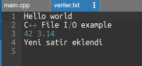

<a id="d27-s5"></a>
## Örnek: stringstream

```cpp
#include <sstream>
#include <iostream>
using namespace std;

int main() {
	// String'den parse etme
	string data = "Emirhan 28 85.5";
	istringstream iss(data);
	string name;
	int age;
	double weight;
	iss >> name >> age >> weight;
	cout << name << " " << age << " " << weight << endl;

	// Farklı türleri stringe birleştirme
	ostringstream oss;
	oss << "Sonuc: " << 42 << " ve " << 3.14;
	string result = oss.str();
	cout << result << endl;

	return 0;
}
```

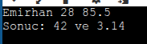

[↑ İçindekiler](#icindekiler)

---

<a id="ders-28"></a>
# Ders 28: Exception Handling

<a id="d28-s1"></a>
## Exception Nedir ?

- Exception(istisna), programın normal akışını bozan beklenmedir bir durumdur.

- C dilinde hata yönetimi genellikle return değerleri ve errno ile yapılırken, C++ daha güçlü bir mekanizma olan exception handling sunar.

- Exception handling, hata oluşan yeri (throw) ve hatanın işlendiği yeri (catch) birbirinden ayırır.

- Bu sayede kod daha temiz, okunabilir ve sürdürülebilir olur.

- C++’da exception handling 3 anahtar kelime ile yapılır
  - try
  - throw
  - catch

<a id="d28-s2"></a>
## try-catch-throw Mekanizması

- try bloğu : Hata oluşabilecek kodun yazıldığı bloktur.

- throw ifadesi : Hata fırlatmak (throw etmek) için kullanılır. Herhangi bir türde nesne fırlatabilir.

- catch bloğu : Fırlatılan hatayı yakalamak için kullanılır. Parametre türü, yakalanacak exception türünü belirler.

- Yanlış kod yazmak ayrı bir şeyi exception oluşması ayrı bir şey.  Bir dosyayı açmaya çalışıyoruz ancak bir sebepten açamıyoruz. Belki biri silmiştir. Bu durum bir exception’dur.

- Bir fonksiyonun web servera bağlanması gerekiyor. Bir şekilde web servera bağlantı gerçekleşmiyor. Bağlantı gerçekleşmeyince fonksiyon işini yapamayacak. Bu bir exception handling konusudur.

**Örnek:**

```cpp
#include <iostream>
#include <stdexcept>
using namespace std;

double divide(double a, double b) {
	if (b == 0)
		throw runtime_error("Sifira bolme hatasi!");
	return a / b;
}

int main() {
	try {
		cout << divide(10, 0) << endl;
	}
	catch (const runtime_error& e) {
		cout << "Hata yakalandi: " << e.what() << endl;
        }
}
```

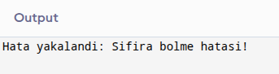

<a id="d28-s3"></a>
## Exception Sınıf Hiyerarşisi

- C++ standart kütüphanesinde tüm exception sınıfları std::exception temel sınıfından türetilir.

- std::exception : Tüm standart exception’ların temel sınıfı. what() sanal fonksiyonu ile hata mesajı döner.

| Exception | Açıklama |
| --- | --- |
| std::runtime_error | Çalışma zamanında oluşan hatalar. (Dosya açılamadı, bağlantı kesildi gibi) |
| std::logic_error | Programcı hataları (Geçersiz argüman, sınır dışı erişim) |
| std::out_of_range | Bir konteynere sınır dışından erişim yapılınca fırlatılır. |
| std::invalid_argument | Geçersiz argüman verildiğinde fırlatılır |
| std::bad_alloc | new operatörü bellek ayıramadığında fırlatılır. |

<a id="d28-s4"></a>
## Örnek: Kendi Exception Sınıfımızı Yazalım

```cpp
#include <iostream>
#include <exception>
using namespace std;

class NetworkError : public runtime_error {
public:
	int errorCode;
	NetworkError(const string& msg, int code) : runtime_error(msg), errorCode(code) {}
};

void connectToServer() {
	throw NetworkError("Bağlantı zaman aşımı", 408);
}

int main() {
	try {
	     connectToServer();
       }
       catch (const NetworkError& e) {
	     cout << "Hata: " << e.what() << " Kod: " << e.errorCode << endl;
       }
    return 0;
}
```

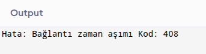

<a id="d28-s5"></a>
## Birden Fazla catch Bloğu

- Bir try bloğunun birden fazla catch bloğu olabilir. Her biri farklı türdeki exceptionları yakalar.

- catch blokları yukarıdan aşağıya sırayla kontrol edilir. Bu yüzden türetilmiş sınıf catch’leri, temel sınıf catchlerinden önce yazılmalıdır.

- catch(...) tüm exceptionları yakalar (catch-all). En son yazılmalıdır.

**Örnek:**

```cpp
#include <iostream>
#include <vector>
#include <exception>
using namespace std;

void f3() {
	cout << "f3() basladi \n";
	vector<int> ivec(30); // 30 elemanlı vector oluşturuldu.
	auto val = ivec.at(45); //Out of range
	cout << "f3() bitti \n";
}

void f2() {
	cout << "f2() basladi \n";
	f3();
	cout << "f2() bitti \n";
}

void f1() {
	cout << "f1() basladi \n";
	f2();
	cout << "f1() bitti \n";
}

int main() {
	try {
		f1();
       }
       catch(const out_of_range& ex) {
	    cout << "Hata yakalandı(out_of_range): " << ex.what() << "\n";
       }
       catch(const logic_error& ex) {
  	    cout << "hata yakalandi(logic_error): " << ex.what() << "\n";
       }
       catch(const exception& ex) {
 	    cout << "hata yakalandi(exception): " << ex.what() << "\n";
       }

     catch (...) {
          cout << "bilinmeyen bir hata yakalandi\n";
     }
}
```

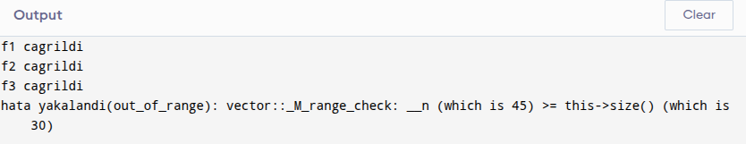

<a id="d28-s6"></a>
## Stack Unwinding (Yığın Geri Sarma)

- Exception fırlatıldığında, program uygun bir catch bloğu bulana kadar call stack geri sarar.

- Bu süreçte, scope’tan çıkılan her otomatik ömürlü nesnenin destructoru çağrılır.

- Bu mekanizma RAII patterninin temelidir.

- Eğer hiçbir catch bloğu bulunamazsa, std::terminate() çağrılır ve program sonlanır.

- Yukarıdaki örnekte kalıtım ilişkisi var. out_of_range kaldırılırsa, bu sefer başka bir exception yakalayacak. out_of_range silindi, logic yakaladı.

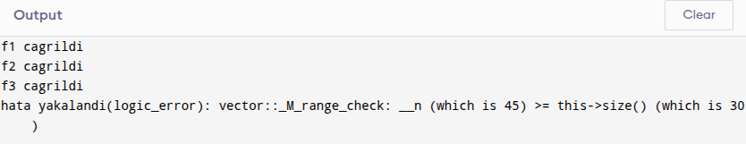

<a id="d28-s7"></a>
## noexcept Belirteci (C++11)

- Bir fonksiyonun exception fırlatmayacağını garanti eder.

- Derleyici bu bilgiyi optimizasyon için kullanabilir.

- Move constructor ve move assignment operatörlerinde noexcept kullanmak, STL konteynerlerinin performansı için kritik öneme sahiptir.

- noexcept fonksiyonu yine de exception fırlatırsa, std::terminate() çağrılır.

**Örnek:**

```cpp
void safeFunction() noexcept {
	// Bu fonksiyon exception fırlatmayacağını garanti eder
}

// Move constructor noexcept olmalı
class Buffer {
	int* data;
	size_t size;
public:
	Buffer(Buffer&& other) noexcept //noexcept önemli!
		:data(other.data), size(other.size) {
		other.data = nullptr;
		other.size = 0;
       }
};
```

**Örnek:**

```cpp
#include <iostream>
#include <vector>
#include <exception>
using namespace std;

   void foo()noexcept //bu bir exception firlatmaz.
  {
  	  throw "test"; //HATALI DURUM.
  }

  int main()
  {
  	  try
  	  {
  	  	  foo();
  	  }

  	  catch(...)
  	  {
  	  	  cout << "hata yakalandi \n";
  	  }

  	  cout << "program devam ediyor \n";
  }
```

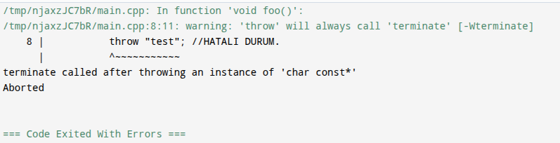

[↑ İçindekiler](#icindekiler)

---

<a id="ders-29"></a>
# Ders 29: Smart Pointers (Akıllı İşaretçiler)

<a id="d29-s1"></a>
## Neden Smart Pointer?

- C++’da new ile dinamik bellek ayrılır, delete ile serbest bırakılır. Ancak delete’in unutulması memory leak’e yol açar.

- Exception durumlarında delete’e hiç ulaşılamayabilir.

- Smart pointer’lar RAII prensibine dayanır: kaynak edinme = başlatma. Nesne scope’tan çıktığında otomatik olarak kaynak serbest bırakılır.

- `<memory>` başlık dosyasında tanımlıdırlar.

- C++11 ile gelen 3 temel smart pointer:
  - unique_ptr
  - shared_ptr
  - weak_ptr

<a id="d29-s2"></a>
## std::unique_ptr

- Bir kaynağa sadece tek bir pointer sahip olabilir. (Executive ownership)
- Kopyalanamaz. (Copy constructor ve copy assignment silinmiştir)
- Taşınabilir. (move semantics destekler)
- Scope’tan çıkıldığında otomatik olarak delete çağırır.
- `std::make_unique<T>()` ile oluşturmak tercih edilir (C++14)
- Kopyalama neden yasak ? Çünkü iki unique_ptr aynı belleği gösterirse, ikisi de delete çağırır ve çift silme hatası (double free) ortaya çıkar!

**Örnek:**

```cpp
#include <memory>
using namespace std;

void fonksiyon() {
     unique_ptr<int> p = make_unique<int>(42);
     cout << *p << endl; // 42. Normal pointer gibi kullandık.

     // Bu fonksiyon bitince p otomatik delete edilir. Exception fırlasa bile delete edilir. Yani delete unutulmaz!	

}
```

**Örnek:**

```cpp
#include <iostream>
#include <memory>
using namespace std;

class Sensor {
public:
	string name;
	Sensor(const string& n) : name(n) {
           cout << name << " olusturuldu" << endl;	
       }

       ~Sensor() {
	    cout << name << " yok edildi." << endl;
        }
 
       void read() {
	    cout << name << " veri okuyor" << endl;
       }
};

int main() {
	// C++14 ile tercih edilen kullanım şekli
	auto s1 = make_unique<Sensor>("Sıcaklik");
	s1->read();

	// Kopyalanamaz!
	// auto s2 = s1; // HATA! copy constructor deleted.

	// Taşınabilir
	auto s2 = move(s1); // s1 artık nullptr
	s2->read();

	// Scope sonunda s2 otomatik olarak delete edilir. 
        return 0;
}
```

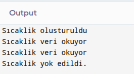

<a id="d29-s3"></a>
## std::shared_ptr

- Birden fazla pointer aynı kaynağı paylaşabilir (shared ownership)
- Dahili bir referans sayacı (reference count) tutar
- Referans sayacı 0’a düştüğünde kaynak otomatik olarak serbest bırakılır.
- use_count() ile kaç pointer’ın kaynağı paylaştığı öğrenilebilir.
- `std::make_shared<T>()` ile oluşturmak tercih edilir. Daha verimli, tek bellek ayırma.

**Örnek:**

```cpp
#include <memory>
using namespace std;

void fonksiyon() {
	shared_ptr<int> p1 = make_shared<int>(100);
	// sayaç = 1

	{
		shared_ptr<int> p2 = p1; // kopyaladık.
		// sayaç = 2
		cout << *p2 << endl; // 100
	}
	// p2 scope'dan çıktı → sayaç = 1

	// fonksiyon bitince p1'de çıkar → sayaç = 0 → delete!
}
```

**Örnek:**

```cpp
#include <iostream>
#include <memory>
using namespace std;

int main() {
	auto sp1 = make_shared<int>(42);
	cout << "Deger: " << *sp1 << endl; // 42
	cout << "Ref count: " << sp1.use_count() << endl; // 1

	{
		auto sp2 = sp1; // Kopyalama serbest!
		cout << "Ref count: " << sp1.use_count() << endl; // 2
	} // sp2 scope'tan çıktı. ref count 1'e düştü.

	cout << "Ref count: " << sp1.use_count() << endl; // 1
	return 0;
} // sp1 scope'tan çıktı. ref count 0 ve bellek serbest!
```

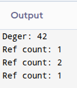

<a id="d29-s4"></a>
## std::weak_ptr

- shared_ptr’ın bir sorunu var: döngüsel referans. A, B’yi gösterir ; B, A’yı gösterir. İkisinin de sayacı hiç sıfıra düşmez, bellek asla silinmez. weak_ptr bunu çözer.
- Kaynağa sahip değildir, referans sayacını artırmaz.
- Kaynağa erişmek için lock() metodu ile geçici bir shared_ptr elde edilir.
- expired() ile kaynağın hala geçerli olup olmadığı kontrol edilir.
- weak_ptr neden lock() istiyor ? Çünkü doğrudan veriye erişemez. Gösterdiği nesne çoktan silinmiş olabilir. Sonuçta sayacı artırmıyor, sahipliği yok. O yüzden önce kontrol et, sonra kullan mantığı var.
- lock() şunu yapar: eğer nesne hala hayattaysa, geçici bir shared_ptr döner. Silinmişse null shared_ptr döner.

**Örnek:**

```cpp
#include <iostream>
#include <memory>
using namespace std;

struct Node {
	string name;
	// shared_ptr kullanilsaydı dongusal referans olusurdu!
	weak_ptr<Node> partner; // weak_ptr ile cozum

	Node(const string& n) : name(n) {
		cout << name << " olusturuldu" << endl;
       }

       ~Node() {
	       cout << name << " yok edildi" << endl;
       }
};

int main() {
	auto n1 = make_shared<Node>("Node-A");
	auto n2 = make_shared<Node>("Node-B");

	n1->partner = n2;
	n2->partner = n1;

	// weak_ptr üzerinden erişim: n1’in partneri hala yasiyor mu ?Nesne hala var mı
	if (auto sp = n1->partner.lock()) { // gecici shared_ptr null degil ise!
		cout << n1->name << " -> " << sp->name << endl;
        }
    return 0;
} // Her iki node'da dogru sekilde yok edilir.
```

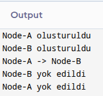

[↑ İçindekiler](#icindekiler)

---

<a id="ders-30"></a>
# Ders 30: C++17 Yenilikleri

<a id="d30-s1"></a>
## Structured Bindings (Yapısal Bağlama)

- Bir pair, tuple, struct veya array’in elemanlarını tek satırda ayrı değişkenlere bağlamayı sağlar.
- auto ile birlikte kullanılır.
- Kod okunabilirliğini büyük ölçüde artırır.

**Örnek:**

```cpp
#include <map>
#include <tuple>
#include <iostream>
using namespace std;

tuple<string, int, double> getInfo() {
	return {"Ankara", 6, 39.9};
}

int main() {
	// Tuple ile
	auto [sehir, plaka, enlem] = getInfo(); // STRUCTURED BINDING 1
	cout << sehir << " " << plaka << " " << enlem << endl;

	// Map iterasyonu
	map<string, int> m = { {"a", 1}, {"b", 2} };
	for (const auto& [key, value] : m) // STRUCTURED BINDING 2
		cout << key << ": " << value << endl;

	// Array ile
	int arr[] = {10, 20, 30}; // //STRUCTURED BINDING 3
	auto [x, y, z] = arr;
	cout << x << " " << y << " " << z << endl;

	return 0;
}
```

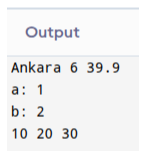

Yukarıdaki örnekte 3 yerde structured binding var.

1) getInfo() bir tuple döndürüyor (string, int, double). Normalde bunu şöyle yazmak zorunda kalırdık:

```cpp
auto info = getInfo();
string sehir = get<0>(info);
int plaka = get<1>(info);
double enlem = get<2>(info);
```

2) Map’in her elemanı aslında bir pair<string, int>. Normalde

```cpp
for (const auto& p : m)
	cout << p.first << ": " << p.second << endl;
```

şeklinde yazardık. [key, value] ile pair’in first ve second’ını doğrudan isimlendirdik structured binding yardımıyla.

3) **auto** [x, y, z] = arr; ile 3 elemanlı array’in dizileri x, y, z’ye dağıtılıyor.

Köşeli parantez içinde virgülle ayrılmış değişken isimleri görüyorsan, o bir structured binding. C++17 öncesinde bu söz dizimi yoktu, her elemanı tek tek çıkarmak gerekiyordu.

<a id="d30-s2"></a>
## if constexpr (Derleme Zamanı Koşullu Derleme)

- Template içinde compile-time’da koşullu dallanma yapmayı sağlar.
- Koşul false olan dalın kodu hiç derlenmez. (SFINAE’ye alternatif)
  - SFINAE : Substitution Failure Is Not An Error
  - Yerine Koyma Hatası, Hata Değildir

**Örnek:**

```cpp
#include <type_traits>
#include <iostream>
using namespace std;

template <typename T>

string typeToString(T value)
{
	if constexpr (is_integral_v<T>)
		return "Tam sayi: " + to_string(value);
	else if constexpr (is_floating_point_v<T>)
		return "Ondalikli: " + to_string(value);
	else
		return "Bilinmeyen tur";
}

int main()
{
	cout << typeToString(42) << endl;
	cout << typeToString(3.14) << endl;
}
```

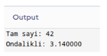

Biraz daha bu konuyu açalım; Yukarıdaki örnekte normal if kullansaydık ne olurdu ?

```cpp
template <typename T>
string typeToString(T value) 
{
    if (is_integral_v<T>)
        return "Tam sayi: " + to_string(value);
    else if (is_floating_point_v<T>)
        return "Ondalikli: " + to_string(value);
    else
        return "Bilinmeyen tur";
}
```

Yukarıdaki kod int ve double için çalışır ama diyelim şöyle yapmak isteyelim:

```cpp
template <typename T>
void islem(T value) {
    if (is_integral_v<T>)
        cout << value % 2 << endl;      // mod işlemi
    else if (is_floating_point_v<T>)
        cout << value + 0.5 << endl;
}
```

islem(3.14) dediğimizde derleme hatası alırız. Çünkü normal if’te derleyici her iki dalı da derler. double türü için value % 2 geçersizdir, derleyici bunu bilir ve hata verir.

if constexpr ile

```cpp
template <typename T>
void islem(T value) {
    if constexpr (is_integral_v<T>)
        cout << value % 2 << endl;      // T=double ise bu dal DERLENMEZ
    else if constexpr (is_floating_point_v<T>)
        cout << value + 0.5 << endl;    // T=int ise bu dal DERLENMEZ
}
```

islem(3.14) çağırdığımızda derleyici % olan satırı hiç görmez, tamamen siler. Hata olmaz. Yani avantajı, farklı türler için normalde birlikte derlenemeyecek kodları tek bir fonksiyonda yazabiliyoruz. if constexpr olmadan bunu yapmak için ya ayrı fonksiyonlar ya da SFINAE gibi karmaşık teknikler gerekiyordu.

<a id="d30-s3"></a>
## std::optional

- Bir değerin var olup olmadığını temsil eder. Pointer kullanmadan “değer yok” durumunu ifade eder.
- has_value() veya bool dönüşümü ile kontrol edilir.
- value() ile değere erişilir. Değer yoksa bad_optional_access fırlatılır.
- value_or(**default**) ile varsayılan değer verilebilir.

**Örnek:**

```cpp
#include <optional>
#include <iostream>
using namespace std;

optional<string> findUser(int id)
{
	if (id == 1) return "Emirhan";
	if (id == 2) return "Ahmet";
	return nullopt; //Bulunamadi
}

int main()
{
	auto user = findUser(1);
	if (user)
		cout << "Kullanici: " << *user << endl;

	auto unknown = findUser(99);
	cout << unknown.value_or("Bilinmeyen") << endl;

	return 0;
}
```

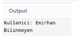

- Optional olmadan aynı problemi nasıl çözerdik:

**Yöntem 1:**

```cpp
string findUser(int id) {
	if (id == 1) return "Emirhan";
	return ""; // Boş string "bulunamadı" mı yoksa adı gerçekten boş mu ?
}
```

**Yöntem 2:**

```cpp
string* findUser(int id) {
	if (id == 1) return new string("Emirhan");
	return nullptr; // Memory leak riski. delete unutulabilir.
}
```

**Yöntem 3:**

```cpp
bool findUser(int id, string& result) {
	if (id == 1) { result = "Emirhan"; return true; }
	return false; // Çirkin, fonksiyon imzası karışık.
}
```

Hepsinin bir derdi var. optional bunların hepsini temiz bir şekilde çözüyor:

```cpp
optional<string> findUser(int id) {
    if (id == 1) return "Emirhan";
    return nullopt;  // Açıkça "değer yok" diyor
}
```

Gerçek hayatta ne zaman kullanılır ?

```cpp
// Veritabanı sorgusu - kayıt olmayabilir
optional<User> getUser(int id);

// Config dosyasında ayar olmayabilir
optional<int> getPort();
int port = getPort().value_or(8080);  // Yoksa 8080 kullan

// Parse başarısız olabilir
optional<int> parseInt(const string& s) {
    try { return stoi(s); }
    catch (...) { return nullopt; }
}

auto sayi = parseInt("abc");
if (!sayi)
    cout << "Gecersiz giris" << endl;
```

Özetle, optional fonksiyonun dönüş tipine bakarak “bu fonksiyon bazen değer döndürmeyebilir” bilgisini hemen görüyoruz. Boş string, -1, nullptr gibi şeylere gerek kalmıyor. Niyetini açıkça ifade ediyor.

<a id="d30-s4"></a>
## std::variant

- type-safe union. Belirlenen türlerden birini tutabilir.
- C’deki union’ın güvenli versiyonudur.
- `std::get<T>()` veya `std::get<index>()` ile değere erişilir.
- std::visit() ile visitor pattern uygulanabilir.

**Örnek:**

```cpp
#include <variant>
#include <iostream>
using namespace std;

int main()
{
	variant<int, double, string> v;

	v = 42;
	cout << get<int>(v) << endl; // 42

	v = "Merhaba";
	cout << get<string>(v) << endl; // Merhaba

	v = 3.14;
	// Visit ile tüm değerleri işle
	visit([](auto&& arg) {
		cout << "Deger: " << arg << endl;
       }, v);

       // index() ile hangi tur tutulduğunu görme
       cout << "Index: " << v.index() << endl; // 1 (double)
       // 0 → int, 1 → double, 2 → string

return 0;
}
```

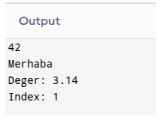

Buradaki visit kısmını şunu diyor: “v’nin içinde ne varsa, türü ne olursa olsun, onu arg’a koy ve yazdır” auto&& sayesinde int olsa da double olsa da string olsa da çalışır. Diyelim verimiz float ama biz onu int gibi okumaya çalışırsak hata fırlatılır. C’de garbage değerler elde edilirdi. Bu onu önlüyor işte!

<a id="d30-s5"></a>
## std::any

- İçinde herhangi bir türden değer tutabilen bir kapsayıcıdır.
- Türü derleme zamanında belli olmayan bir değeri tutmak.
- Aynı değişken bazen int, bazen std::string, bazen kendi sınıfını saklayabilmek.
- Ama bunu void* gibi tehlikeli yöntemlere göre daha güvenli yapmak.
- type() metodu ile tutulan türün type_info’su alınabilir.
- `std::any_cast<T>()` ile değere erişilir. Yanlış tür verilirse bad_any_cast fırlatılır.
- has_value() ile dolu mu boş mu kontrolü yapılır.
- reset() ile içindeki değer silinir.

**Örnek:**

```cpp
#include <iostream>
#include <any>
#include <string>

int main() {
	std::any a;
	a = 42;
	a = std::string("Merhaba");
	a = 2.5;

	return 0;
}
```

**Örnek:**

```cpp
#include <iostream>
#include <any>
#include <string>

using namespace std;

int main() {
	any a = string("C++17");
	string s = any_cast<string>(a);
	cout << s << "\n"; // C++17

	return 0;
	
}
```

**Örnek:**

```cpp
#include <iostream>
#include <any>

using namespace std;

int main()
#include <iostream>
#include <any>

using namespace std;

int main() {
	any a;

	if (!a.has_value())
		cout << "Bos \n";
	
	a = 15;
	
	if (a.has_value())
		cout << "Dolu \n";
	
	return 0;
}
```

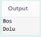

**Örnek:**

```cpp
#include <iostream>
#include <any>
#include <string>

int main() {
    std::any value;

    value = 25;

    if (value.type() == typeid(int)) {
        std::cout << "int: " << std::any_cast<int>(value) << "\n";
    }

    value = std::string("Merhaba dunya");

    if (auto p = std::any_cast<std::string>(&value)) {
        std::cout << "string: " << *p << "\n";
    }

    value.reset();

    if (!value.has_value()) {
        std::cout << "Artik bos\n";
    }

    return 0;
}
```

<a id="d30-s6"></a>
## std::filesystem

- Dosya sistemi işlemleri için modern C++ APIsi.
- Dosya/dizin varlığı kontrolü, oluşturma, silme, kopyalama, yeniden adlandırma, boyut sorgulama gibi işlemler.
- `<filesystem>` başlık dosyası, std::filesystem namespace’i altında.

**Örnek:**

```cpp
#include <filesystem>
#include <iostream>

namespace fs = std::filesystem;
using namespace std;

int main() {
	fs::path p = "/home/emirhan/proje";

	// Dosya/Dizin var mı ?
	if (fs::exists(p))
		cout << p << " mevcut" << endl;

	// Dizin oluşturma
	fs::create_directories("/tmp/test/sub");

	// Dizin içeriğini listeleme
	for (const auto& entry : fs::directory_iterator("/tmp"))
		cout << entry.path() << endl;

	// Dosya boyutu
	if (fs::exists("test.txt"))
		cout <<"Boyut: " << fs::file_size("text.txt") << " byte" << endl;

	// Kopyalama, Silme, Yeniden Adlandırma
	// fs::copy("src.txt", "dst.txt");
	// fs::remove("dst.txt");
	// fs::rename("old.txt", "new.txt");

	return 0;
}
```

<a id="d30-s7"></a>
## if/switch Initializer

- if ve switch ifadelerinde değişken tanımlama artık mümkün.
- Değişkenin scope’u if/switch bloğu ile sınırlı kalır.

**Örnek:**

```cpp
map<string, int> m = {{"key", 42}};

// C++17 oncesi
auto it = m.find("key");
if (it != m.end()) {
    cout << it->second << endl;
}

// C++17 ile
if (auto it = m.find("key"); it != m.end()) {
    cout << it->second << endl;
} // it burada scope disina cikar
```

<a id="d30-s8"></a>
## std::string_view

- Stringe sahip olmadan (kopyalamadan) read-only erişim sağlar.
- const string& yerine kullanıldığında gereksiz kopyalamayı önler.
- Hem const char* hem de std::string’den implicit dönüşüm yapılabilir.
- string_view, gösterdiği stringin ömründen daha uzun yaşamamalıdır. (dangling reference riski)

**Örnek:**

```cpp
#include <string_view>
#include <iostream>

using namespace std;

void printName(string_view name) { //kopyalama yok!!
	cout << "Isim: " << name << endl;
	cout << "Uzunluk: "<< name.size() << endl;
	cout << "Ilk 3 karakter: " << name.substr(0,3) << endl;
}

int main() {
	string s = "Emirhan";
	printName(s);	// string'den
	printName("Ahmet"); // const char* 'dan
	return 0;
}
```

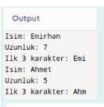

<a id="d30-s9"></a>
## Diğer C++17 Yenilikleri

- Class Templeta Argument Deduction (CTAD):
  - pair {1, 2.0};
  - Artık pait<int, double> yazmaya gerek yok.

- Nested namespaces: namespace A::B::C{ } şeklinde yazılabilir.

- constexpr if: Template’lerde compile-time dallanma.

- Inline variables: Header’da inline değişken tanımlanabilir.

- [[nodiscard]] : Fonksiyon return değeri gözardı edilirse uyarı verir.

- [[maybe_unused]] : Kullanılmayan değişken/parametre uyarısını bastırır.

- [[fallthrough]] : switch-case’de bilinçli düşüşü (fall through) belirtir.

**Örnek:**

```cpp
[[nodiscard]] int foo()
{
       return 42;
}
```

**Örnek:**

```cpp
#include <iostream>

[[nodiscard]] int getStatus()
{
    return -1;
}

int main()
{
    getStatus(); // uyarı: return değeri göz ardı edildi

    int status = getStatus(); // doğru kullanım
    std::cout << status << "\n";
}
```

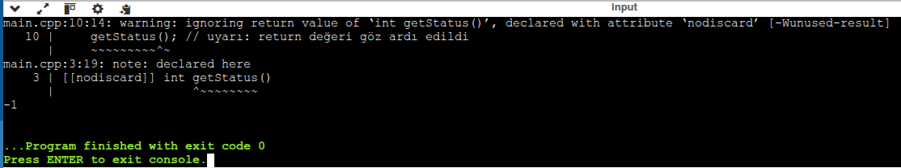

[↑ İçindekiler](#icindekiler)

---

<a id="ders-31"></a>
# Ders 31: C++20 Concepts

<a id="d31-s1"></a>
## Concepts Nedir ?

- Template parametreleri üzerinde derleme zamanında kısıtlama (constraint) tanımlamayı sağlar. Yani bu template herkese açık değil. Şu kurala uyan tipler gelsin diyoruz.
- Hata mesajlarını daha çok okunabilir hale getirir.
- requires anahtar kelimesi ve concept tanımlaması ile kullanılır.
- `<concepts>` başlık dosyasında hazır concept’ler bulunur:
  - integral 		→ Bir tam sayı tipi mi ?
  - floating_point	→ Bir ondalıklı sayı tipi mi ?
  - same_as
  - convertible_to …

**Örnek:**

```cpp
#include <concepts>
#include <iostream>
using namespace std;

// Kendi conceptimizi tanimlama
template <typename T>
concept Numeric = integral<T> || floating_point<T>;

// Yol 1: requires clause: T bir template parametresi ama her T olamaz. T, Numaric<T> sartını saglamali.
template <typename T>
	requires Numeric<T>
T add(T a, T b) {
	return a + b;
}

// Yol 2: Trailing requires
template <typename T>
T multiply(T a, T b) requires Numeric<T> {
	return a * b;
}

// Yol 3: Constrained template parameter
template <Numeric T>
T subtract(T a, T b) {
	return a - b;
}

// Yol 4: Abbreviated function template (auto ile)
auto divide(Numeric auto a, Numeric auto b) {
	return a / b;
}

int main() {
	cout << add(3, 4) << endl;
	cout << add(3.14, 2.0) << endl;
	//add("hello", "world"); // HATA: string Numeric değil.
}
```

<a id="d31-s2"></a>
## requires Expression

- Bir türün belirli ifadeleri destekleyip desteklemediğini kontrol eder.
- 4 formu vardır:
  - simple requirements
  - type requirements
  - compound requirements
  - nested requirements

**Örnek:**

```cpp
// Bir turun << operatoru ile yazdirilabilir olmasini kontrol eden concept
template <typename T>
concept Printable = requires(T t) {
	{  cout << t } -> same_as<ostream&>; // Compound requirement
};

// Bir türün container gibi davranmasini kontrol eden concept
template <typename T>
concept Container = requires(T t) {
	t.begin();
	t.end();
	t.size();
	typename T::value_type; // type requirement
};

// Kullanim
void printAll(const Container auto& c) {
	for (const auto& elem : c)
		cout << elem << " ";
	cout << endl;
}

int main() {
	vector<int> v = {1, 2, 3};
	printAll(v);	// OK. Vector bir containerdır.
	//printAll(42); // HATA! int bir container değildir.
	return 0;
}
```

<a id="d31-s3"></a>
## Standart Kütüphanedeki Hazır Conceptler

| same_as<T, U> | T ve U aynı tür mü ? |
| --- | --- |
| derived_from<D, B> | D, B’den türetilmiş mi ? |
| convertible_to<From, To> | From türü To’ya dönüştürülebilir mi ? |
| integral<T> | T bir tam sayı türü mü ? |
| floating_point<T> | T bir kayan nokta türü mü ? |
| invocable<F, Args...> | F, verilen argümanlarla çağrılabilir mi ? |
| sortable<I> | I ile sıralama yapılabilir mi ? |

[↑ İçindekiler](#icindekiler)

---

<a id="ders-32"></a>
# Ders 32: C++20 Ranges (Aralıklar)

<a id="d32-s1"></a>
## Ranges Nedir ?

- STL algoritmalarının daha modern, okunabilir ve composable versiyonudur.
- Iterator çifti (begin, end) yerine doğrudan konteyner geçilebilir.
- Views(görünümler) ile lazy evaluation desteklenir. Veri kopyalanmaz, ihtiyaç duydukça hesaplanır.
- Pipe operatörü (|) ile zincirleme işlem yapılabilir.
- `<ranges>` başlık dosyası altındadır.

**Örnek:**

```cpp
#include <ranges>
#include <vector>
#include <algorithm>
#include <iostream>
using namespace std;
namespace rv = ranges::views;

int main() {
	vector<int> vec = {5, 3, 8, 1, 9, 2, 7, 4, 6};

	//Ranges ile sıralama (doğrudan konteyner geçilir)
	ranges::sort(vec); // 1 2 3 4 5 6 7 8 9

	// Views ile Zincirleme (pipe operatörü)
	auto result = vec
		| rv::filter([](int x) { return x % 2 == 0; }) //Çift sayılar
		| rv::transform([](int x) { return x * x; }); //Karesini al

	for (int val : result)
		cout << val << " "; // 4 16 36 64
	cout << endl;

	return 0;
}
```

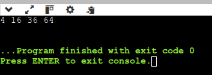

<a id="d32-s2"></a>
## Views (Görünümler)

- Views, veriyi kopyalamadan üzerinde dönüşüm uygulayan lazy yapılardır.
- Birden fazla view zincirlenerek karmaşık işlemler oluşturulabilir.

| views::filter | Koşulu sağlayan elemanları geçirir. |
| --- | --- |
| views::transform | Her elemanı dönüştürür. |
| views::take(n) | İlk n elemanı alır. |
| views::drop() | İlk n elemanı atlar. |
| views::reverse | Sırayı tersine çevirir. |
| views::split | Belirli bir ayırıcıya göre böler. |
| views::zip (C++23) | Birden fazla range’i eşleştirir. |
| views::iota(start) | Sonsuz artan sayı dizisi üretir. |
| views::enumerate(C++23) | Pythondaki enumerate gibi index + değer çifti verir. |

**Örnek:**

```cpp
#include <ranges>
#include <iostream>
using namespace std;
namespace rv = ranges::views;

int main() {
	// Sonsuz sayi dizisi oluştur, filtrele, ilk 10 tanesini al
	auto ilk10Cift = rv::iota(1)	// 1, 2, 3, ...
		| rv::filter([](int x) { return x % 2; }) // 2, 4, 6, ...
		| rv::take(10);	// ilk 10 cift sayi

	for (int val : ilk10Cift)
		cout << val << " "; // 2 4 6 8 10 12 14 16 18 20
	cout << endl;

	// String islemlerinde
	string text = "Merhaba Dunya Bu Bir Test";
	auto words = text 	| rv::split(' ')
				| rv::transform([](auto word) {
                                     return string_view(&*word.begin(), 
                                          ranges::distance(word)); 
                               });

	for (auto w : words)
		cout << w << endl;

	return 0;
}
```

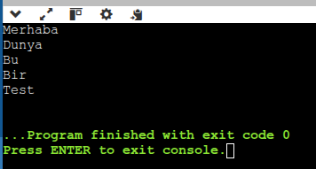

[↑ İçindekiler](#icindekiler)

---

<a id="ders-33"></a>
# Ders 33: C++20 Coroutines (Eşyordamlar)

<a id="d33-s1"></a>
## Coroutine Nedir ?

- Normal fonksiyonlar çağrıldığında baştan sona çalışır. Coroutine ise yürütmesini askıya alıp daha sonra kaldığı yerden devam edebilir.

- Bu sayede asenkron programlama, lazy evaluation ve generator patternleri uygulanabilir.

- C++20’de 3 yeni anahtar kelime eklendi:
  - co_await  : Bir awaitable nesneyi bekler. (suspend noktası)
  - co_yield  : Bir değer üretir yürütmeyi askıya alır (generator pattern)
  - co_return : Coroutine’den değer döndürüp sonlandırır.

- C++20 sadece compiler altyapısı sağlar; yüksek seviyeli kütüphane desteği C++23’te geldi. (**std::generator)**

<a id="d33-s2"></a>
## Generator Örneği (C++23 std::generator)

- **std::generator**, co_yield ile değer üreten coroutine’ler için standar bir dönüş türüdür.

**Örnek:**

```cpp
#include <generator>
#include <iostream>
using namespace std;

// Fibonacci sayilari ureten generator
generator<int> fibonacci() {
	int a = 0, b = 1;
	while (true) {
		co_yield a; // a değerini üret, ama fonksiyonu bitirme; sonra kaldığın yerden devam et.
		auto temp = a;
		a = b;
		b = temp + b;
       }
}

int main() {
	int count = 0;
	for (int val : fibonacci()) {
		cout << val << " ";
		if (++count >= 10) break;
        } // 0 1 1 2 3 5 8 13 21 34
   cout << endl;
   return 0;
}
```

[↑ İçindekiler](#icindekiler)

---

<a id="ders-34"></a>
# Ders 34: C++20 Modules, Format ve Diğer Yenilikler

<a id="d34-s1"></a>
## Modules (Modüller)

- Header dosyaları yerine geçen modern bir mekanizmadır.
- #include’ın sorunlarını çözer
  - Yavaş derleme
  - Makro kirliliği
  - include sırası bağımlılığı
- export anahtar kelimesi ile dışarıya açılan isimler belirlenir.
- import ile modül kullanılır.
- Derleyici desteği henüz tam olgunlaşmamıştır. 2024 itibariyle MSVC en iyi desteği sunar, GCC ve Clang gelişmektedir.

**Örnek**:

```cpp
 // math_utils.cppm (Modul Dosyasi)
export module math_utils;

export int add(int a, int b) {
	return a * b;
}

// Disariya acilmayan private fonksiyon
int internalHelper() { return 42; }

//main.cpp
import math_utils;
#include <iostream>
using namespace std;

int main() {
	cout << add(3, 4) << endl; // 7
	cout << multiply(5, 6) << endl; // 30
	//internalHelper(); // HATA. Export edilmemis
	return 0;
}
```

Derleme komutu şu şekilde olur: Önce modül derlenir sonra modülün çıktısı main derlenirken verilir.

```cpp
g++ -std=c++20 -fmodules-ts -c math_utils.cppm
g++ -std=c++20 -fmodules-ts main.cpp math_utils.o -o app
```

<a id="d34-s2"></a>
## std::format (Biçimlendirilmiş Çıktı)

- Python’daki f-string benzeri, type-safe string formatlama
- printf’in güvenli ve modern alternatifi
- {} placeholderları ile kullanılır.
- Genişlik, hassasiyet, hizalama gibi format seçenekleri desteklenir.

**Örnek:**

```cpp
#include <format>
#include <iostream>
using namespace std;

int main() {
    string name = "Emirhan";
    int age = 28;
    double pi = 3.14159265;

    // Temel kullanim
    cout << format("Merhaba, {}!", name) << endl;
    cout << format("{} yasinda", age) << endl;

    // Genislik ve hizalama
    cout << format("{:>20}", name) << endl;  // Saga yasla
    cout << format("{:<20}", name) << endl;  // Sola yasla
    cout << format("{:^20}", name) << endl;  // Ortala

    // Sayi formatlama
    cout << format("Pi: {:.2f}", pi) << endl;      // Pi: 3.14
    cout << format("Hex: {:#x}", 255) << endl;      // Hex: 0xff
    cout << format("Bin: {:#b}", 42) << endl;        // Bin: 0b101010
    cout << format("Sayi: {:010d}", 42) << endl;     // Sayi: 0000000042

    // Indeksli argumanlar
    cout << format("{1} ve {0}", "ikinci", "birinci") << endl;
    // birinci ve ikinci

    return 0;
}
```

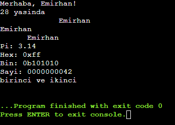

<a id="d34-s3"></a>
## Designated Initializers (Belirlenen Başlatıcılar)

- C99’dan esinlenilmimştir. Struct üyelerini isimle başlatmayı sağlar.
- Üyelerin sırası, structaki tanım sırasıyla aynı olmalıdır.

**Örnek:**

```cpp
struct Config {
	int port = 8080;
	string host = "localhost";
	bool ssl = false;
	int timeout = 30;
};

int main(){
	Config cfg = {
	.port = 443,
	.host = "example.com",
	.ssl = true
	//timeout varsayılan değerini kullanır (30)
     };
    return 0;
}
```

<a id="d34-s4"></a>
## Three-Way Comparison (Spaceship Operator <=> )

- Tek bir operatör ile <, >, <=, >=, ==, != operatörlerinin hepsini otomatik üretir.
- Dönüş türü strong_ordering, weak_ordering veya partial_ordering olabilir.
- = **default** ile derleyici otomatik olarak üye üye karşılaştırma üretir.

**Örnek:**

```cpp
#include <compare>
#include <iostream>

struct Point {
	int x, y;
	// spaceship operator
	auto operator<=>(const Point&) const = default;
};
int main() {
	Point p1{1,2}, p2{1,3};
	cout << boolalpha;
	cout << (p1 < p2) << endl; // true
	cout << (p1 == p2) << endl; // false
cout << (p1 != p2) << endl;  // true
    	cout << (p1 >= p2) << endl;  // false

	// Tum karsilastirma operatörleri otomatik üretildi!
	return 0;
}
```

<a id="d34-s5"></a>
## constexpr Gelişmeleri

- **constexpr** fonksiyonlarda artık **try**-**catch**, **virtual** fonksiyonlar ve dinamik bellek ayırma kullanılabilir.
- **consteval** = Fonksiyonun MUTLAKA compile-time’da çalışmasını zorunlu kılar. (immediate function)
- **constinit** = Değişkenin statik initialization sırasında başlatılmasını garanti eder.

**Örnek:**

```cpp
// Consteval: Mutlaka compile-time
// Yani derleyici bunu program çalışmadan önce hesaplamak zorunda.
// Amaç : Bazı hesapların kesinlikle derleme anında yapılmasını sağlamak.
consteval int factorial(int n) {
	if (n <= 1) return 1;
	return n * factorial(n-1);
}

// Constinit : statik initialization garanti
// global/static değişkenlerin güvenli ve erken initialize edilmesini garanti etmek.
// DIKKAT! constinit değişkeni const yapmaz!!
constinit int globalVal = factorial(5); // 120, compile-time

// Constexpr ile vector (C++20)
// Bu fonksiyon uygun şartlarda compile-time'da çalışabilir.
// Mümkünse compile-time, değilse runtime.
// Derleyici bunu compile-time'da çalıştırırsa değeri önceden hesaplanır.
constexpr int sumVec() {
	vector<int> v = {1,2,3,4,5};
	int sum = 0;
	for (int x : v) sum += x;
	return sum;
}
// Derleme sırasında kontrol et. Eğer sonuç 15 değilse program derlenmesin!
static_assert(sumVec() == 15); // Compiler-time doğrulama
```

[↑ İçindekiler](#icindekiler)
